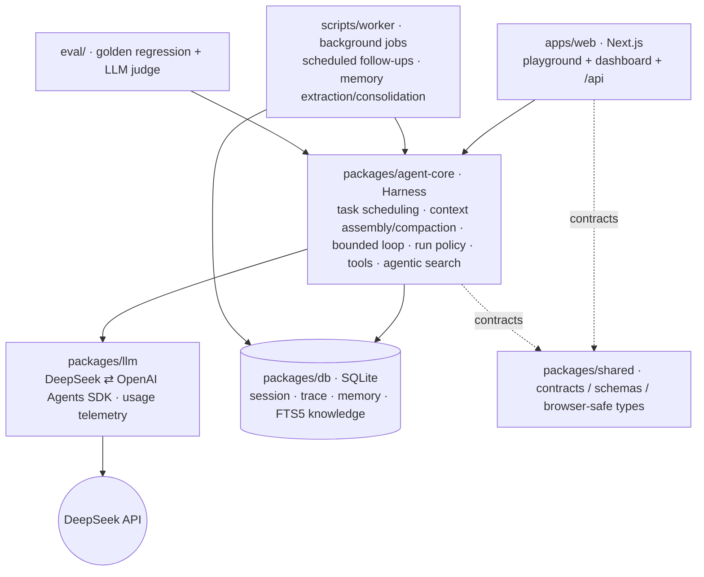
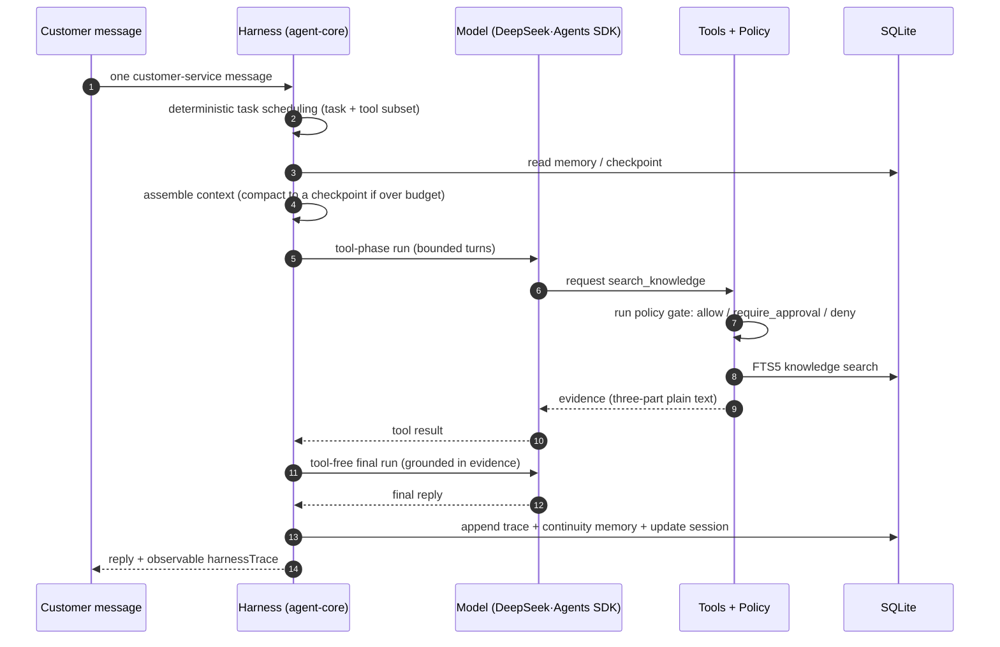

<p align="center"><strong>Chatty</strong></p>
<p align="center">
  <a href="https://github.com/ImWenyaoT/chatty/actions/workflows/ci.yml"></a>
</p>
<p align="center"><a href="README.md">简体中文</a> | English</p>

---

A seller-side customer-service **[Agent][] [Harness][]** · TypeScript / Node.js · DeepSeek-backed. Around one question — *what makes a single service [turn][] complete and correct* — it shapes task identification, [context][] assembly, knowledge retrieval, tool use, risk approval, and human handoff into an evaluable, replayable loop. The [model][] is pinned to `deepseek-v4-pro`; the [harness][] is the part that evolves.

- **Task endpoints + regression eval** — high-frequency service tasks get explicit endpoints (answer · check knowledge · check availability · hand off · follow up); golden scenarios + an LLM judge regression-test them, turning off-topic replies, missed tool calls, and misjudged actions into a fixed test set.
- **Agentic retrieval, no RAG** — facts (policy · fees · rental period · after-sales) go through a `search_knowledge` [tool][tool call] over a SQLite FTS5 knowledge base: top-3 hits, a bounded tool loop, deduped queries, evidence fed back into [context][] for grounded fact-checking — no RAG pipeline, no vector database.
- **Constrained executor** — the model output is parsed into a constrained `CustomerServiceAction`; the executor routes every call through a tool registry and an allow / require_approval / deny [permission][permission mode] gate, so refunds, handoff, and session-close (medium/high risk) reach approval or a human.
- **Closed feedback loop** — tool calls, approval paths, and eval failures chain into *service task → failure attribution → prompt / flow change → regression*, keeping agent-experience issues trackable, fixable, and verifiable.

## Quickstart

```bash
pnpm install --frozen-lockfile
pnpm dev      # Next.js playground (apps/web)
pnpm test     # workspace unit tests
pnpm smoke    # core data-path smoke, no network
pnpm eval     # golden regression (needs a DeepSeek key)
```

Set `OPENAI_API_KEY` (a DeepSeek OpenAI-format key) before the playground — the message API returns 503 without it. State persists to `data/chatty.sqlite`; set `CHATTY_DB_PATH` to override.

## Monorepo

`apps/web` is presentation only; the value lives in the `agent-core` [harness][], with the [model][] and persistence as replaceable dependencies.



| Path | Role |
| --- | --- |
| [`packages/agent-core`](packages/agent-core) | harness core: task scheduling, [context][], run policy, tool execution, agentic search |
| [`packages/llm`](packages/llm) | Agents SDK adapter for DeepSeek + usage telemetry ([cache tokens][], cost) |
| [`packages/db`](packages/db) | SQLite: [session][] / trace / [memory][memory system] / knowledge (FTS5) |
| [`packages/shared`](packages/shared) | cross-package types, schemas, browser-safe contracts |
| [`apps/web`](apps/web) | Next.js playground + dashboard |
| [`eval/`](eval) | golden regression + LLM judge |

## Quality gates

`test` / `test:fullstack` / `test:coverage` / `test:coverage:core` / `smoke` / `typecheck` / `lint` run on every PR and `main` via [CI](.github/workflows/ci.yml); the full-stack gate exercises the real Next API, SQLite, and worker. The real-LLM golden regression is a manual workflow ([`eval.yml`](.github/workflows/eval.yml)). A `v*` tag builds a standalone server, health-checks it on a persistent SQLite path, and publishes a runnable [release](.github/workflows/release.yml). Root [`package.json`](package.json) is the command source of truth.

## Core capabilities

One message = one bounded [turn][]. The [harness][] owns the task boundary, [context][], and tools; the [model][] only picks the next step inside the scheduled task.



### Task scheduling

The harness — not the model — picks the bounded task and its tool subset before composing (a Claude-Code-style narrowed tool pool with bounded turns per task).

### Loop & flow control

Two bounded phases: a tool round, then a tool-free final run grounded in that evidence. Missing-key, provider, and output-validation failures stay explicit errors — never disguised as a reply.

### Input / prompt assembly

[Context][] is assembled from [memory][memory system] + retrieved knowledge + the prior checkpoint, and [compacted][compaction] into a new checkpoint once it exceeds the [token][] budget.

### Executor

Every [tool call][] passes an allow / require_approval / deny [permission][permission mode] gate — high-risk tools (e.g. refunds) never auto-execute. The reply, trace, and continuity [memory][memory system] commit to SQLite within one [turn][].

## Tool calling

Each scheduled task exposes only its required tools as Agents SDK function [tools][tool]. `search_knowledge` runs agentic retrieval over SQLite FTS5 (steps 5–9 above); `check_availability` / `create_handoff` / `schedule_followup` cover the rest. No [MCP][] or [skills][skill] here — those belong to the multi-agent sibling project, not this single-agent harness.

## Data note

Open source, but the business comes from a real shop: real customer/shop data is never committed; examples use placeholders (a sample rental shop / 18800000000). See [AGENTS.md](AGENTS.md).

## License

[MIT](LICENSE).

<!-- AI coding dictionary (https://www.aihero.dev/ai-coding-dictionary) — terms kept in English and linked, not translated. -->
[agent]: https://www.aihero.dev/ai-coding-dictionary/agent
[harness]: https://www.aihero.dev/ai-coding-dictionary/harness
[model]: https://www.aihero.dev/ai-coding-dictionary/model
[context]: https://www.aihero.dev/ai-coding-dictionary/context
[memory system]: https://www.aihero.dev/ai-coding-dictionary/memory-system
[session]: https://www.aihero.dev/ai-coding-dictionary/session
[turn]: https://www.aihero.dev/ai-coding-dictionary/turn
[compaction]: https://www.aihero.dev/ai-coding-dictionary/compaction
[token]: https://www.aihero.dev/ai-coding-dictionary/token
[tool]: https://www.aihero.dev/ai-coding-dictionary/tool
[tool call]: https://www.aihero.dev/ai-coding-dictionary/tool-call
[permission mode]: https://www.aihero.dev/ai-coding-dictionary/permission-mode
[cache tokens]: https://www.aihero.dev/ai-coding-dictionary/cache-tokens
[MCP]: https://www.aihero.dev/ai-coding-dictionary/mcp
[skill]: https://www.aihero.dev/ai-coding-dictionary/skill
