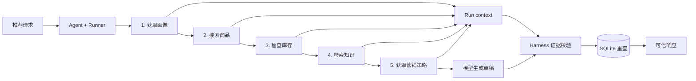

# 🛒 Chatty：单 Agent 电商推荐与营销系统

> 一个面向求职展示的 AI Agent Demo：模型负责决策，Harness 用真实 Tool、SQLite 数据和最终校验约束结果。

`OpenAI Agents SDK` · `FastAPI` · `SQLite FTS5` · `Pydantic` · `uv` · `Ruff` · `ty`

## 项目解决什么问题

传统“LLM 推荐 Demo”容易让模型直接编造商品、库存和营销信息。Chatty 把生成能力与业务事实分开：

| 问题 | Chatty 的处理 |
|---|---|
| 模型可能编造商品 | 最终商品必须来自 Tool 召回结果 |
| 推荐与库存脱节 | Tool 检查库存，响应前再次过滤缺货商品 |
| 理由缺少依据 | SQLite FTS5 检索知识并返回 Agent |
| 价格、库存不可信 | 最终字段由 SQLite 回填 |
| 失败被 fallback 掩盖 | 返回明确错误，不伪造默认推荐 |

## 核心设计：Agent = Model + Harness



- **Model**：根据 instructions、请求和 tool results 决定下一步，最终生成商品 ID、理由和营销文案。
- **Harness**：提供 tools、保存 run context、限制轮次、验证证据、回填可信字段并映射错误。
- **Tool**：提供用户画像、商品搜索、库存、知识检索和营销策略五项确定性能力。

## 五个 Tool

| Tool | 输入 | 输出 | 数据来源 |
|---|---|---|---|
| `get_user_profile` | 用户 ID、请求上下文 | 合并后的用户画像 | SQLite |
| `search_products` | 类目、价格、标签、数量 | 候选商品 | SQLite |
| `check_inventory` | 商品 ID | 有货商品与低库存标记 | SQLite |
| `retrieve_knowledge` | 查询词、类目、商品 ID | Top-K 知识文档 | SQLite FTS5 |
| `get_marketing_strategy` | 用户分群 | 语气、规则、禁词 | SQLite |

Agent 必须依次调用五个 Tool。最终商品必须来自召回与库存检查范围，并且流程必须完成非空知识检索。

## 数据层

Chatty 使用一个 SQLite 文件完成：

- 商品、库存和用户画像的结构化查询
- 营销策略与禁词存储
- FTS5 全文检索
- BM25 相关性排序
- 演示数据事务初始化

JSON/JSONL 只作为可读种子。启动时导入 SQLite 并建立演示数据投影；库存检查、
知识检索和最终商品回填会在请求路径读取 SQLite。

## 可信推荐链

模型不能直接决定业务事实。返回响应前，Chatty 会：

1. 确认五次 tool call 按顺序完成，且知识检索返回结果。
2. 验证商品同时通过召回、库存和知识范围检查。
3. 拒绝未知或缺货商品，并从 SQLite 回填业务字段。
4. 限制返回数量并替换营销禁词。

校验失败时返回明确错误。

## 轻量 A/B 测试与指标

Chatty 使用 SHA-256 对 `user_id + experiment_id` 稳定分桶：

| 分组 | 策略 |
|---|---|
| `control` | 商品热度优先 |
| `treatment_personalized` | 类目、价格、近期行为与热度组合排序 |

指标接口提供请求成功率、延迟和正负反馈统计。

当前实现只演示稳定分桶、策略差异和指标采集，不声称效果提升或统计显著性。

## 快速开始

要求 Python 3.12+ 和 [uv](https://docs.astral.sh/uv/)。

```bash
git clone https://github.com/ImWenyaoT/chatty.git
cd chatty
cp .env.example .env
```

编辑 `.env`：

```dotenv
OPENAI_API_KEY=your_key
OPENAI_BASE_URL=https://api.deepseek.com
MODEL_ID=deepseek-v4-pro
```

启动：

```bash
uv sync
uv run uvicorn main:app --reload
```

调用推荐接口：

```bash
curl -X POST http://127.0.0.1:8000/api/v1/recommend \
  -H 'Content-Type: application/json' \
  -d '{
    "user_id": "user_active",
    "scene": "homepage",
    "num_items": 3,
    "context": {"preferred_categories": ["耳机"]}
  }'
```

## HTTP 接口

| 方法 | 路径 | 用途 |
|---|---|---|
| `GET` | `/health` | 模型、商品和知识状态 |
| `POST` | `/api/v1/recommend` | 生成推荐 |
| `GET` | `/api/v1/experiments` | 查看实验分组统计 |
| `POST` | `/api/v1/experiments/ranking_strategy/outcomes` | 记录正负反馈 |
| `GET` | `/api/v1/metrics` | 查看进程内指标 |

错误约定：

| 场景 | HTTP 状态 |
|---|---:|
| 请求字段不合法 | 422 |
| 未配置模型密钥 | 503 |
| Agent Loop、Tool 或输出失败 | 502 |

## 测试

脚本模型按顺序产生五次 tool call 和最终输出，无需联网即可验证真实 Runner、tool results 和 Harness 校验。

```bash
uv run ruff check .
uv run ty check
uv run pytest -q
```

聚焦调试 Agent Loop：

```bash
uv run pytest -q tests/test_agent.py tests/test_agent_failures.py
```

## 项目文件结构

```text
chatty/
├── .github/workflows/ci.yml  # Ruff、ty 与 pytest
├── data/                     # JSON/JSONL 演示种子
├── docs/                     # 架构、代码走读和面试材料
├── src/chatty/
│   ├── agent.py              # Agent、Runner 与证据校验
│   ├── tools.py              # Function tools 与 run context
│   ├── catalog.py            # 搜索、排序与可信响应
│   ├── repositories.py       # SQLite 结构化查询
│   ├── retrieval.py          # FTS5 与 BM25
│   ├── database.py           # SQLite schema 与连接
│   ├── seed.py               # 种子指纹与事务初始化
│   ├── experiments.py        # A/B 分桶与指标
│   ├── debug.py              # Agent 运行轨迹
│   ├── models.py             # Pydantic 数据契约
│   ├── config.py             # 模型与调试配置
│   └── app.py                # FastAPI 应用
├── tests/                    # 数据、Tool、Agent 与 API 测试
├── .env.example              # 环境变量示例
├── .gitignore                # 本地产物与密钥排除规则
├── AGENTS.md                 # Agent 协作规则
├── CONTEXT.md                # 项目边界与词汇
├── LICENSE                   # MIT License
├── README.md                 # 项目入口
├── main.py                   # ASGI 入口
├── pyproject.toml            # 依赖与工具配置
└── uv.lock                   # 可复现依赖锁
```

`.env`、`.local/`、虚拟环境和缓存目录只存在于本地，不属于项目文件。

## 面试时怎么讲

重点讲清楚三个设计选择：

1. **Agent loop 如何工作**：模型根据请求和 tool results 推进推荐流程。
2. **为什么 Model 不能决定业务事实**：商品、价格和库存由 Harness 与 SQLite 控制。
3. **如何验证结果可信**：Harness 校验调用证据、商品范围、库存、数量和营销禁词。

进一步材料：

- [系统架构](docs/architecture.md)
- [代码讲解](docs/code-walkthrough.md)
- [面试指南](docs/interview-guide.md)
- [简历模板](docs/resume-template.md)

## License

[MIT](LICENSE)
