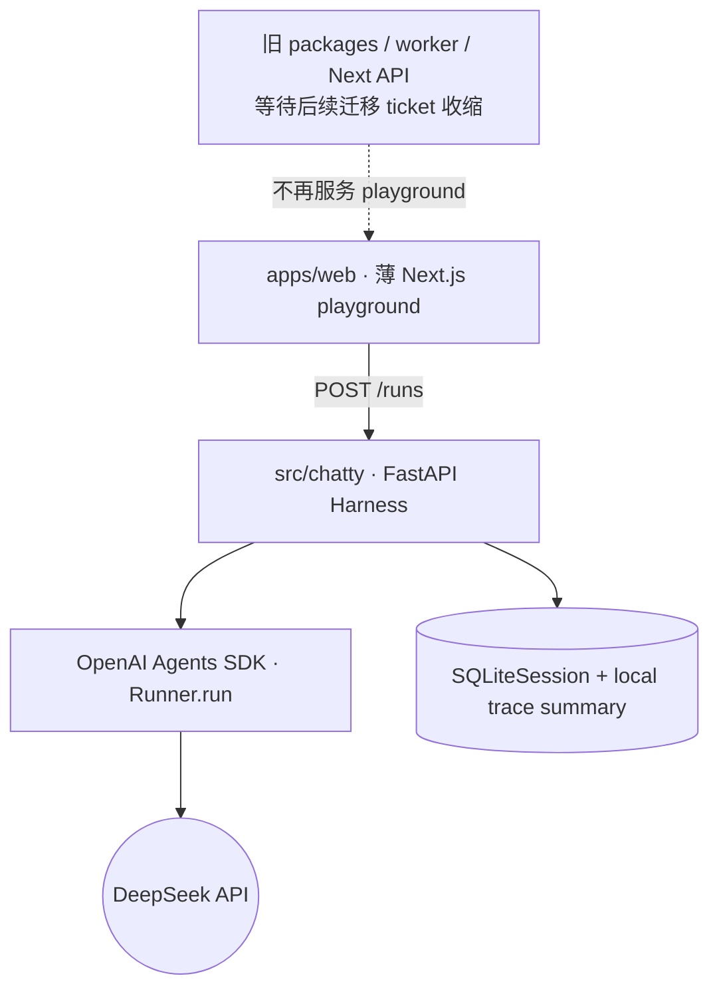
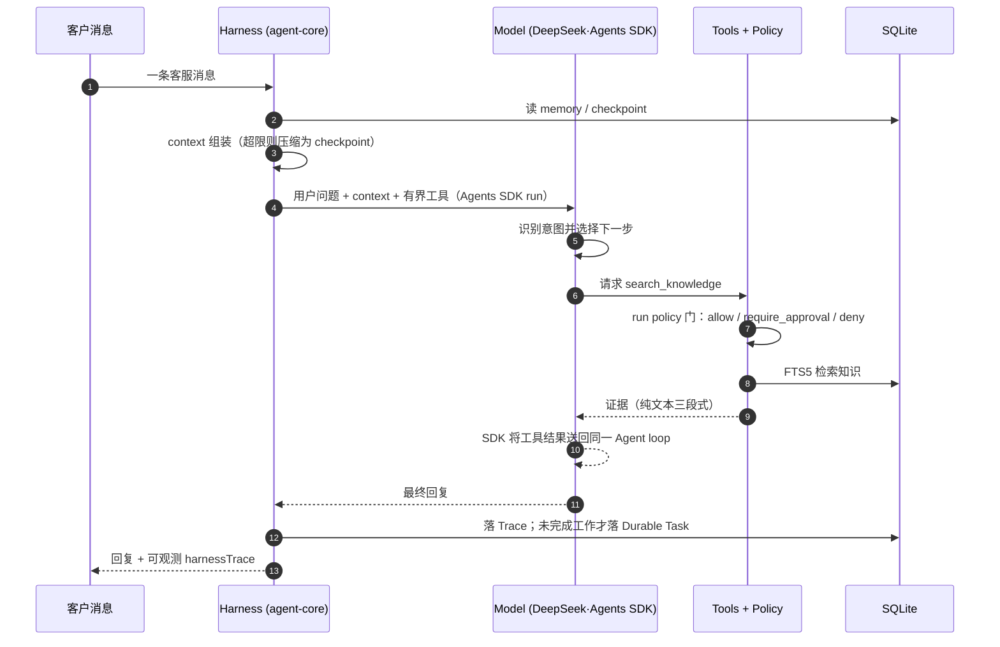

<p align="center"><strong>Chatty</strong></p>
<p align="center">
  <a href="https://github.com/ImWenyaoT/chatty/actions/workflows/ci.yml"></a>
</p>
<p align="center">简体中文 | <a href="README.en.md">English</a></p>

---

面向租赁电商客服场景的 **[agent][] [harness][]** · Python / FastAPI + 薄 Next.js · DeepSeek 驱动。项目最高层公理是 **Agent = Model + Harness**：OpenAI Agents SDK 负责 Agent Loop，Chatty Harness 负责 Context、Tools、执行边界与完成验证。[model][] 默认是 `deepseek-v4-pro`。

当前迁移纵切先证明 `playground → FastAPI → Runner.run → SQLiteSession` 的最小路径；订单、知识、Memory 和人工支持仍由后续 ticket 迁移，不在这个纵切中提前实现。

- **任务终点 + 回归评测** — 从客服高频任务定义终点(回复 · 查知识 · 查库存 · 转人工 · 跟进);golden 场景 + LLM judge 做回归,把偏题回复、工具漏调、动作误判沉淀为固定测试集。
- **Agentic 检索,不做 RAG** — 政策/费用/租期/售后等事实走 `search_knowledge` [tool call][] over SQLite FTS5:top-3 命中、有界 tool loop、query 去重、证据回填 [context][] 做核验——无 RAG pipeline、无 vector database。
- **真实业务闭环** — SQLite 保存商品、尺码数量和租赁/买断订单；库存、下单、确认、取消、Handoff 与定时跟进都通过工具产生可核验回执，而不是固定 Demo 回复。
- **有边界的长期工作** — 同步请求只留 Trace；等待客户、人工、时间或前置依赖时才创建 Durable Task。第二笔 confirmed order 后才启用来源可追溯的 Long-term Customer Memory。
- **闭环反馈** — 工具调用、审批路径与评测失败样本串成 *客服任务 → 失败归因 → prompt / 流程改动 → 回归验证*,让 agent 体验问题可追踪、可修正、可验证。

## 快速开始

```bash
cp .env.example .env
uv sync --locked
uv run --env-file .env python main.py  # FastAPI：http://127.0.0.1:8000

# 另一个终端
pnpm install --frozen-lockfile
pnpm dev                            # playground：http://127.0.0.1:3000
```

运行配置只有 `OPENAI_API_KEY`、`OPENAI_BASE_URL` 和 `MODEL_ID`。示例默认使用 DeepSeek OpenAI-compatible Chat Completions、`deepseek-v4-pro`、关闭 thinking 且不启用 streaming；缺少 key 时 Run API 明确返回 503。Session 与本地 trace 摘要保存在 `data/chatty.sqlite`。

```bash
UV_CACHE_DIR=.cache/uv uv run ruff format --check .
UV_CACHE_DIR=.cache/uv uv run ruff check .
UV_CACHE_DIR=.cache/uv uv run ty check
UV_CACHE_DIR=.cache/uv uv run pytest -q

# 有现成凭据时才运行真实 DeepSeek no-Tool contract
UV_CACHE_DIR=.cache/uv uv run pytest -q --run-deepseek tests/test_deepseek_contract.py
```

## Monorepo

根 Python 应用是新的 Agent 运行入口；`apps/web` 的 playground 只调用 FastAPI 并展示 messages、loading、error、`session_id` 与 `trace_id`。旧 TypeScript 后端仍暂存于仓库，待父 spec 的后续收缩 ticket 在可见行为被覆盖后删除。



| 路径 | 作用 |
| --- | --- |
| [`src/chatty`](src/chatty) | FastAPI、Agent 配置、SDK Run 与本地 trace 摘要 |
| [`tests`](tests) | FastAPI + disposable SQLite + 可控 SDK Model 的高层 seam |
| [`apps/web`](apps/web) | 调用 FastAPI 的薄 playground；其他保留页暂未迁移 |
| `packages/*`、`scripts/worker.mts` | 旧 TypeScript 后端，等待后续 ticket 删除 |

## 质量门禁

Python 门禁是 locked sync、Ruff、ty、pytest 与真实 FastAPI 进程 smoke；web 门禁是 frozen pnpm install、测试、typecheck 和 production build。旧 TypeScript 全套门禁在收缩 ticket 完成前仍继续运行。

## 核心能力

以下是父 spec 的目标能力；当前纵切只实现无 Tool 的 Agent Run、Session continuity 与最小 local trace。

一条消息 = 一个有界 [turn][]。Model 读取 [context][] 并选择下一步工具；[harness][] 不预先替 Model 做意图分类，只掌控可见工具、可信身份、权限、执行、预算与完成验证。



### task scheduling

Model 在 Harness 暴露的有界业务工具中识别意图并选择下一步；Harness 不用关键词或正则替 Model 预先分类。Harness 仍控制工具 schema、权限、业务不变量、最大 turns 和完成验证。

### loop 和流程控制

一个由 OpenAI Agents SDK 承载的有界 loop：Model 选择工具，SDK 执行 model → tool → result → model，Harness 负责最大 turns、权限、业务不变量与完成验证。缺 key、provider、输出校验失败都保持显式错误，绝不伪装成回复。

### input 拼接 prompt

[context][] 由 [memory][memory system] + 检索知识 + 上一个 checkpoint 拼成,超 [token][] 预算则 [compaction][] 成新 checkpoint。

### 执行器 executor

每次 [tool call][] 过 allow / require_approval / deny [permission][permission mode] 门。普通库存与订单操作由 SQLite 事务完成；需要授权、人工判断或安全恢复耗尽时，Harness 强制创建同形态的 Durable Handoff。

## tool calling

Harness 把当前客服 Agent 可用的最小业务工具集作为 Agents SDK function [tool][] 暴露，由 Model 根据上下文选择。`search_knowledge` 查询卖家验证知识；`check_availability` 与订单工具读写 SQLite；`create_handoff` / `schedule_followup` 创建 Durable Task。这里没有 [MCP][]、[skill][skill] 或 multi-agent 协议。

## 数据说明

本仓库开源,但业务源自真实店铺:真实客户信息与店铺隐私数据一律不入库,示例统一用占位符(示例租衣店 / 18800000000)。约定见 [AGENTS.md](AGENTS.md)。

## 许可

以 [MIT](LICENSE) 许可发布。

<!-- AI coding dictionary (https://www.aihero.dev/ai-coding-dictionary) —— 这些词保持英文并链接，不翻译。 -->
[agent]: https://www.aihero.dev/ai-coding-dictionary/agent
[harness]: https://www.aihero.dev/ai-coding-dictionary/harness
[model]: https://www.aihero.dev/ai-coding-dictionary/model
[context]: https://www.aihero.dev/ai-coding-dictionary/context
[memory system]: https://www.aihero.dev/ai-coding-dictionary/memory-system
[session]: https://www.aihero.dev/ai-coding-dictionary/session
[turn]: https://www.aihero.dev/ai-coding-dictionary/turn
[compaction]: https://www.aihero.dev/ai-coding-dictionary/compaction
[token]: https://www.aihero.dev/ai-coding-dictionary/token
[tool]: https://www.aihero.dev/ai-coding-dictionary/tool
[tool call]: https://www.aihero.dev/ai-coding-dictionary/tool-call
[permission mode]: https://www.aihero.dev/ai-coding-dictionary/permission-mode
[cache tokens]: https://www.aihero.dev/ai-coding-dictionary/cache-tokens
[MCP]: https://www.aihero.dev/ai-coding-dictionary/mcp
[skill]: https://www.aihero.dev/ai-coding-dictionary/skill
