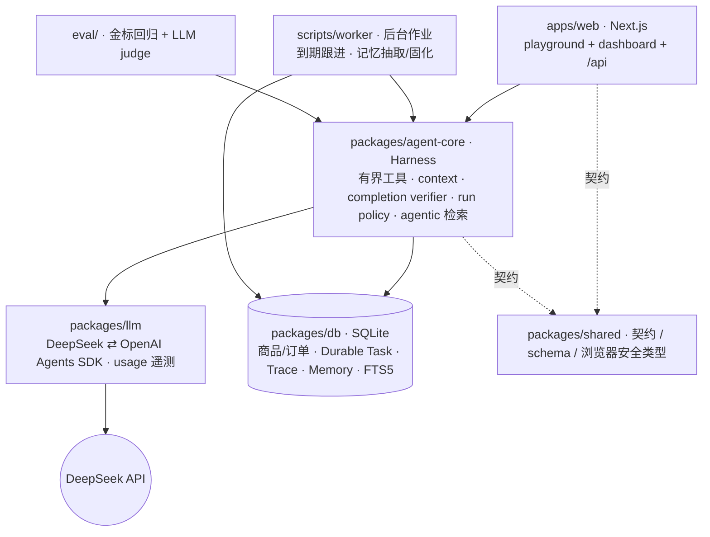
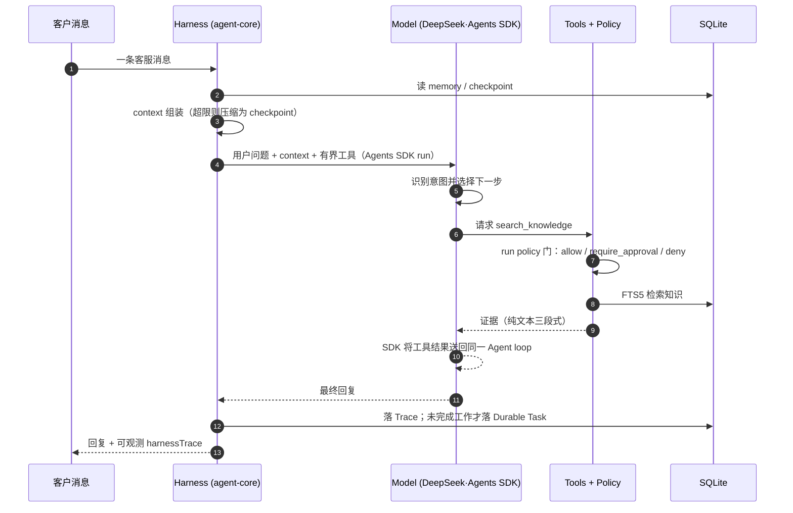

<p align="center"><strong>Chatty</strong></p>
<p align="center">
  <a href="https://github.com/ImWenyaoT/chatty/actions/workflows/ci.yml"></a>
</p>
<p align="center">简体中文 | <a href="README.en.md">English</a></p>

---

面向租赁电商客服场景的 **[agent][] [harness][]** · TypeScript / Node.js · DeepSeek 驱动。围绕一个问题——*一轮客服如何算完成、算做对*——把 Model 驱动的任务选择、[context][]、知识检索、tool use、风险审批与人工接管设计成可评测、可复盘的闭环。[model][] 固定为 `deepseek-v4-pro`，[harness][] 才是可演进的部分。

- **任务终点 + 回归评测** — 从客服高频任务定义终点(回复 · 查知识 · 查库存 · 转人工 · 跟进);golden 场景 + LLM judge 做回归,把偏题回复、工具漏调、动作误判沉淀为固定测试集。
- **Agentic 检索,不做 RAG** — 政策/费用/租期/售后等事实走 `search_knowledge` [tool call][] over SQLite FTS5:top-3 命中、有界 tool loop、query 去重、证据回填 [context][] 做核验——无 RAG pipeline、无 vector database。
- **真实业务闭环** — SQLite 保存商品、尺码数量和租赁/买断订单；库存、下单、确认、取消、Handoff 与定时跟进都通过工具产生可核验回执，而不是固定 Demo 回复。
- **有边界的长期工作** — 同步请求只留 Trace；等待客户、人工、时间或前置依赖时才创建 Durable Task。第二笔 confirmed order 后才启用来源可追溯的 Long-term Customer Memory。
- **闭环反馈** — 工具调用、审批路径与评测失败样本串成 *客服任务 → 失败归因 → prompt / 流程改动 → 回归验证*,让 agent 体验问题可追踪、可修正、可验证。

## 快速开始

```bash
pnpm install --frozen-lockfile
pnpm dev      # Next.js playground（apps/web）
pnpm test     # 全 workspace 单测
pnpm smoke    # 核心数据链路冒烟，无网络
pnpm eval     # 金标回归（需真实 DeepSeek key）
```

运行 playground 前配置 `OPENAI_API_KEY`(DeepSeek 的 OpenAI-format key),否则消息接口返回 503。状态默认持久化到 `data/chatty.sqlite`;改路径设 `CHATTY_DB_PATH`。

## Monorepo

`apps/web` 只做展示与 HTTP 适配,价值在 `agent-core` 这层 [harness][];[model][] 与持久化都是可替换的依赖。



| 路径 | 作用 |
| --- | --- |
| [`packages/agent-core`](packages/agent-core) | harness 核心：有界工具、[context][]、run policy、tool execution、completion verification |
| [`packages/llm`](packages/llm) | DeepSeek 的 Agents SDK 适配 + usage 遥测([cache tokens][]、成本) |
| [`packages/db`](packages/db) | SQLite:[session][] / trace / [memory][memory system] / knowledge(FTS5) |
| [`packages/shared`](packages/shared) | 跨包类型、schema 与浏览器安全契约 |
| [`apps/web`](apps/web) | Next.js playground + dashboard |
| [`eval/`](eval) | 金标回归 + LLM judge |

## 质量门禁

`test` / `test:fullstack` / `test:coverage` / `test:coverage:core` / `smoke` / `typecheck` / `lint` 在每个 PR 与 `main` 上由 [CI](.github/workflows/ci.yml) 跑;full-stack 门覆盖真实 Next API、SQLite 与 worker 的联调。真实 LLM 的金标回归是手动 workflow([`eval.yml`](.github/workflows/eval.yml))。`v*` tag 会构建 standalone server、以持久 SQLite 路径做 `/api/health` 冒烟,并发布可运行的 [release](.github/workflows/release.yml)。命令以根 [`package.json`](package.json) 为真相源。

## 核心能力

一条消息 = 一个有界 [turn][]。Model 读取 [context][] 并选择下一步工具；[harness][] 不预先替 Model 做意图分类，只掌控可见工具、可信身份、权限、执行、预算与完成验证。



### task scheduling

Model 在 Harness 暴露的有界业务工具中识别意图并选择下一步；Harness 不用关键词或正则替 Model 预先分类。Harness 仍控制工具 schema、权限、业务不变量、最大 turns 和完成验证。

### loop 和流程控制

一个由 OpenAI Agents SDK 承载的有界 loop：Model 选择工具，SDK 执行 model → tool → result → model，Harness 负责最大 turns、权限、业务不变量与完成验证。缺 key、provider、输出校验失败都保持显式错误，绝不伪装成回复。

### input 拼接 prompt

[context][] 由 [memory][memory system] + 检索知识 + 上一个 checkpoint 拼成,超 [token][] 预算则 [compaction][] 成新 checkpoint。

### 执行器 executor

每次 [tool call][] 过 allow / require_approval / deny [permission][permission mode] 门。普通库存与订单操作由 SQLite 事务完成；需要授权、人工判断或安全恢复耗尽时，Harness 强制创建同形态的 Durable Handoff。

## tool calling

Harness 把当前客服 Agent 可用的最小业务工具集作为 Agents SDK function [tool][] 暴露，由 Model 根据上下文选择。`search_knowledge` 查询卖家验证知识；`check_availability` 与订单工具读写 SQLite；`create_handoff` / `schedule_followup` 创建 Durable Task。这里没有 [MCP][]、[skill][skill] 或 multi-agent 协议。

## 数据说明

本仓库开源,但业务源自真实店铺:真实客户信息与店铺隐私数据一律不入库,示例统一用占位符(示例租衣店 / 18800000000)。约定见 [AGENTS.md](AGENTS.md)。

## 许可

以 [MIT](LICENSE) 许可发布。

<!-- AI coding dictionary (https://www.aihero.dev/ai-coding-dictionary) —— 这些词保持英文并链接，不翻译。 -->
[agent]: https://www.aihero.dev/ai-coding-dictionary/agent
[harness]: https://www.aihero.dev/ai-coding-dictionary/harness
[model]: https://www.aihero.dev/ai-coding-dictionary/model
[context]: https://www.aihero.dev/ai-coding-dictionary/context
[memory system]: https://www.aihero.dev/ai-coding-dictionary/memory-system
[session]: https://www.aihero.dev/ai-coding-dictionary/session
[turn]: https://www.aihero.dev/ai-coding-dictionary/turn
[compaction]: https://www.aihero.dev/ai-coding-dictionary/compaction
[token]: https://www.aihero.dev/ai-coding-dictionary/token
[tool]: https://www.aihero.dev/ai-coding-dictionary/tool
[tool call]: https://www.aihero.dev/ai-coding-dictionary/tool-call
[permission mode]: https://www.aihero.dev/ai-coding-dictionary/permission-mode
[cache tokens]: https://www.aihero.dev/ai-coding-dictionary/cache-tokens
[MCP]: https://www.aihero.dev/ai-coding-dictionary/mcp
[skill]: https://www.aihero.dev/ai-coding-dictionary/skill
