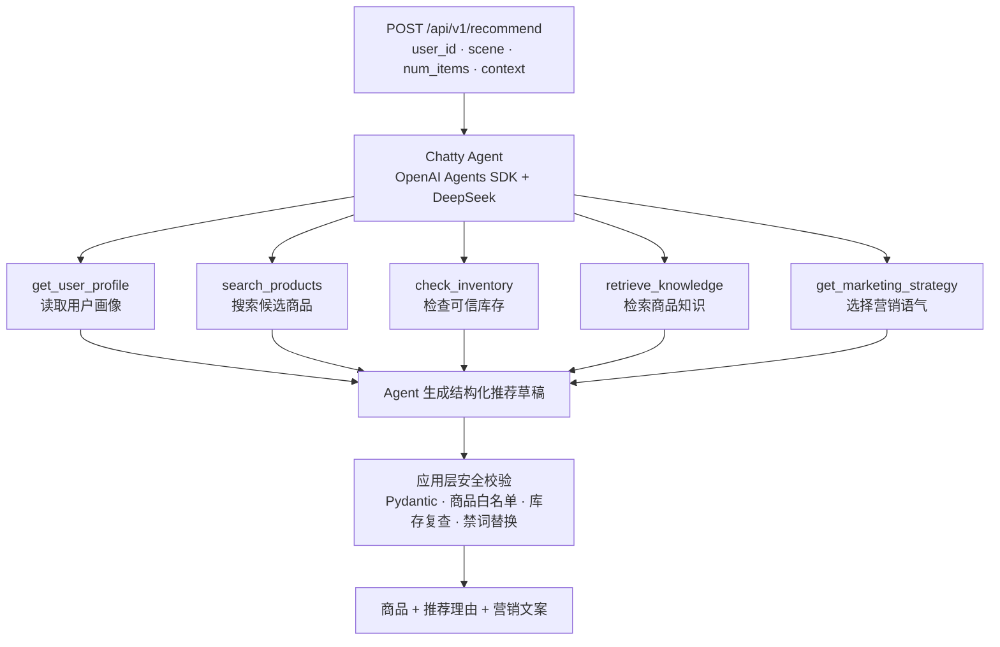
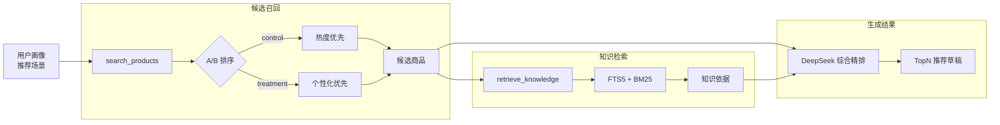

# 🛒 Chatty 单 Agent 电商推荐与营销系统

> **面向小白的 AI Agent 求职项目**：用一个 Agent 完成用户画像、商品推荐、库存校验、知识检索和营销文案生成。

[](pyproject.toml)
[](https://openai.github.io/openai-agents-python/)
[](https://fastapi.tiangolo.com/)
[](LICENSE)

## 📖 目录

1. [这个项目是什么？](#-这个项目是什么)
2. [系统架构（看图秒懂）](#-系统架构看图秒懂)
3. [四大核心能力详解](#-四大核心能力详解)
4. [技术栈](#-技术栈)
5. [关键代码展示](#-关键代码展示)
6. [快速上手运行](#-快速上手运行)
7. [API 接口文档](#-api-接口文档)
8. [项目文件结构](#-项目文件结构)
9. [配套文档](#-配套文档)
10. [面试八股文精选](#-面试八股文精选)
11. [简历写法（直接复制）](#-简历写法直接复制)

## 🤔 这个项目是什么？

### 用一句话解释

> Chatty 让一个 AI Agent 查询用户和商品数据、过滤缺货商品、检索商品知识，再生成个性化推荐理由与营销文案。

### 它解决了什么问题？

| 痛点 | 常见做法 | Chatty 的做法 |
|---|---|---|
| 推荐结果和库存脱节 | 模型直接推荐商品 | 返回前重新查询库存，自动剔除缺货商品 |
| 推荐理由缺少依据 | 模型根据常识自由生成 | 通过 SQLite FTS5 检索商品知识 |
| 营销文案千篇一律 | 所有用户使用同一段文案 | 按 5 类用户画像选择营销语气 |
| Demo 架构过重 | 多个 Agent 加多个外部服务 | 一个 Agent、五个 Tool、一个 SQLite 文件 |

### 技术关键词（面试常考）

`Single Agent` · `Tool Calling` · `OpenAI Agents SDK` · `RAG` · `SQLite FTS5` · `Pydantic` · `FastAPI` · `A/B Testing`

## 🏗 系统架构（看图秒懂）



Chatty 不拆分子 Agent。一个 Agent 使用 5 个 Tool 完成用户画像、商品推荐、营销文案和库存决策四大核心能力。其中商品推荐包含商品搜索和知识检索两个 Tool。

## 🔧 四大核心能力详解

### 能力 1：用户画像

**文件**：[`src/chatty/tools.py`](src/chatty/tools.py)、[`src/chatty/catalog.py`](src/chatty/catalog.py)

**它做什么？**

读取用户的演示画像，再合并当前请求中的浏览、购买、类目和价格偏好，供后续推荐使用。

**核心逻辑（简化）**：

```python
# Step 1：从 SQLite 读取演示用户画像
base_profile = catalog.profiles.get(user_id)
# 返回: {"segment": "price_sensitive", "preferred_categories": ["耳机", "配件"]}

# Step 2：合并本次请求携带的实时偏好
profile = catalog.user_profile(
    request.user_id,
    request.context,
)
# 请求中的类目、价格、浏览和购买记录会覆盖默认画像

# Step 3：保存到 Agent Run Context，供后续 Tool 复用
context.profile = profile
# 输出: 经过 Pydantic 校验的 UserProfile
```

**关键技术**：

- SQLite `user_profiles` 表保存五类演示用户
- 请求 Context 覆盖默认画像，不修改原始数据
- Pydantic `UserProfile` 校验画像结构

### 能力 2：商品推荐

**文件**：[`src/chatty/tools.py`](src/chatty/tools.py)、[`src/chatty/catalog.py`](src/chatty/catalog.py)、[`src/chatty/retrieval.py`](src/chatty/retrieval.py)

**它做什么？**

先按类目、价格和标签搜索候选商品，再检索相关商品知识。Agent 根据用户画像、候选商品和知识证据选择最终商品。

**推荐流程**：



**关键技术**：

- `search_products` Tool 完成候选商品搜索
- `retrieve_knowledge` Tool 使用 SQLite FTS5 + BM25 完成轻量 RAG
- A/B 分组对比热度优先与个性化优先排序

### 能力 3：营销文案

**文件**：[`src/chatty/agent.py`](src/chatty/agent.py)、[`src/chatty/tools.py`](src/chatty/tools.py)、[`data/marketing_templates.json`](data/marketing_templates.json)

**它做什么？**

根据用户分群选择营销语气，再由 DeepSeek 为每个推荐商品生成推荐理由和个性化文案。

**核心逻辑（简化）**：

```python
# 5 套营销策略 × 5 类用户分群
STRATEGIES = {
    "new_user": "热情友好，突出易上手和选择成本低",
    "active": "自然有活力，结合浏览偏好和使用场景",
    "high_value": "克制有品质感，强调性能和长期价值",
    "price_sensitive": "直接务实，突出售价与性价比",
    "churn_risk": "温和召回，强调与既有兴趣的关联",
}

# Step 1：Tool 根据画像选择策略
strategy = catalog.marketing_strategy(profile.segment)

# Step 2：DeepSeek 生成推荐理由与营销文案
draft = parse_recommendation_draft(result.final_output)

# Step 3：广告法禁词过滤
FORBIDDEN_WORDS = ["最好", "第一", "最便宜", "绝对", "100%"]
safe_copy = catalog.sanitize(draft.recommendations[0].marketing_copy)
# 命中的禁词会替换为 ***，不允许模型原样输出
```

**关键技术**：

- 五类用户分群对应五套营销语气
- DeepSeek V4 Pro 通过 Chat Completions 生成文本
- Pydantic 校验 JSON，禁词表过滤广告绝对化用语

### 能力 4：库存决策

**文件**：[`src/chatty/tools.py`](src/chatty/tools.py)、[`src/chatty/repositories.py`](src/chatty/repositories.py)、[`src/chatty/catalog.py`](src/chatty/catalog.py)

**它做什么？**

查询候选商品库存，过滤缺货商品，并标记库存不超过 100 件的低库存商品。

**核心逻辑（简化）**：

```python
# 输入: Agent 选出的商品 ID ["P001", "P002", "P003"]
# 查询 SQLite 中的可信库存，不采用模型生成的库存数字
products = catalog.inventory(product_ids)

# 输出 1: 缺货商品不会进入最终推荐
available = [product for product in products if product.stock > 0]

# 输出 2: 库存不超过 100 件时添加低库存标记
low_stock = [
    product.product_id
    for product in available
    if product.stock <= 100
]

# 最终防线: Catalog.finalize() 再次校验商品存在性和库存
# 同时从 SQLite 回填商品名称、价格、库存和标签
```

**关键技术**：

- `check_inventory` Tool 从 SQLite 读取可信库存
- Agent 生成后由 Catalog 再次过滤缺货商品
- 最终价格、库存和标签统一从商品目录回填

## 🌐 技术栈

| 模块 | 技术 |
|---|---|
| Agent 框架 | OpenAI Agents SDK |
| 大模型 | DeepSeek V4 Pro，通过 OpenAI-compatible Chat Completions API 调用 |
| 数据校验 | Pydantic |
| 业务数据 | SQLite |
| 轻量 RAG | SQLite FTS5 + BM25 |
| Web API | FastAPI + Uvicorn |
| 工程工具 | uv + Ruff + ty + pytest |

项目只使用 Python，不包含 Java、Go、LangChain、LangGraph 或前端。

## 💻 关键代码展示

### 单 Agent 工具编排（核心代码）

**文件**：[`src/chatty/agent.py`](src/chatty/agent.py)

```python
async def recommend(self, request: RecommendationRequest) -> RecommendationResponse:
    started = time.perf_counter()

    # ① 请求开始时完成 A/B 分组
    group = self.metrics.assign(request.user_id)

    # ② Run Context 保存请求、商品目录、实验组和 Tool 中间结果
    context = RecommendationContext(
        request=request, catalog=self.catalog, experiment_group=group
    )

    # ③ 一个 Agent 挂载五个 Tool，不创建子 Agent 或 Handoff
    agent = Agent[RecommendationContext](
        name="Chatty",
        instructions=AGENT_INSTRUCTIONS,
        model=self._ensure_model(),
        tools=build_tools(),
    )

    # ④ Agents SDK 负责 Tool Calling 循环，最多运行 10 轮
    result = await Runner.run(
        agent, request.model_dump_json(), context=context, max_turns=10
    )

    # ⑤ 五个 Tool 必须全部调用，关键上下文不能缺失
    if set(TOOL_NAMES) != context.used_tools:
        raise RecommendationFailure("required_tools_not_used")
    if not context.knowledge:
        raise RecommendationFailure("knowledge_not_retrieved")
    if context.profile is None:
        raise RecommendationFailure("profile_not_loaded")

    # ⑥ 最终商品必须经过召回、库存检查和知识检索
    draft = parse_recommendation_draft(result.final_output)
    recommended_ids = {item.product_id for item in draft.recommendations}
    if not recommended_ids <= context.recalled_product_ids:
        raise RecommendationFailure("product_not_recalled")
    if not recommended_ids <= context.in_stock_product_ids:
        raise RecommendationFailure("inventory_not_checked")
    if not recommended_ids <= context.knowledge_product_ids:
        raise RecommendationFailure("product_not_grounded")

    # ⑦ 再用 SQLite 可信数据生成最终响应
    products = self.catalog.finalize(draft, request, context.profile, group)
```

> 💡 **小白解读**：Agent 像一个导购员，五个 Tool 是它能调用的业务能力。Run Context 相当于同一次推荐任务的工作台，避免画像、候选商品和知识证据散落在多个 Agent 之间。

---

### A/B 测试引擎（稳定分桶）

**文件**：[`src/chatty/experiments.py`](src/chatty/experiments.py)

```python
@dataclass
class ExperimentMetrics:
    experiment_id: str = "ranking_strategy"

    def assign(self, user_id: str) -> ExperimentGroup:
        # 用户 ID + 实验 ID 做 SHA-256，避免 Python hash 随进程变化
        key = f"{user_id}:{self.experiment_id}".encode()
        digest = hashlib.sha256(key).digest()

        # 奇偶分桶为两个 50% 组，同一用户始终进入同一组
        bucket = int.from_bytes(digest[:8]) % 2
        return "control" if bucket == 0 else "treatment_personalized"

    def record_outcome(self, user_id: str, success: bool) -> ExperimentGroup:
        # 服务端重新分组，不信任客户端提交的实验组
        group = self.assign(user_id)
        with self._lock:
            stats = self._groups[group]
            if success:
                stats.positive_outcomes += 1
            else:
                stats.negative_outcomes += 1
        return group
```

- **control**：按商品热度排序
- **treatment_personalized**：综合类目、价格和近期行为排序
- **线程安全**：使用 `Lock` 保护进程内指标写入

> 💡 **小白解读**：稳定分桶就像按用户身份证号固定分班。用户重复访问时不会一会儿进对照组、一会儿进实验组，因此两种排序策略才具有可比性。

---

### 结构化校验 + 业务护栏（可靠性保障）

**文件**：[`src/chatty/agent.py`](src/chatty/agent.py)、[`src/chatty/catalog.py`](src/chatty/catalog.py)、[`src/chatty/app.py`](src/chatty/app.py)

```python
# ① DeepSeek 返回文本或 Markdown JSON 时，先提取再交给 Pydantic
draft = parse_recommendation_draft(result.final_output)

# ② Catalog.finalize() 是最终业务防线
for item in draft.recommendations:
    product = products_by_id.get(item.product_id)
    if product is None:
        raise CatalogError("unknown_recommended_product")  # 拒绝虚构商品
    if product.stock <= 0:
        continue                                           # 过滤缺货商品

    recommendations.append(
        RecommendedProduct(
            product_id=product.product_id,
            price_cents=product.price_cents,               # 价格来自 SQLite
            stock=product.stock,                           # 库存来自 SQLite
            reason=sanitize(item.reason),                  # 替换广告禁词
            marketing_copy=sanitize(item.marketing_copy),
        )
    )

# ③ 不静默吞错：缺少模型配置返回 503，其余 Agent 失败返回 502
status_code = 503 if error.code == "llm_not_configured" else 502
raise HTTPException(status_code=status_code, detail=error.code)
```

> 💡 **小白解读**：模型只负责提出“推荐哪个商品、为什么推荐、怎么写文案”。商品是否存在、价格多少、有没有库存由应用层重新确认。失败时返回明确错误，而不是伪造一份看似成功的默认推荐。

## 🚀 快速上手运行

### 前置条件

- Python 3.12+
- [uv](https://docs.astral.sh/uv/)
- DeepSeek API Key

### 启动服务

```bash
git clone https://github.com/ImWenyaoT/chatty.git
cd chatty
cp .env.example .env
# 编辑 .env，填写 OPENAI_API_KEY
uv sync --locked
uv run python main.py
```

首次启动会从 `data/` 导入演示数据，并创建 `.local/chatty.db`。

### 调用推荐接口

```bash
curl -X POST http://127.0.0.1:8000/api/v1/recommend \
  -H "Content-Type: application/json" \
  -d '{
    "user_id": "user_active",
    "scene": "homepage",
    "num_items": 3,
    "context": {
      "recent_views": ["手机", "降噪"],
      "preferred_categories": ["手机", "耳机"]
    }
  }'
```

打开 [FastAPI 接口文档](http://127.0.0.1:8000/docs) 查看请求和响应模型。

## 📡 API 接口文档

| 方法 | 路径 | 说明 |
|---|---|---|
| `GET` | `/health` | 查看服务状态、模型和数据量 |
| `POST` | `/api/v1/recommend` | 生成个性化商品推荐 |
| `GET` | `/api/v1/experiments` | 查看实验分组与统计 |
| `POST` | `/api/v1/experiments/ranking_strategy/outcomes` | 记录实验结果 |
| `GET` | `/api/v1/metrics` | 查看进程内指标 |

## 📁 项目文件结构

```text
chatty/
├── data/                         # 商品、用户、营销和知识种子
├── docs/                         # 架构、代码、面试和简历文档
├── src/chatty/
│   ├── agent.py                  # Agent + Runner
│   ├── tools.py                  # 五个 Function Tool
│   ├── catalog.py                # 搜索、排序和结果校验
│   ├── database.py               # SQLite schema 与连接
│   ├── retrieval.py              # FTS5 + BM25 检索
│   ├── experiments.py            # 稳定分桶与指标
│   ├── models.py                 # Pydantic 模型
│   └── app.py                    # FastAPI 路由
├── tests/
├── main.py
└── pyproject.toml
```

## 📚 配套文档

| 文档 | 内容 |
|---|---|
| [系统架构](docs/architecture.md) | Agent Loop、数据流、RAG 和业务校验 |
| [代码讲解](docs/code-walkthrough.md) | 按文件读懂核心实现 |
| [项目方案](docs/project-plan.md) | 技术选型、功能范围和实施结果 |
| [面试指南](docs/interview-guide.md) | STAR 话术、八股文和追问 |
| [简历模板](docs/resume-template.md) | 初级与后端岗位写法 |
| [性能测量](docs/benchmark.md) | QPS、延迟、样本成功率和测量边界 |

## ❓ 面试八股文精选

### Q1：为什么用单 Agent？

当前流程只有一个目标和五个紧密相关的 Tool。单 Agent 能共享上下文，也避免额外的编排与状态同步。

### Q2：RAG 怎么实现？

知识文档写入 SQLite FTS5。Agent 调用 `retrieve_knowledge` 后，系统执行全文检索和 BM25 排序，再把 Top-K 文档返回模型。

### Q3：怎么防止模型幻觉？

模型只提交商品 ID 和生成文本。价格、库存和标签由应用层从 SQLite 重新读取。

更多问题见 [面试指南](docs/interview-guide.md)。

## 📋 简历写法（直接复制）

> **Chatty｜单 Agent 电商推荐与营销系统**
> Python / OpenAI Agents SDK / DeepSeek V4 Pro / FastAPI / SQLite FTS5
>
> - 基于 OpenAI Agents SDK 实现单 Agent 推荐流程，自主调用用户画像、商品搜索、库存校验、知识检索和营销策略 5 个 Tool
> - 使用 SQLite 管理 20 个商品、5 类用户画像与库存数据，基于 FTS5 + BM25 实现轻量 RAG
> - 使用 Pydantic 和应用层白名单校验模型输出，拒绝未知商品并过滤缺货商品
> - 实现 SHA-256 稳定实验分桶、进程内指标与 FastAPI 推荐接口，使用 30 个测试覆盖核心流程

这是本地 API Demo。数据和指标均为演示用途，不代表真实业务收益。

## 🔗 参考资料与致谢

- [OpenAI Agents SDK](https://openai.github.io/openai-agents-python/)
- [multi-agent-ecommerce-system](https://github.com/bcefghj/multi-agent-ecommerce-system)：业务场景和文档结构参考

## 📄 License

[MIT](LICENSE)
