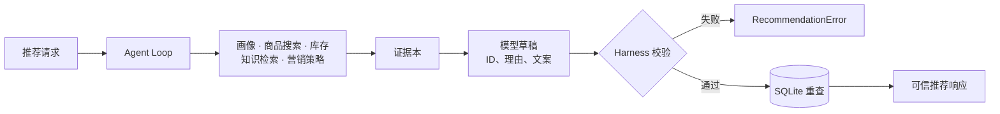

# 🛒 Chatty

Chatty 是面向电商推荐与营销的单 Agent 演示。它让模型理解需求、选择候选商品并生成理由与文案；
程序通过 Tool、SQLite 和 Harness 保证商品、价格、库存等业务事实可信。

`OpenAI Agents SDK` · `SQLite FTS5` · `Pydantic` · `uv` · `Ruff` · `ty`

## 工作流与 Agent 设计

Chatty 的重点不是让模型“记住”商品数据，而是将模型的概率性判断限制在推荐与表达，
将可验证的业务规则写成代码。一次推荐使用五个只读 Tool，Harness 记录工具证据，
只有满足全部校验的模型草稿才能被 SQLite 回填为最终响应。


```mermaid
flowchart LR
    U["推荐请求"] --> A["Agent Loop"]
    A --> T["画像 · 商品搜索 · 库存\n知识检索 · 营销策略"]
    T --> E["证据本"]
    E --> D["模型草稿\nID、理由、文案"]
    D --> V{"Harness 校验"}
    V -->|"失败"| F["RecommendationError"]
    V -->|"通过"| DB[("SQLite 重查")]
    DB --> R["可信推荐响应"]
```

| 层次 | 职责 |
|---|---|
| OpenAI Agents SDK | 定义 Agent、Tool Schema 与 Agent Loop，处理模型和工具调用编排 |
| Harness | 记录证据、限制轮次、校验工具依赖与推荐依据、映射稳定错误码 |
| Catalog / SQLite | 查询商品与库存、检索知识、回填真实字段、过滤禁词 |

五个 Tool 都必须被调用；真实依赖保持“画像 → 搜索 → 库存”的偏序，知识检索和营销策略
可换序。允许换条件重搜或补充检索；同参数第 4 次调用会被阻止，避免无效循环。

最终要求推荐商品同时属于“搜索召回、库存确认、知识依据”三组证据；否则明确失败，
不返回看似成功的降级结果。商品名称、价格、库存和标签均从 SQLite 重查，模型只提供理由与文案。

## 关键实现取舍

- **SQLite 是运行时事实源，JSON/JSONL 是种子。** 六份可读种子在启动时事务性导入 SQLite；
  运行时用 SQL 筛选商品、查库存，用 FTS5 检索知识。它不是多 Agent 共享层，也不是数仓。
- **轻量 RAG 使用稀疏检索。** 52 篇知识文档切为 85 个块，以 SQLite FTS5 + BM25 检索；
  类目与商品 ID 先缩小范围，再以同义词扩展查询。小规模、领域明确时，这比引入 embedding
  和向量库更简单、可解释；规模扩大或表达高度自由时应升级为稠密或混合检索。
- **中文索引两侧按字切分。** FTS5 的 `unicode61` 不会自然切分无空格中文；索引与查询都按字
  切分，展示给模型的仍是原文。长文档按句子切为约 160 字、重叠 40 字，减少无关上下文。
- **业务正确性不依赖提示词。** 模型可能编造 ID 或不遵守 JSON 格式，因此代码分别验证证据、
  解析 JSON、重读数据库并过滤营销禁词。

| 指标 | 结果与口径 |
|---|---|
| 检索 | 10 条标注查询上，`recall@5 = 100%`（Top-5 至少命中一条相关知识），`MRR = 0.7833` |
| 端到端评测 | 18 条基础、多约束、陷阱任务各运行 3 次：53 / 54 单次通过（98%），17 / 18 任务 Pass^3（94%） |
| 消融对照 | 同模型、同任务下移除 Tool 与 Harness：52 个推荐实例中 42 个不存在、5 个超预算，错误率约 90%；完整链路在这些硬规则上为 0 |

这些是小规模合成数据上的工程验证：它们说明 Harness 能否守住业务约束，
不代表真实电商推荐质量或统计显著性。

## 能力边界

- Chatty 是单 Agent 推荐系统；用户画像、商品搜索、库存检查、知识检索和营销策略都是 Tool。
- 入口是 `Recommender.recommend()`（单轮）与 `chatty.conversation.Conversation`（信息不足时先澄清）；没有 HTTP 服务或前端。会话之间互不记忆，不是客服式长期对话。
- 不使用向量库或 LLM-as-a-Judge：前者在当前规模下没有必要，后者无法替代可由 SQL 验证的业务事实。
- SQLite 适合本地 demo、测试隔离和读多写少场景，不适合高并发、多进程写入或海量数仓分析。

## 项目简介（精简版）

Chatty 是一个基于 OpenAI Agents SDK 的单 Agent 电商推荐与营销项目。模型通过五个只读 Tool
获取用户画像、商品、库存、知识和营销规则；SQLite 保存业务事实，FTS5 完成轻量 RAG；
Harness 校验工具调用和商品证据，并在响应前从数据库回填价格、库存和商品信息。项目通过
确定性测试、检索指标和移除 Tool/Harness 的消融实验，验证模型不能直接决定业务事实。

## 技术栈

- Python 3.13+、uv、Pydantic
- OpenAI Agents SDK、OpenAI-compatible Chat Completions API
- SQLite、SQLite FTS5、BM25
- Ruff、ty、pytest

## 启动

需要 Python 3.13+ 与 [uv](https://docs.astral.sh/uv/)。

```bash
git clone https://github.com/ImWenyaoT/chatty.git
cd chatty
cp .env.example .env
# 编辑 .env，填写 OPENAI_API_KEY
uv sync

uv run python demo.py                  # 交互模式
uv run python demo.py 家电 user_budget  # 单次推荐
```

交互模式可直接输入“想买个降噪耳机，2000 以内”。输入适配器会解析类目与价格区间；
推荐结果中的 ID、名称、价格与库存均来自 SQLite 重查。

`/` 开头是命令，`/help` 列出全部：`/user <id>` 换身份问同一个需求，能看出画像对结果的影响；
`/1`…`/4` 直接跑预设需求。四条预设里有两条**刻意不会成功**——一条条件太紧、应当返回
`invalid_recommendation` 而不是硬凑，一条需求太模糊、可能先反问再推荐。只看成功用例
看不出 Harness 在做什么。

## 配置

`.env` 只用于本地配置；已导出的环境变量优先。

| 环境变量 | 默认值 | 说明 |
|---|---|---|
| `OPENAI_API_KEY` | 空 | 真实模型调用必填 |
| `OPENAI_BASE_URL` | `https://api.deepseek.com` | OpenAI-compatible Endpoint |
| `MODEL_ID` | `deepseek-v4-flash` | 调用模型 |
| `CHATTY_AGENT_DEBUG` | 关闭 | 设为 `1` 时记录 Agent 运行轨迹 |

## 评测与质量门禁

```bash
uv run python -m evals --level L1     # 基础任务
uv run python -m evals                # 全量 18 条；调用真实模型
uv run python -m evals --repeat 3     # Pass^3
uv run python -m evals --retrieval    # 仅检索，不调用模型
uv run python -m evals --ablation     # 完整 Agent 与裸模型对照

uv run ruff check .
uv run ty check
uv run pytest -q
```

109 项测试使用脚本化模型，不联网、不产生费用，验证 Harness 契约；真实模型评测衡量的是
概率性行为，两者不能互相替代。

## 目录

```text
data/             可读 JSON/JSONL 种子数据
src/chatty/       数据库、查询、Tool、Agent Loop 与 Harness
evals/            任务集、评分、检索指标与消融实验
tests/            Harness 与评估框架测试
docs/             领域词汇与协作规范
```

## License

[MIT](LICENSE)
