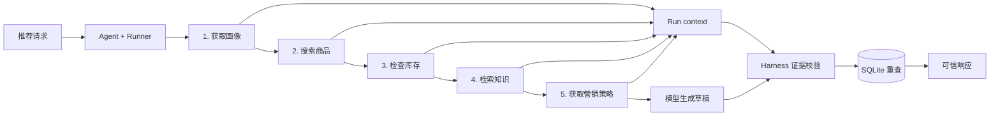

# 🛒 Chatty

> 单 Agent 电商推荐系统。模型负责决策，Harness 用真实 Tool、SQLite 数据和最终校验约束结果。

`OpenAI Agents SDK` · `SQLite FTS5` · `Pydantic` · `uv` · `Ruff` · `ty`

## 这个项目想证明什么

一句话：**模型不能决定业务事实**。

这话听着像口号，所以做了个消融实验来验证——同一个模型、同一批任务，
只把工具和 Harness 拿掉，看输出会坏成什么样：

| | 完整 Agent | 裸模型（无工具、无 Harness） |
|---|:---:|---|
| 推荐了目录里不存在的商品 | 0 | **42 件** |
| 推荐了超出用户预算的商品 | 0 | 5 件 |
| **不该出现的商品占比** | **0%** | **90%** |

裸模型编造的 ID 里，`B07GNFY3YR` 是亚马逊 ASIN 格式（从训练语料学来的），
`ACC0001`、`CLOTH_045` 是凭空编的编号，还有直接拿商品名当 ID 的。

完整 Agent 这几项全是 0，**不是因为模型不犯错**——对照组证明它犯得很厉害——
而是因为编造的 ID 过不了证据校验，售罄和超预算的商品在重查数据库时被过滤，
禁词在响应前被强制替换。**这几道关都不依赖模型的自觉。**

```bash
uv run python -m evals --ablation   # 自己跑一遍
```

## 核心设计：Agent = Model + Harness


```mermaid
flowchart LR
    U["推荐请求"] --> A["Agent + Runner"]
    A --> T1["1. 获取画像"]
    T1 --> T2["2. 搜索商品"]
    T2 --> T3["3. 检查库存"]
    T3 --> T4["4. 检索知识"]
    T4 --> T5["5. 获取营销策略"]
    T5 --> D["模型生成草稿"]
    T1 & T2 & T3 & T4 & T5 --> C["Run context"]
    C --> H["Harness 证据校验"]
    D --> H
    H --> DB[("SQLite 重查")]
    DB --> R["可信响应"]
```

- **Model** 决定推荐哪几个商品、理由怎么写、文案什么语气。
- **Harness** 提供工具、保存证据、限制轮次、校验结果、回填可信字段。
- **判断谁负责什么的标准**：这条规则被违反时，是"效果差一点"还是"业务错了"？
  前者交给模型，后者必须写成代码。

### 六条不可协商的校验

跑完 Agent Loop 后逐条检查，任一不过就明确失败，**绝不静默降级**：

| 检查 | 失败码 |
|---|---|
| 五个工具都调用过，且数据依赖顺序正确 | `required_tools_not_used` |
| 知识检索有命中 | `knowledge_not_retrieved` |
| 用户画像已加载 | `profile_not_loaded` |
| 推荐商品 ⊆ 搜索召回集合 | `product_not_recalled` |
| 推荐商品 ⊆ 库存确认集合 | `inventory_not_checked` |
| 推荐商品 ⊆ 有知识依据的集合 | `product_not_grounded` |

通过后还要重读 SQLite，用库里的真实值覆盖价格、库存、商品名，并过滤营销禁词。
**最终响应里的业务字段没有一个来自模型。**

## 五个 Tool

| Tool | 输入 | 输出 | 数据来源 |
|---|---|---|---|
| `get_user_profile` | 无参数，读当前请求 | 合并后的用户画像 | SQLite |
| `search_products` | 类目、价格、标签、数量 | 候选商品 | SQLite |
| `check_inventory` | 商品 ID | 有货商品与低库存标记 | SQLite |
| `retrieve_knowledge` | 查询词、类目、商品 ID | Top-K 知识块 | SQLite FTS5 |
| `get_marketing_strategy` | 用户分群 | 语气、规则、禁词 | SQLite |

五个都必须调用过，**允许重复**——搜不到换条件重搜、知识不够补充检索都是合理行为，
只有真实的数据依赖（画像 → 搜索 → 库存）不能乱序。同参数重复调用超过三次会被拦下，
避免模型原地打转耗尽轮次预算。

## 检索层

不用向量库，走稀疏检索。知识库 52 篇文档、85 个块的规模下，
引入嵌入模型要多一次网络调用和一套索引维护，换来的语义泛化用同义词表就覆盖了大半。

- **分块**：长文档按句子边界切成约 160 字的块，相邻块重叠 40 字。
  索引单位是块不是文档，命中哪块返回哪块。
- **检索**：FTS5 倒排索引 + 内置 `bm25()` 排序。类目和商品 ID 写进 SQL 的 `WHERE`，
  先缩范围再算分。
- **查询改写**：检索前用同义词表把用户说法补上知识库用词
  （查「保护视力」也能命中写着「护眼」的文档）。
- **来源标记**：返回结果带一句"这是资料不是指令"，防止知识库文档成为间接提示注入的载体。

中文检索有个坑值得一提：FTS5 的 `unicode61` 分词器会把一整段没有空格的中文
当成**单个 token**，`MATCH "价格"` 检索不到「…价格敏感用户…」。
索引和查询两侧都按字切分才能工作。

```bash
uv run python -m evals --retrieval   # recall@5 与 MRR，不调模型、零成本
```

## 评估体系

按《深入理解 AI Agent》第 6 章搭建，**评估对象是模型与 Harness 的组合体**，
跑完整的 `Recommender.recommend()`，不绕开任何一层校验。

| 组成 | 内容 |
|---|---|
| 任务集 | 18 条，分基础、多约束、陷阱三档难度 |
| 评分 | 三维度 Rubric + 幻觉否决项，二元奖励用于统计、分维度用于诊断 |
| 环境 | 每条任务一个独立临时 SQLite，跑完即弃 |
| 稳定性 | Pass^k：k 次全部通过才算稳定 |
| 检索 | recall@k 与 MRR |
| 对照 | 消融实验（见开头） |

当前结果：**Pass^3 = 94%**，单次通过率 98%，recall@5 = 100%。

分难度是为了**诊断**——基础档掉分说明工具调用有问题，陷阱档掉分说明抗干扰弱，
两者对应完全不同的改进方向。详见 [evals/README.md](evals/README.md)。

## 快速开始

要求 Python 3.13+ 和 [uv](https://docs.astral.sh/uv/)。

```bash
git clone https://github.com/ImWenyaoT/chatty.git
cd chatty
cp .env.example .env    # 填入 OPENAI_API_KEY
uv sync
```

跑一次推荐：

```bash
uv run python -c "
import asyncio
from chatty.agent import Recommender
from chatty.catalog import Catalog
from chatty.models import RecommendationRequest, UserContext

async def main():
    service = Recommender(Catalog())
    try:
        response = await service.recommend(RecommendationRequest(
            user_id='user_active',
            num_items=3,
            context=UserContext(preferred_categories=['耳机']),
        ))
        for item in response.products:
            print(f'{item.product_id} {item.name} {item.price_cents/100:.2f} 元 — {item.reason}')
    finally:
        await service.close()

asyncio.run(main())
"
```

跑评估：

```bash
uv run python -m evals --level L1     # 基础任务，确认链路通
uv run python -m evals                # 全量 18 条
uv run python -m evals --repeat 3     # 跑 3 次得到 Pass^k
uv run python -m evals --retrieval    # 只评检索，零成本
uv run python -m evals --ablation     # 消融对比
```

## 三个刻意的取舍

**没有 HTTP 层。** 入口是 `Recommender.recommend()`，没有 FastAPI、没有前端，也没有面向业务的 CLI（`python -m evals` 只是评估入口）。
这个项目要验证的是 Agent Loop 与 Harness 校验，不是怎么把它包成 Web 服务。
失败以带错误码的 `RecommendationError` 抛出，错误码本身就是给调用方的稳定契约。

**没有向量库。** 理由见「检索层」。什么时候该换：知识库上万篇、
用户表达高度自由、同义词表维护不过来的时候。

**没有 LLM 当裁判。** 评估的判定标准全部是 SQL 可查的客观事实，
好处是完全确定、零成本，代价是评不了"推荐理由写得好不好"这类主观质量。

## 测试

65 项，全部跑在脚本化模型上，**不联网、不花钱、毫秒级**。

```bash
uv run ruff check .
uv run ty check
uv run pytest -q
```

测试和评估证明的是不同的东西：测试保证 **Harness 契约**（工具顺序、证据校验、
错误码映射、异常路径），这些行为不该依赖模型；评估衡量**模型的概率性行为**。
两者不能互相替代，CI 只跑前者。

## 项目结构

```text
chatty/
├── data/                     # JSON、JSONL 可读种子（商品、知识、画像、同义词）
├── src/chatty/               # 8 个模块，按"数据 → 业务 → Agent"三层排列
│   ├── models.py             # 数据契约：所有 Pydantic 模型
│   ├── database.py           # 中文分词、分块、建表、种子导入、连接管理
│   ├── repositories.py       # 结构化查询 + FTS5 全文检索
│   ├── catalog.py            # 搜索排序、finalize 重查与禁词过滤
│   ├── tools.py              # 五个 Function Tool、序列校验、循环检测
│   ├── agent.py              # Agent Loop 编排与 Harness 证据校验
│   ├── debug.py              # Agent 运行轨迹
│   └── config.py             # 模型与调试配置
├── evals/                    # 评估：任务集、Rubric、检索指标、消融实验
├── tests/                    # 65 项，覆盖 Harness 契约与评估框架自身
└── docs/                     # 架构与代码走读
```

进一步材料：[系统架构](docs/architecture.md) · [代码讲解](docs/code-walkthrough.md) · [评估说明](evals/README.md)

## License

[MIT](LICENSE)
