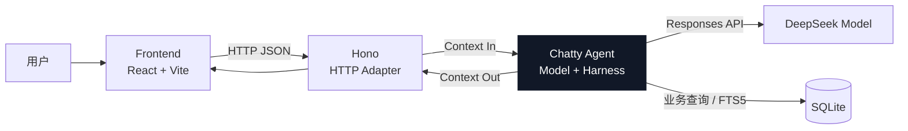
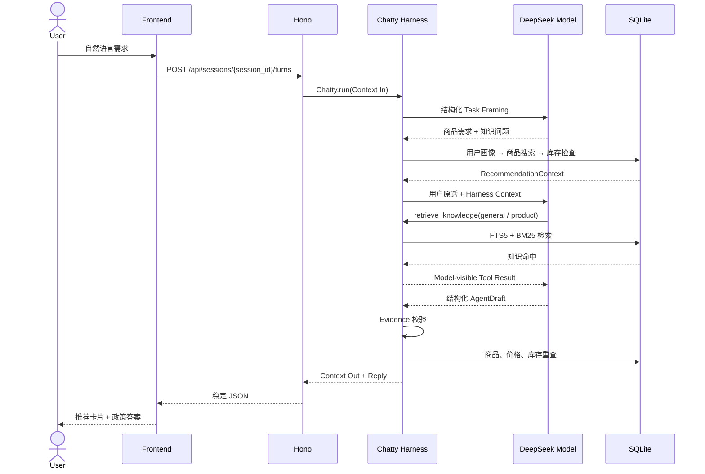
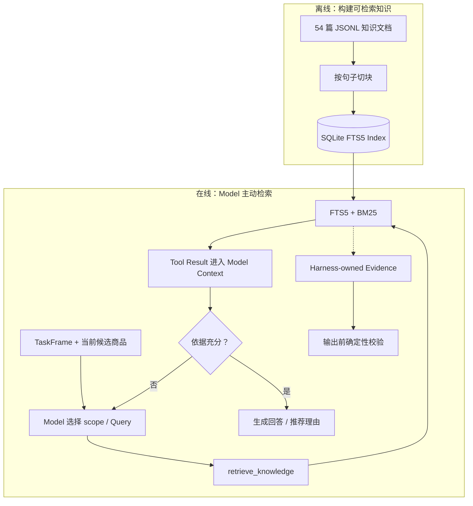
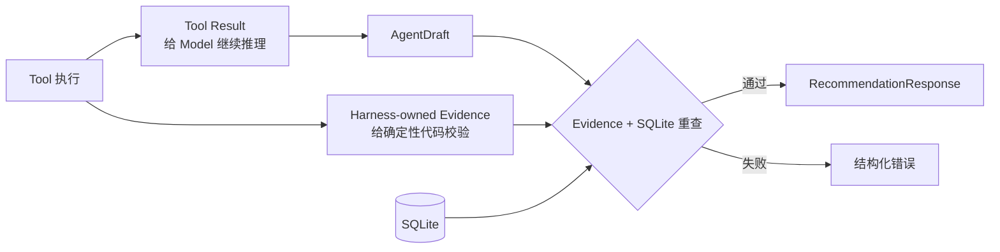

<div align="center">

# 🛒 Chatty

**面向电商推荐与政策问答的中文 Single Agent。**

<sub>Model 负责理解需求、主动检索与生成表达；Harness + SQLite 负责流程、事实与可信输出。</sub>

[](https://github.com/ImWenyaoT/chatty/actions/workflows/ci.yml)
[](apps/api/package.json)
[](https://openai.github.io/openai-agents-js/)
[](LICENSE)

[快速开始](#快速开始) · [看一次请求](#一次请求如何完成) · [理解架构](#系统架构) · [查看评估](#评估与验证) · [阅读 Chatty Book](docs/chatty-book/README.md)

</div>

---

Chatty 不是“让模型直接推荐商品”的聊天壳。它把一次请求拆成结构化需求、确定性业务准备、
Model 主导的 Tool Loop、Evidence 校验与领域输出：商品 ID、价格和库存必须来自 SQLite，
知识问答必须经过检索，模型只负责它擅长的语义理解、检索决策和自然语言表达。

> 给 Model 自由度，但不把业务事实也交给 Model。

## 效果

下面是一次真实 DeepSeek mixed-goal 请求：既推荐 300 元内耳机，也回答七天无理由退货条件。
界面同时展示理解结果、耗时、Model 请求数、Token Usage 与事实来源说明。

<a href="docs/assets/chatty-conversation.png">
  
</a>

Demo 还提供只读 SQLite 数据页。这里展示的是运行时实际查询的商品和画像，不是前端直接读取
JSON/JSONL 后伪造的数据面板。

<a href="docs/assets/chatty-catalog.png">
  
</a>

## 为什么需要 Chatty

纯 Model 推荐很容易产生三个问题：需求结构不稳定、Tool 调用失序、商品事实不可验证。
Chatty 用一条最小闭环解决它们：

| 问题 | Chatty 的处理方式 | 最终约束 |
| --- | --- | --- |
| “200 元耳机”是预算、类目还是一句普通问答？ | Task Framer 输出结构化 `TaskFrame` | 商品需求与知识问题可以同时保留 |
| 商品搜索、库存与知识检索谁先执行？ | Harness 固定业务依赖，Agent Loop 只开放需要语义判断的 Tool | 不让 Model 重复决定确定步骤 |
| Model 会不会编造商品、价格或库存？ | Harness-owned Evidence + 输出前 SQLite 重查 | 不一致直接失败，不做静默降级 |
| 政策答案有没有依据？ | Agentic RAG 主动检索，通用与商品知识分域 | 缺少检索依据时拒绝产出 |

## 系统架构

Frontend、Hono 与 Agent 的关系保持简单：Hono 是 HTTP Adapter，Chatty Agent 才拥有
Model + Harness；SQLite 只保存演示业务数据和 FTS5 知识索引。


```mermaid
flowchart LR
    User["用户"] --> Frontend["Frontend<br/>React + Vite"]
    Frontend -->|"HTTP JSON"| API["Hono<br/>HTTP Adapter"]
    API -->|"Context In"| Agent["Chatty Agent<br/>Model + Harness"]
    Agent -->|"Responses API"| DeepSeek["DeepSeek Model"]
    Agent -->|"业务查询 / FTS5"| SQLite[("SQLite")]
    Agent -->|"Context Out"| API
    API --> Frontend

    classDef agent fill:#111827,color:#fff,stroke:#111827;
    class Agent agent;
```

### 职责划分

| Module | 负责 | 不负责 |
| --- | --- | --- |
| Frontend | 收集输入，展示对话、Trace、Token 与只读数据 | 推导推荐事实 |
| Hono | HTTP 校验、Session、错误码、Reply 序列化与前端类型推导 | 调用 Tool 或决定推荐逻辑 |
| Chatty Agent | Task Framing、Agent Loop、Evidence、Context In/Out | HTTP 和页面渲染 |
| Model | 语义理解、主动检索、Query 改写、理由与文案 | 决定真实价格和库存 |
| SQLite | 商品、库存、画像、营销策略与知识索引 | 会话状态和模型生成 |

## 一次请求如何完成

以“推荐 300 元以内的耳机，并告诉我七天无理由退货条件”为例：


```mermaid
sequenceDiagram
    actor U as User
    participant F as Frontend
    participant A as Hono
    participant H as Chatty Harness
    participant M as DeepSeek Model
    participant D as SQLite

    U->>F: 自然语言需求
    F->>A: POST /api/sessions/{session_id}/turns
    A->>H: Chatty.run(Context In)
    H->>M: 结构化 Task Framing
    M-->>H: 商品需求 + 知识问题
    H->>D: 用户画像 → 商品搜索 → 库存检查
    D-->>H: RecommendationContext
    H->>M: 用户原话 + Harness Context
    M->>H: retrieve_knowledge(general / product)
    H->>D: FTS5 + BM25 检索
    D-->>H: 知识命中
    H-->>M: Model-visible Tool Result
    M-->>H: 结构化 AgentDraft
    H->>H: Evidence 校验
    H->>D: 商品、价格、库存重查
    H-->>A: Context Out + Reply
    A-->>F: 稳定 JSON
    F-->>U: 推荐卡片 + 政策答案
```

主流程中的自由度是有意分配的：

- **Harness 直接执行**：用户画像、商品搜索、库存检查；它们是确定业务步骤。
- **Model 主动决定**：何时检索、使用 `general` 还是 `product` scope、是否改写 Query。
- **Harness 最终裁决**：推荐商品是否曾被召回、是否有库存、是否有知识依据、SQLite 是否一致。

## Agentic RAG

Chatty 只实现最小 Agentic RAG，不引入向量数据库、Dense Retrieval 或额外 RAG 框架。


```mermaid
flowchart TB
    subgraph Offline["离线：构建可检索知识"]
        Seed["54 篇 JSONL 知识文档"] --> Chunk["按句子切块"]
        Chunk --> FTS[("SQLite FTS5 Index")]
    end

    subgraph Online["在线：Model 主动检索"]
        Input["TaskFrame + 当前候选商品"] --> Decide["Model 选择 scope / Query"]
        Decide --> Tool["retrieve_knowledge"]
        Tool --> Rank["FTS5 + BM25"]
        FTS --> Rank
        Rank --> Result["Tool Result 进入 Model Context"]
        Result --> Rewrite{"依据充分？"}
        Rewrite -->|"否"| Decide
        Rewrite -->|"是"| Draft["生成回答 / 推荐理由"]
        Rank -.-> Evidence["Harness-owned Evidence"]
        Evidence --> Validate["输出前确定性校验"]
    end
```

`general` scope 支撑配送、退换货等政策回答；`product` scope 只围绕当前在售候选商品检索。
Query 可以由 Model 改写，但用户原话始终独立保留，改写结果不能覆盖原始需求。

## Evidence：让推荐事实可追溯

Tool Result 与 Evidence 服务于不同消费者：


```mermaid
flowchart LR
    Tool["Tool 执行"] --> Result["Tool Result<br/>给 Model 继续推理"]
    Tool --> Evidence["Harness-owned Evidence<br/>给确定性代码校验"]
    Result --> Draft["AgentDraft"]
    Draft --> Gate{"Evidence + SQLite 重查"}
    Evidence --> Gate
    SQLite[("SQLite")] --> Gate
    Gate -->|"通过"| Reply["RecommendationResponse"]
    Gate -->|"失败"| Error["结构化错误"]
```

当前校验覆盖 Tool 依赖顺序、商品召回、库存、知识支撑、商品 ID、价格和最终字段一致性。
未知 SDK/Tool 异常也会被收口为稳定错误，不会静默返回看似成功的推荐。

## 快速开始

### 环境要求

| 依赖 | 版本 |
| --- | --- |
| Node.js | 24+ |
| pnpm | 11.20+ |
| Model API | DeepSeek Responses API key |

```bash
git clone https://github.com/ImWenyaoT/chatty.git
cd chatty

pnpm setup
cp .env.example .env.local
# 在 .env.local 中填写 DEEPSEEK_API_KEY

pnpm dev
```

打开 [http://localhost:5173](http://localhost:5173)。`pnpm dev` 会同时启动：

- Web GUI：`http://localhost:5173`
- Chatty API：`http://127.0.0.1:8000`

配置优先级为 `.env.local > .env > 系统环境变量`。默认使用 DeepSeek；同时保留
`OPENAI_API_KEY`、`OPENAI_BASE_URL` 和 `MODEL_ID` 兼容变量。

### 可以直接尝试

| 场景 | 示例输入 | 观察重点 |
| --- | --- | --- |
| 商品推荐 | `推荐 300 元以内的耳机` | 预算、库存和 SQLite 重查 |
| 政策问答 | `你们使用哪家快递公司？` | general 知识检索 |
| Mixed goal | `推荐耳机，并告诉我七天无理由退货条件` | general / product 双 scope |
| 无候选商品 | `推荐 200 元以内的耳机` | 澄清而不是编造商品 |
| 画像覆盖 | 切换用户后提出同一需求 | 本轮明确约束优先于历史画像 |

## 目录与阅读路径

```text
chatty/
├── apps/
│   ├── api/
│   │   ├── src/agent/   # Chatty Agent：Framing、Loop、Tool、Evidence、Workflow
│   │   ├── src/data/    # SQLite、Catalog 与领域模型
│   │   ├── src/evals/   # Retrieval Eval 与真实 DeepSeek Agent Eval
│   │   ├── src/api.ts   # Hono HTTP Adapter
│   │   ├── src/paths.ts # 仓库根位置，供仓库级 .env 使用
│   │   └── tests/       # node:test 确定性测试与 golden 基线
│   └── web/             # React + Vite 桌面 Demo，通过 Hono RPC 使用 HTTP 契约
├── packages/
│   └── seed-data/       # SQLite 初始化种子，自身导出 DATA_DIR，不是运行时查询接口
└── docs/
    ├── chatty-book/     # 从请求到架构的十章说明
    └── adr/             # 架构决策记录
```

建议代码阅读顺序：

1. [`apps/api/src/agent/chatty.ts`](apps/api/src/agent/chatty.ts)：单一 `run()` Interface 与 Context In/Out。
2. [`apps/api/src/agent/framing.ts`](apps/api/src/agent/framing.ts)：把自然语言映射为 `TaskFrame`。
3. [`apps/api/src/agent/executor.ts`](apps/api/src/agent/executor.ts)：生成 Draft，再以 Evidence 收敛为 Reply。
4. [`apps/api/src/agent/workflow.ts`](apps/api/src/agent/workflow.ts)：状态栏、批次裁决与 Tool Guardrail。
5. [`apps/api/src/agent/evidence.ts`](apps/api/src/agent/evidence.ts)：Harness-owned Evidence 与确定性校验。
6. [`apps/api/src/data/catalog.ts`](apps/api/src/data/catalog.ts)：SQLite 查询、BM25 检索与最终事实重查。

## 评估与验证

Chatty 使用两类执行方式、三个验证层级：确定性测试与 Retrieval Eval 不调用 Model，
Agent Eval 调用真实 Model。这样既能快速定位代码和检索回归，也能检查完整 Agent 效果。

| 层级 | 是否调用 Model | 当前覆盖 / 指标 | 用途 |
| --- | --- | --- | --- |
| 确定性测试 | 否 | 23 项测试（含 63 条 golden 基线对拉） | Tool 顺序、Evidence、SQLite、HTTP、会话状态 |
| Retrieval Eval | 否 | 10 条标注 Query；HitRate@5 100%，MRR@5 0.8083 | FTS5 + BM25 检索质量 |
| Agent Eval | 是，真实 DeepSeek | 7 条端到端 Case；最近一次通过率 85.7%（6/7） | 推荐、澄清、政策问答、mixed-goal |

```bash
pnpm test             # 确定性测试，不联网
pnpm eval:retrieval   # FTS5 检索评测，不联网
pnpm eval:agent       # 真实 DeepSeek + 完整 Chatty.run()
pnpm run check        # lint、typecheck、test、build
```

Agent Eval 还记录 Action、端到端耗时、Model 请求数与 Token。真实 Model 输出存在波动，
因此 README 保留最近一次实测值，而不是把单次满分包装成稳定能力。

## MVP 边界

Chatty 有意保持在最小可实现范围：

- 一个 Agent，不引入 Multi-Agent、Handoff、LangChain 或 LangGraph。
- SQLite 保存演示业务数据与 FTS5 知识索引；会话只存在服务端进程内存。
- JSON/JSONL 只负责初始化 SQLite，不作为运行时业务查询接口。
- 不使用外部数据库、向量数据库、Dense Retrieval 或 LLM-as-Judge。
- 不处理支付、下单、真实库存扣减或生产级鉴权。
- Web GUI 只面向桌面 Demo，不承担生产电商前台职责。

## 文档

- [Chatty Book](docs/chatty-book/README.md)：十章解释 Agent、Harness、Context、Tool、RAG、Evidence、Eval 与 Web GUI。
- [ADR 0001](docs/adr/0001-web-ui-and-http-layer.md)：为什么增加 React Frontend 与 HTTP Adapter。
- [ADR 0002](docs/adr/0002-python-fastapi-agents-sdk.md)：为什么使用 OpenAI Agents SDK 与 DeepSeek Responses API。
- [ADR 0003](docs/adr/0003-typescript-migration.md)：为什么从 Python 迁移到 TypeScript 全栈。
- [CONTEXT.md](CONTEXT.md)：项目唯一领域词汇入口。

## License

[MIT](LICENSE)
