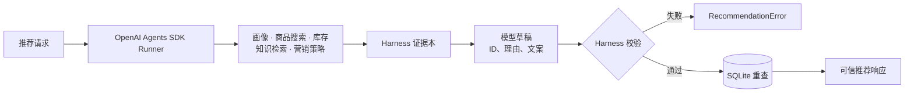

# 🛒 Chatty

Chatty 是面向电商推荐与营销的单 Agent 演示。它让模型理解需求、选择候选商品并生成理由与文案；
程序通过 Tool、SQLite 和 Harness 保证商品、价格、库存等业务事实可信。

`TypeScript` · `OpenAI Agents SDK` · `DeepSeek Responses API` · `SQLite FTS5` · `React` · `pnpm`

## 工作流与 Agent 设计

Chatty 的重点不是让模型「记住」商品数据，而是将模型的概率性判断限制在推荐与表达，
将可验证的业务规则写成代码。一次推荐使用五个只读 Tool，Harness 记录工具证据，
只有满足全部校验的模型草稿才能被 SQLite 回填为最终响应。


```mermaid
flowchart LR
    U["推荐请求"] --> A["OpenAI Agents SDK Runner"]
    A --> T["画像 · 商品搜索 · 库存<br/>知识检索 · 营销策略"]
    T --> E["Harness 证据本"]
    E --> D["模型草稿<br/>ID、理由、文案"]
    D --> V{"Harness 校验"}
    V -->|"失败"| F["RecommendationError"]
    V -->|"通过"| DB[("SQLite 重查")]
    DB --> R["可信推荐响应"]
```

| 层次              | Context In                                         | Context Out                                      |
| ----------------- | -------------------------------------------------- | ------------------------------------------------ |
| Model             | 用户需求、会话历史、Harness 允许它看到的 Tool 结果 | Tool Call 或推荐草稿                             |
| OpenAI Agents SDK | Agent、Tool Schema、DeepSeek Responses 模型        | 标准化的 Agent Loop 与 Tool 调用                 |
| Harness           | Tool Call、Tool 原始结果、调用轨迹                 | 给模型的可见上下文，以及仅供代码校验的证据与状态 |
| Catalog / SQLite  | 结构化查询                                         | 商品、库存、知识与营销规则的事实                 |

五个 Tool 都必须被调用；真实依赖保持「画像 → 搜索 → 库存」的偏序，知识检索和营销策略
可换序。允许换条件重搜或补充检索；Harness 限制重复调用和总轮次，防止无效循环。

最终要求推荐商品同时属于「搜索召回、库存确认、知识依据」三组证据；否则明确失败。
商品名称、价格、库存和标签均从 SQLite 重查，模型只提供理由与文案。

## Agentic RAG

`retrieve_knowledge` 不是另一个 Agent，而是五个 Tool 之一。它先用类目和商品 ID 缩小范围，
再用 SQLite FTS5 + BM25 检索知识块；结果进入 Agent 上下文并参与生成，这个完整过程才是 RAG。

当前数据规模小、领域明确，稀疏检索更简单、可解释；所以不引入 embedding 或向量数据库。
分块不是把文档变成孤岛：块保留文档、类目和商品索引，Agent 可根据中间结果调整查询并再检索。

## 自进化与评估

- 画像自进化：成功请求只把本轮显式类目偏好回写到用户画像；当前请求始终优先于历史偏好。
- 确定性测试：验证 Agents SDK Tool、证据门禁、SQLite/FTS5、配置优先级和画像回写，不联网。
- 检索评测：10 条标注 Query 用代码计算 `recall@5` 与 MRR，不调用模型。

这些都是小规模合成数据上的工程验证，不代表真实电商推荐质量或统计显著性。

## 技术栈

- TypeScript、Node.js、pnpm workspace
- OpenAI Agents SDK，通过 OpenAI-compatible Responses API 调用 DeepSeek
- SQLite、SQLite FTS5、BM25
- React 19、Vite
- Vitest、TypeScript compiler、oxlint、Prettier

## 启动

需要 Node.js 和 pnpm。DeepSeek 是默认模型提供方。

```bash
git clone https://github.com/ImWenyaoT/chatty.git
cd chatty
pnpm install
cp .env.example .env.local
# 编辑 .env.local，填写 DEEPSEEK_API_KEY

# 两个终端
pnpm dev       # TypeScript 后端 :8000
pnpm dev:web   # React 前端 :5173
```

前端通过 Vite 将 `/api` 代理到后端。HTTP 层与 Agent 共用同一个 `Conversation`；
推荐结果中的 ID、名称、价格与库存均来自 SQLite 重查。

## 配置

配置加载优先级是：**已导出的系统环境变量 > `.env.local` > `.env`**。
后加载的文件不会覆盖已存在的变量，因此本机 shell/CI 注入的密钥始终最优先。
`.env` 和 `.env.local` 都不入库；仓库只保留 `.env.example`。

| 环境变量            | 默认值                     | 说明                                             |
| ------------------- | -------------------------- | ------------------------------------------------ |
| `DEEPSEEK_API_KEY`  | 空                         | 主密钥，真实 DeepSeek 调用必填                   |
| `OPENAI_API_KEY`    | 空                         | 兼容后备；仅在 `DEEPSEEK_API_KEY` 缺失时使用     |
| `DEEPSEEK_BASE_URL` | `https://api.deepseek.com` | DeepSeek OpenAI-compatible Endpoint              |
| `DEEPSEEK_MODEL`    | `deepseek-v4-flash`        | 调用模型；当前 DeepSeek Responses API 支持的模型 |

## 评测与质量门禁

```bash
pnpm test             # 确定性单测，不联网
pnpm eval:retrieval   # 仅检索评测，不调用模型
pnpm typecheck
pnpm lint
pnpm build
pnpm check            # 提交前统一门禁
```

## 目录

```text
apps/api/         Agent、Harness、SQLite、HTTP 与测试
apps/web/         React + Vite 对话界面
data/             可读 JSON/JSONL 种子数据
docs/adr/         架构决策记录
```

## License

[MIT](LICENSE)
