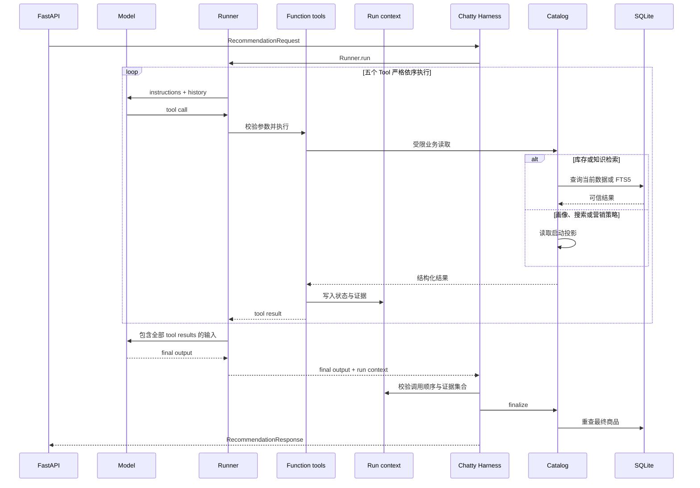
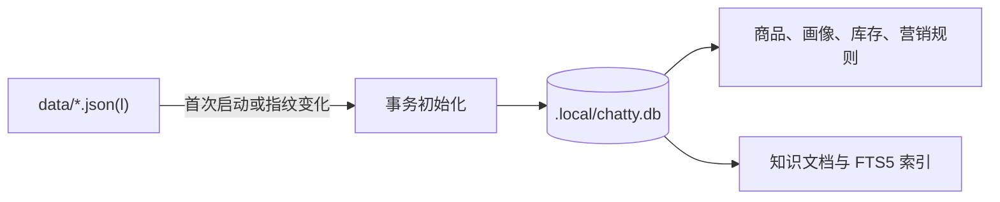
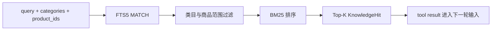
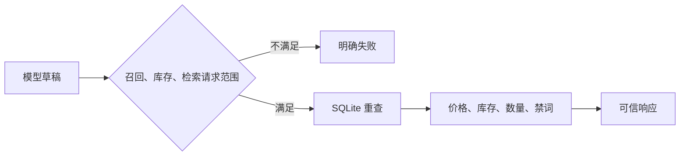

# Chatty 系统架构设计

本文档说明 Chatty 的 Agent Loop、数据流、RAG 和业务校验边界。

## 1. 系统总览

Chatty 使用一个 Agent 完成一次电商推荐请求。用户画像、商品搜索、库存检查、知识检索和营销策略由五个 Tool 提供。

## 2. 组件职责

| 组件 | 职责 | 可信数据来源 |
|---|---|---|
| FastAPI | 校验请求并映射错误码 | Pydantic 模型 |
| Chatty Agent | 选择 Tool 并生成理由与文案 | Tool 返回结果 |
| Catalog | 搜索、排序和最终业务校验 | SQLite |
| KnowledgeRetriever | 检索商品知识 | SQLite FTS5 |
| ExperimentMetrics | 稳定分桶和进程内统计 | 内存 |

## 3. Agent Loop

Agent 必须完成五步：

1. 获取用户画像
2. 搜索候选商品
3. 检查候选商品库存
4. 检索相关商品知识
5. 获取用户分群对应的营销策略

服务端记录 Tool 调用顺序。缺少、重复、乱序或没有检索到知识时，本次推荐失败。

## 4. 数据流

JSON 和 JSONL 只负责初始化。Catalog 启动时从 SQLite 建立商品、画像和营销规则投影；
库存检查、知识检索和最终商品回填在请求路径读取 SQLite。

## 5. 轻量 RAG

Retrieval-Augmented Generation（RAG）流程包含四步：

1. `retrieve_knowledge` 接收查询词、类目和候选商品 ID
2. SQLite FTS5 执行 `MATCH`
3. BM25 对结果排序并返回 Top-K 文档
4. Agent 根据检索内容生成推荐理由和营销文案

知识检索使用 SQLite FTS5 与 BM25。

## 6. 模型输出边界

模型只生成商品 ID、推荐理由和营销文案。Catalog 返回响应前会：

- 拒绝不存在的商品 ID
- 过滤库存为零的商品
- 从 SQLite 重新填充名称、价格、库存和标签
- 限制推荐数量
- 替换营销禁词

当前模型接入通过 Chat Completions 返回 JSON 文本。应用层提取 JSON 后，再由 Pydantic 校验。

## 7. A/B 测试

`ranking_strategy` 使用 SHA-256 对 `user_id + experiment_id` 分桶：

| 分组 | 比例 | 排序策略 |
|---|---:|---|
| `control` | 50% | 商品热度优先 |
| `treatment_personalized` | 50% | 用户类目、价格和行为优先 |

同一个用户稳定进入同一组。请求量、成功率和延迟只保存在当前进程内。

当前实现不计算实验提升或统计显著性。

## 8. 失败处理

| 场景 | HTTP 状态 | 错误码 |
|---|---:|---|
| 未配置模型密钥 | 503 | `llm_not_configured` |
| Tool 缺少、重复、乱序或证据不足 | 502 | 对应稳定失败码 |
| 模型或 Agent Loop 失败 | 502 | `recommendation_failed` |
| 输出无法通过校验 | 502 | `invalid_recommendation` |
| 请求字段不合法 | 422 | FastAPI 校验详情 |

错误会写入日志，不返回静默降级结果。
