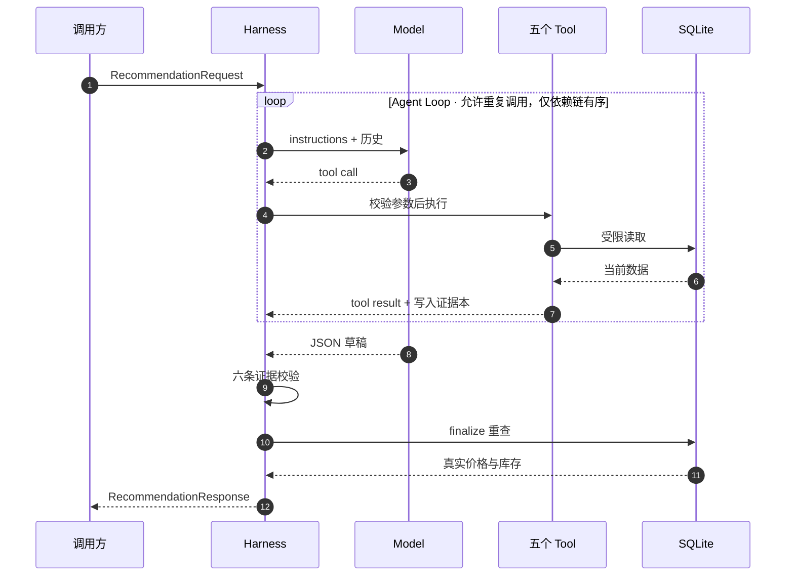
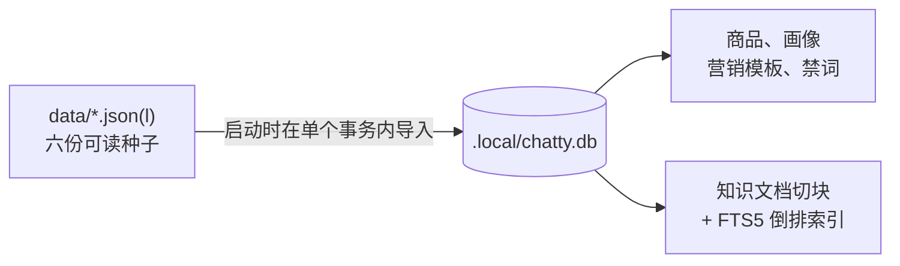
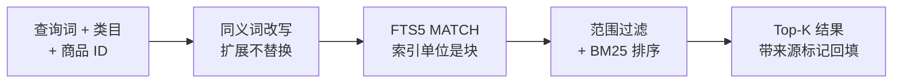
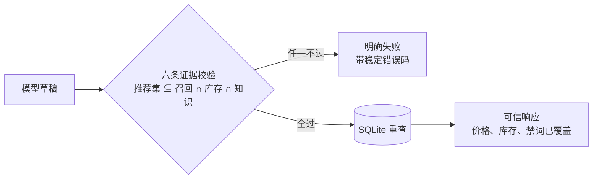

# Chatty 系统架构设计

本文档说明 Chatty 的 Agent Loop、数据流、RAG 和业务校验边界。

## 1. 系统总览

Chatty 使用一个 Agent 完成一次电商推荐请求。用户画像、商品搜索、库存检查、知识检索和营销策略由五个 Tool 提供。

```mermaid
sequenceDiagram
    autonumber
    participant U as 调用方
    participant H as Harness
    participant M as Model
    participant T as 五个 Tool
    participant DB as SQLite

    U->>H: RecommendationRequest
    loop Agent Loop · 允许重复调用，仅依赖链有序
        H->>M: instructions + 历史
        M-->>H: tool call
        H->>T: 校验参数后执行
        T->>DB: 受限读取
        DB-->>T: 当前数据
        T-->>H: tool result + 写入证据本
    end
    M-->>H: JSON 草稿
    H->>H: 六条证据校验
    H->>DB: finalize 重查
    DB-->>H: 真实价格与库存
    H-->>U: RecommendationResponse
```

## 2. 组件职责

| 组件 | 职责 | 可信数据来源 |
|---|---|---|
| Recommender | 库入口：跑 Agent Loop、校验证据、映射失败码 | Tool 证据 + SQLite |
| Chatty Agent | 选择 Tool 并生成理由与文案 | Tool 返回结果 |
| Catalog | 搜索、排序和最终业务校验 | SQLite |
| KnowledgeRetriever | 检索商品知识 | SQLite FTS5 |

## 3. Agent Loop

Agent 需要完成五件事：

1. 获取用户画像
2. 搜索候选商品
3. 检查候选商品库存
4. 检索相关商品知识
5. 获取用户分群对应的营销策略

Harness 记录实际的 Tool 调用序列，但**不要求严格依序各调一次**：

- 五个工具都必须调用过，**允许重复**——搜不到换条件重搜、知识不够补充检索都是合理行为
- 只有真实的数据依赖必须保持先后：画像 → 搜索 → 库存
- 检索与营销策略之间没有依赖，谁先谁后都行

真正会导致失败的是：漏调工具、调用未注册的工具、依赖顺序颠倒、知识检索无命中。
另外同一工具用**完全相同的参数**调用超过三次会被拦截，防止模型原地打转耗尽轮次预算——
这条拦截会把错误信息回给模型让它自行调整，不中断流程。

## 4. 数据流

```mermaid
flowchart LR
    SEED["data/*.json(l)<br/>六份可读种子"] -->|"启动时在单个事务内导入"| DB[(".local/chatty.db")]
    DB --> B["商品、画像<br/>营销模板、禁词"]
    DB --> K["知识文档切块<br/>+ FTS5 倒排索引"]
```

JSON 和 JSONL 只负责初始化。Catalog 启动时从 SQLite 建立商品、画像和营销规则投影；
库存检查、知识检索和最终商品回填在请求路径读取 SQLite。

## 5. 轻量 RAG

检索走稀疏路线（FTS5 倒排索引 + BM25），不用向量。索引单位是**块**不是整篇文档：
入库时长文档按句子边界切成约 160 字的块、相邻块重叠 40 字，检索命中哪块就返回哪块。

流程五步：

1. `retrieve_knowledge` 接收查询词、类目和候选商品 ID
2. **查询改写**：用同义词表把用户说法补上知识库用词（查「保护视力」补出「护眼」）
3. SQLite FTS5 执行 `MATCH`，类目与商品范围作为 SQL 条件先缩范围
4. BM25 排序并返回 Top-K 知识块，外面包一层来源标记（防间接提示注入）
5. Agent 根据检索内容生成推荐理由和营销文案

```mermaid
flowchart LR
    Q["查询词 + 类目<br/>+ 商品 ID"] --> R["同义词改写<br/>扩展不替换"]
    R --> M["FTS5 MATCH<br/>索引单位是块"]
    M --> F["范围过滤<br/>+ BM25 排序"]
    F --> T["Top-K 结果<br/>带来源标记回填"]
```

两个实现细节：查询词最多取前 8 个（已写进工具描述告知模型）；
中文需要在索引和查询两侧都按字切分，否则 FTS5 的 `unicode61` 会把整段无空格中文
当成单个 token，`MATCH "价格"` 检索不到「…价格敏感用户…」。

## 6. 模型输出边界

模型只生成商品 ID、推荐理由和营销文案。Catalog 返回响应前会：

- 拒绝不存在的商品 ID
- 过滤售罄或价格超出用户画像区间的商品
- 从 SQLite 重新填充名称、价格、库存和标签
- 限制推荐数量
- 替换营销禁词

当前模型接入通过 Chat Completions 返回 JSON 文本。应用层提取 JSON 后，再由 Pydantic 校验。

```mermaid
flowchart LR
    D["模型草稿"] --> E{"六条证据校验<br/>推荐集 ⊆ 召回 ∩ 库存 ∩ 知识"}
    E -->|"任一不过"| F["明确失败<br/>带稳定错误码"]
    E -->|"全过"| DB[("SQLite 重查")]
    DB --> R["可信响应<br/>价格、库存、禁词已覆盖"]
```

## 7. 失败处理

Chatty 是库不是服务，失败以带错误码的 `RecommendationError` 抛出。

| 场景 | 错误码 |
|---|---|
| 未配置模型密钥 | `llm_not_configured` |
| 工具缺失或依赖顺序错误 | `required_tools_not_used` |
| 检索无命中 | `knowledge_not_retrieved` |
| 用户画像未加载 | `profile_not_loaded` |
| 商品未经召回、库存或知识证明 | `product_not_*`、`inventory_not_checked` |
| 输出无法通过校验 | `invalid_recommendation` |
| 模型或 Agent Loop 失败 | `recommendation_failed` |
| 请求字段不合法 | Pydantic `ValidationError` |

错误会写入日志，不返回静默降级结果。
