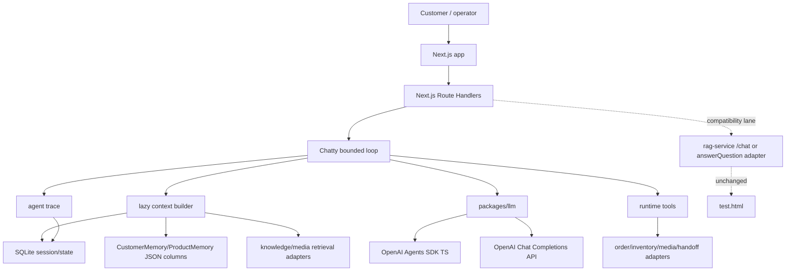
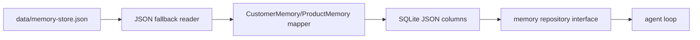
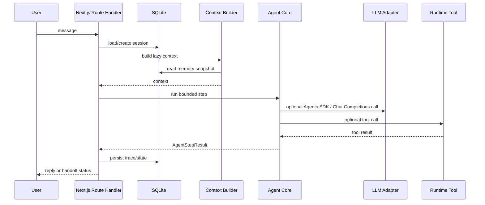
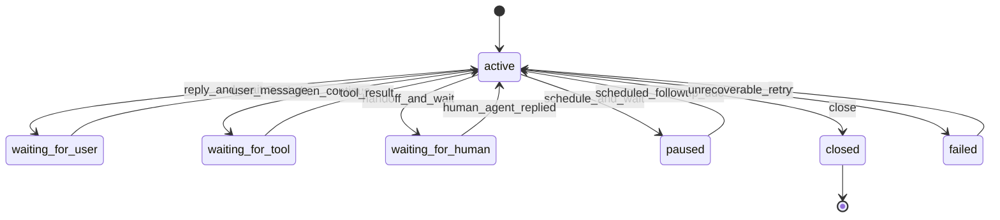
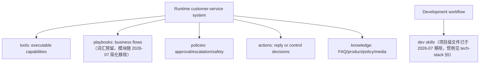
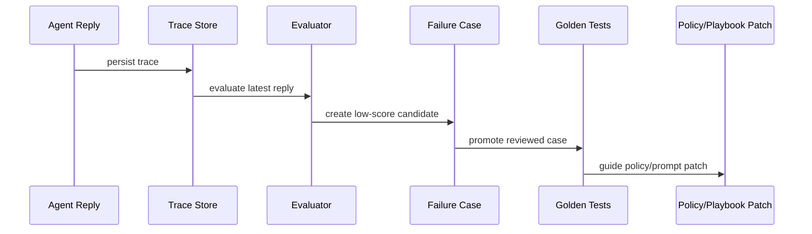

# Loop Engineering Plan

> **历史归档（非当前操作指南）**：本文保留迁移当时的计划与账本，命令、依赖和 runtime lane 可能已经失效。当前事实以 [`../current-architecture.md`](../current-architecture.md)、[`../tech-stack-decisions.md`](../tech-stack-decisions.md) 和仓库代码为准。Agents SDK 后来已重新进入 live compose lane。

Last updated: 2026-07-04

## 0. Decision Snapshot

This plan starts the Next.js-first Chatty agent loop foundation without rewriting the current rental RAG service.

Stack and product decisions are registered once in
[tech-stack-decisions.md](../tech-stack-decisions.md); this plan does not restate them.
This document keeps the migration plan, phase records, and the Legacy Migration Ledger (§16).

## 1. Scope And Non-Goals

### Scope

- Document the target MVP loop architecture.
- Add a minimal TypeScript package skeleton for shared contracts, SQLite schema, agent-core boundaries, and LLM adapters.
- Preserve existing `rag-service` behavior.
- Make the current RAG service build remain the compatibility check.

### Non-Goals

- No full Next.js UI migration yet.
- No rewrite of `rag-service/public/test.html`.
- No rewrite of `rag-service/dashboard`.（该子包已于 2026-07 删除：apps/web 的 `/dashboard` 重建了同类功能，源码在 git 历史 / `legacy-extras` 分支）
- No full memory redesign.
- No full Chatwoot inbox clone.
- No direct production dependency on Agent Builder exported flows.

## 3. Legacy System Baseline (retired R5)

The migration started from the legacy `rag-service` (Fastify + `answerQuestion`),
fully deleted in R5 (2026-07). Recorded here as the migration's starting point:

- `rag-service/src/server.ts` exposed Fastify routes and static pages.
- `rag-service/src/rag.ts` exported `answerQuestion()`.
- `rag-service/src/memory-store.ts` persisted `CustomerMemory` and `ProductMemory` into `data/memory-store.json`.
- `rag-service/src/conversation-orchestrator.ts` derived the current business stage.
- `rag-service/src/rag/action-picker.ts` mapped context into actions.
- `rag-service/public/test.html` was the manual test console; `rag-service/dashboard` the Vite dashboard source — both superseded by apps/web `/playground` + `/dashboard`.

Legacy behavior notes (why the new loop deliberately diverged):

- `answerQuestion()` returned an answer but did not write memory by itself.
- The Fastify `/chat` route called `appendConversationMemory()` after `answerQuestion()`.
- `answerQuestion()` ran RAG before action selection; the new loop does not treat that as the target lazy-context behavior.

## 4. Target MVP Architecture

> 历史注：图中的 Agents SDK lane 曾于 2026-07 清理，后来已重新进入 live compose lane；图保留当时的规划结构。



## 5. Runtime Lanes

### 5.1 Production Lane: Next.js Route Handlers

Next.js Route Handlers are the MVP API surface:

- receive customer/admin messages;
- create or load `AgentSession`;
- call a bounded local agent step;
- persist trace and state;
- return response to the caller.

### 5.2 Model Lane: OpenAI Agents SDK TS

> **历史状态（2026-07）**：该 lane 当时曾因零生产调用方整体移除；之后已由 live compose 重新采用。以下保留原始规划：

Use OpenAI Agents SDK TypeScript when an agent run benefits from tools, handoffs, guardrails, tracing, or built-in loop semantics.

The product code depends on `packages/llm` interfaces, not SDK implementation details.

### 5.3 Compatibility Lane: Chat Completions API

Use direct Chat Completions for:

- legacy `rag-service` compatibility;
- intent classification;
- structured fact extraction;
- reply evaluation;
- fallback generation;
- low-level direct model calls where Agents SDK is unnecessary.

### 5.5 Legacy Reference Lane: rag-service (retired R5)

> **2026-07（R5）**：整个 `rag-service` 已删除，本 lane 不复存在（见 §16 R5 退役记录）。
> answerQuestion 注入位（`LegacyRagServiceAdapter`）早随 loop-runner 删除；评估器跨边界集成
> （`apps/web/lib/legacy-adapter.ts` 的 `loadLegacyEvaluator`）也随 R5 删除，judge 迁至 `eval/judge.ts`。
> 以下为原始规划，仅作历史记录：

The minimal adapter is:

```text
LegacyRagServiceAdapter.answer(input)
  -> legacy /chat HTTP call, or injected answerQuestion function
  -> mapped answer/action/intent/handoff/references result
```

Short-term safest integration is HTTP against legacy `/chat`, because that preserves existing sanitization, memory writing, and response shape.

### 5.6 Naming

Use Chatty for the customer-facing agent and trace identity:

- external name: `Chatty`
- primary agent name: `ChattyAgent`
- rental-commerce instance: `RentalChattyAgent`
- trace field value: `agent_name = 'chatty'`

Keep low-level packages generic, such as `packages/agent-core`, so the architecture does not depend on the brand name.

## 6. Data And Persistence

### 6.1 SQLite MVP Schema

Table definitions live in [tech-stack-decisions.md §6](../tech-stack-decisions.md#6-session-and-memory)
(single registry; not duplicated here).

### 6.2 Current Session Status

> **2026-07 更新**：`agent_sessions` 已在 SQLite 落地（`packages/db`），playground 每轮
> load/create session 并回写 status。以下为 2026-06 决策时的基线：

There was no real session store at decision time.

Continuity then depended on:

- `customerId`;
- `productId`;
- `conversationId`;
- `data/memory-store.json`;
- `recentMessages` under `ProductMemory`.

### 6.3 Conservative Memory Migration



Migration rules:

- Keep `CustomerMemory` and `ProductMemory` shape as JSON columns first.
- Do not normalize all profile fields in MVP.
- Preserve the read-only JSON fallback（SQLite 写路径已常开，`CHATTY_SQLITE` 开关 2026-07 退役）.
- Do not let OpenAI Agents SDK session memory become the long-term business memory.

## 7. Agent Loop Contract

Minimum interfaces:

- `ConversationEvent`
- `AgentSession`
- `AgentStepResult`
- `AgentTrace`
- `RuntimeTool`
- `MemorySnapshot`



## 8. Loop State Model

> **实现状态（2026-07-04）**：当前代码只会产生 `active` / `waiting_for_user` /
> `waiting_for_human` 三个状态（customer-harness 的 `nextStatus`；原 loop-runner 与
> SDK 适配器已删除）；`waiting_for_tool` / `paused` / `failed` / `closed` 及对应事件
> （`tool_result`、`scheduled_followup_due` 等）是预留设计，TS 类型已定义但无 producer
> （对应的运行时 zod 镜像已随 2026-07 清理删除）。引入 tool-chaining / worker 时再实现。
> 下图为目标全集：



## 9. Tools, Playbooks, Policies, And Actions

Runtime vocabulary:



Do not use `skills` for runtime concepts.

## 10. Evaluation And Regression Loop



MVP should preserve the current evaluator direction but make traces first-class.

## 11. Migration Strategy

### Phase 0: Foundation ✅（commit 373c11d）

- Add docs.
- Add shared contracts.
- Add SQLite schema SQL.
- Add agent-core and llm adapter interfaces.
- Keep `rag-service` unchanged.

### Phase 1: Next.js Shell ✅（commit 373c11d / 3f304c5）

- Add `apps/web` with App Router.
- Add simple health and playground routes.
- Link existing `rag-service` test page/dashboard rather than rewriting them.

### Phase 2: SQLite Adapter ✅（CHATTY_SQLITE 开关，commit b464c18；开关已于 2026-07 退役，SQLite 常开）

- Add SQLite connection and repository.
- Add JSON fallback reader from `rag-service/data/memory-store.json`.
- Add feature flag for SQLite write path.

### Phase 3: Agent Loop v0 ✅（commit 373c11d，legacy adapter 为 in-process 注入）

- Implement bounded step runner.
- Use `LegacyRagServiceAdapter.answer()` as the first answer path.
- Persist `AgentTrace`.

### Phase 4: Model Lanes ✅（CHATTY_AGENTS_SDK 开关仅路由 ask_info，commit 4e3a5bc；该 lane 已于 2026-07 整体删除，见 §16）

- Wire OpenAI Agents SDK TS runner.
- Keep Chat Completions direct adapter for extraction/eval/fallback.
- Route only selected actions through Agents SDK.

## 12. Open Questions

Open:

- When should Route Handlers be split into a separate worker or API service?
- When should Qdrant be retained vs wrapped behind a media/knowledge adapter?
- PRD §8.1 的 durable ConversationEvent 表：当前只持久化 trace，事件对象用后即弃。
  M2 的这条承诺显式推迟——单机 MVP 里 trace 已够回放；引入 worker/重试语义时再建表。

Settled:

- SQLite connection lives in `packages/db` (`database.ts`), repositories are factories over it.
- ~~Legacy 集成走 in-process 而非 HTTP：`apps/web/lib/legacy-adapter.ts` dynamic-import
  rag-service dist~~ 2026-07（R5）更新：整个 rag-service 与 `legacy-adapter.ts` 已删除，
  不再有任何跨 legacy 边界；judge 直接是 `eval/judge.ts`（`@rental/llm`），无 dynamic import。
- ~~Agents SDK routes only `ask_info` (feature flag `CHATTY_AGENTS_SDK=1`)~~ 2026-07 当时更新：
  Agents SDK lane 曾整体删除；当前 live compose 已重新采用 Agents SDK，本条只记录迁移历史。
- Stack-level decisions (Next.js first, SQLite, no Fastify, Temporal deferred,
  Chatwoot as reference, runtime concepts are not called skills): see
  [tech-stack-decisions.md](../tech-stack-decisions.md).

## 13. Implementation Plan

1. Keep `rag-service` build passing.
2. Add root workspace files without changing `rag-service` behavior.
3. Add `packages/shared` for DTOs and zod schemas.
4. Add `packages/db` for SQLite schema SQL only.
5. Add `packages/agent-core` for loop contracts and legacy adapter boundary.
6. Add `packages/llm` for OpenAI Agents SDK and Chat Completions adapter boundaries.
7. Typecheck new packages.
8. Build `rag-service`.
9. Add Next.js app only after the package contracts are stable.

## 14. Acceptance Criteria

- `docs/loop-engineering-plan.md` exists and matches latest decisions.（历史路径；本文现位于 `docs/archive/`。）
- The root workspace has no effect on existing `rag-service` runtime behavior.
- `packages/shared` defines minimal loop DTOs.
- `packages/db` defines SQLite MVP schema.
- `packages/agent-core` defines loop and legacy adapter boundaries.
- `packages/llm` defines the Chat Completions adapter boundary（历史状态：Agents SDK 边界当时已删除；当前 live compose 已重新采用）。
- `pnpm build:rag-service` still passes or its existing failures are documented.（历史验收项：该 package 与命令均已删除，不可执行。）

## 16. Legacy Migration Ledger

「保持好 specs/test/interface，随时可重写」的进度账本。五项 legacy 能力的接管状态：

| 能力 | 边界接口 | 状态 | 下一步 |
|---|---|---|---|
| 回答路径 answerQuestion | compose 步的 `CustomerServiceModelFn`（playground route 注入 Chat Completions adapter） | 🟢 R5 已执行（2026-07）：整个 legacy `rag-service` 运行时（answerQuestion / orchestrator / memory-store，~6300 行）已删除。compose 步的 `CustomerServiceModelFn` 是唯一回答路径（`CHATTY_LLM=1` + `OPENAI_API_KEY` 走真 LLM，否则确定性 `createCustomerServiceModelOutput`）；知识检索由 agentic search（`search_knowledge` + FTS）承担 | 无（R5 完成，单 lane 终态） |
| 评估器 LLM-judge | `Evaluator`（`evaluateCustomerServiceReply`，`eval/run.ts` 同步调用回填分数） | 🟢 保留为朴素金标回归的 judge：`pnpm eval` 内由 runner 同步调 judge 回填每场景分数。judge 本体随 R5 迁至 `eval/judge.ts`（改依赖 `@rental/llm`，判分行为不变）。曾有的评测飞轮（自动评分 → `trace_reviews` → 低分晋升 failure_case → promote CLI → golden 回归）已于 2026-07 整体退役（过度设计，dont overdo） | judge 交叉复评（如需） |
| 知识检索 searchKnowledge | agentic search（`search_knowledge` 工具 + FTS5 索引） | 🟢 R4 已执行（2026-07）：legacy 的 embedding/qdrant 检索子系统（qdrant client、embedding 调用、`ingest.ts`、`chunking.ts`、local-vectors）整体删除；agentic search 上线为当前检索路径。legacy `answerQuestion` 内的检索早因 embeddings 404 恒空，删除只是把"404 降级"变成结构上不存在，行为不变 | 无（子系统退役完成） |
| 会话记忆 | `MemoryRepository`（SQLite + 可选 JSON 只读回退） | 🟡 新 loop 仅持久化 recentMessages（写 SQLite）；R5 已把 apps/web 的 JSON 只读回退移除，SQLite 为唯一记忆源（`packages/db` 仍保留可选 JSON 回退能力 + 单测）；profile 字段写 SQLite 仍未实现 | profile 写路径迁 SQLite JSON 列 |
| 事实抽取 + 阶段状态机 | 无边界（legacy 内部） | ⚫ 随 R5 删除：legacy 的 `extractStructuredConversationFacts` + orchestrator 阶段机已整体删除，harness 不实现阶段状态机（行为简化，见 architecture §8）；相关行为已改由金标行为断言表达 | 如需 slot 化 profile / 阶段，在 harness 内重建（无 legacy 依赖） |

已知缺口（测试钉住待修）：`post_order_followup` stage 在 `decideStage` 中不可达，
`close_loop` 动作是死代码——修复属于行为变更，需跑金标 eval 验证后再动。

### R4 退役记录（2026-07）

`agentic-search-design.md §6` 的 R4（删检索子系统）已执行，单独一个 commit：
qdrant client、embedding 调用、`ingest.ts`、`chunking.ts`、local-vectors、
`rag.ts` 内的 `searchKnowledge`/`embedText` 调用点、`@qdrant/js-client-rest` 依赖全部删除。
同批把过度设计的"评测飞轮"（trace 自动评分 → failure_case → golden 自动晋升）拆回
朴素金标回归（当时命令为 `pnpm eval --target harness` + 同步 judge；当前 runner 已无 `--target` 参数，使用 `pnpm eval`）。

**平价状态（如实记录）**：harness lane 金标最好一轮 13/14（`tests/reports/harness-r*.json`），
未追到设计里写的 11/11（那是 legacy 场景集口径）门槛。用户决策**覆盖**了"平价才准删"的
硬门槛——RAG 直接退役，不因 13/14 未达标而阻塞（这是求职作品集项目，dont overdo，见好就收）。

> R4 当时保留双目标 runner（`--target harness` 默认，`--target legacy` 对照）。该双目标结构
> 已随 R5 一并退役——见下方 R5 退役记录。

### R5 退役记录（2026-07）

`agentic-search-design.md §6` 的 R5（删整个 legacy rag-service 运行时）已执行。用户决策覆盖了
"harness 金标平价才准删"的硬门槛（best 13/14，未追 11/11 legacy 口径），直接见好就收（求职作品集项目）：

- `git rm -r rag-service`：整个 legacy 运行时（`answerQuestion` / orchestrator / memory-store /
  Fastify server / prompts-loader / rag 动作层，~6300 行）与 legacy 版 golden 场景集、迭代报告全部删除。
  仅 gitignore 的 `rag-service/data/`（真实客户记忆快照）在本地保留、继续被忽略。
- 评测资产迁至根级 `eval/`（非 workspace 包）：judge → `eval/judge.ts`（改依赖 `@rental/llm`，
  判分行为不变），golden runner → `eval/run.ts`（**去 legacy 目标、单 lane**，删 `--target` 概念），
  14 个 harness 场景 → `eval/golden/`。命令由 `pnpm --filter rental-rag-service eval` 收敛为根 `pnpm eval`。
- apps/web 清理：删 `legacy-adapter.ts`（飞轮删后无调用方）、`db.ts` 的 JSON 记忆兜底、
  `next.config` 的 `rental-rag-service` external。CI `eval.yml` 改跑 `pnpm eval`。
- **终态**：只剩 harness 一条 lane + 一个朴素金标（`pnpm eval`），无任何 legacy 脚手架。
