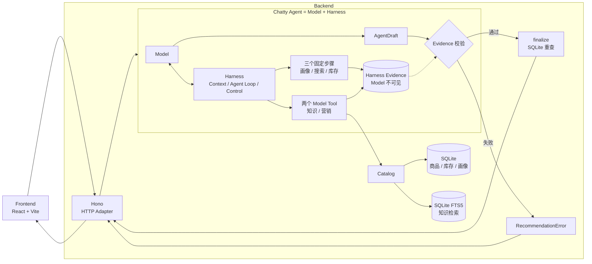

# 第 1 章：Agent 与 Harness

用户输入“我要一个 300 元的蓝牙耳机”以后，Chatty 不能立刻生成答案。商品是否存在、价格是否低于 300 元、库存是否充足，都不是语言模型应该猜测的内容。

Chatty Agent 由 Model 和 Harness 组成：

```text
Agent = Model + Harness
```

Model 擅长理解自然语言、选择 Tool、组织推荐理由和营销文案。Harness 是 Agent 中位于 Model 外面的运行环境，负责准备 Context、提供并执行 Tool、保存调用证据、限制循环次数并校验最终结果。Tool 属于 Harness，不是与 Model、Harness 并列的第三部分。

一次运行会经过这些代码：



Frontend 在这里作为一个完整 Module，不展开页面与 React 组件；Backend 才展示内部实现，
因为 Chatty 的核心工程判断集中在 Agent、Harness、Tool、Evidence 与事实源之间的协作。

这是一种混合模式：Harness 直接执行确定性的 `画像 → 搜索 → 库存`，再把类型化
`RecommendationContext` 交给 Model。Model 只决定知识检索 Query、调用营销策略并生成草稿；
两个支撑 Tool 由 Harness 串行执行，确保后一步看见最新 Evidence。价格、库存、调用上限和最终裁决始终由 Harness 掌握。

Chatty 因此既保留了 Agent 处理开放问题的能力，也让关键业务规则保持确定性。模型可以发挥判断力，但不能越过程序拥有的事实。

主要代码位于：

- `src/agent/lib/chatty.ts`：Chatty Agent 对外唯一的一轮接口 `run()`。
- `src/agent/lib/executor.ts`：准备三个确定性步骤的 Context，并让 Agents SDK 执行开放 Tool Loop。
- `src/agent/lib/workflow.ts`：Harness 的阶段机、批次门禁和上下文末尾状态栏。
- `src/agent/tools/`：Harness 暴露给 Model 的知识检索与营销策略 function tools。
- `src/agent/lib/evidence.ts`：Harness 的调用顺序与事实集合校验。
- `src/data/catalog.ts`：隔离 Tool 与 SQLite 查询。

Agents SDK 负责循环和 Tool 调用，Chatty 自己的 Harness 负责业务约束、Evidence
与最终裁决。这样标准运行循环不用重复实现，电商事实规则也不会被藏进 SDK adapter。

[返回目录](README.md) · [下一章：Context 如何流动 →](chapter2.md)
