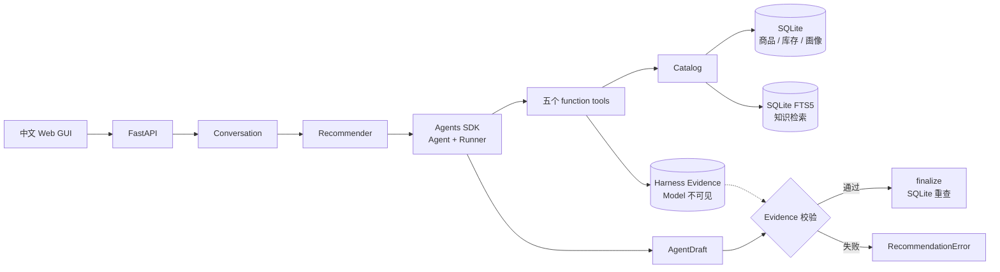

# 第 1 章：Agent 与 Harness

用户输入“我要一个 300 元的蓝牙耳机”以后，Chatty 不能立刻生成答案。商品是否存在、价格是否低于 300 元、库存是否充足，都不是语言模型应该猜测的内容。

Chatty 将整个系统分成 Model 和 Harness：

```text
Agent = Model + Harness
```

Model 擅长理解自然语言、选择 Tool、组织推荐理由和营销文案。Harness 是模型外面的运行环境，负责准备 Context、执行 Tool、保存调用证据、限制循环次数并校验最终结果。

一次运行会经过这些代码：



这不是一条完全固定的流水线。模型可以改变商品搜索条件、重新组织知识检索 Query，也可以交换知识检索和营销策略的次序。但价格、库存、调用上限和最终裁决始终由 Harness 掌握。

Chatty 因此既保留了 Agent 处理开放问题的能力，也让关键业务规则保持确定性。模型可以发挥判断力，但不能越过程序拥有的事实。

主要代码位于：

- `backend/app/agent.py`：定义 Agent，并让 Agents SDK 执行 Tool Loop。
- `backend/app/tools.py`：五个 Tool 的输入、业务调用和 Evidence 记录。
- `backend/app/evidence.py`：Harness 的调用顺序与事实集合校验。
- `backend/app/catalog.py`：隔离 Tool 与 SQLite 查询。

Agents SDK 负责循环和 Tool 调用，Chatty 自己的 Harness 负责业务约束、Evidence
与最终裁决。这样标准运行循环不用重复实现，电商事实规则也不会被藏进 SDK adapter。
