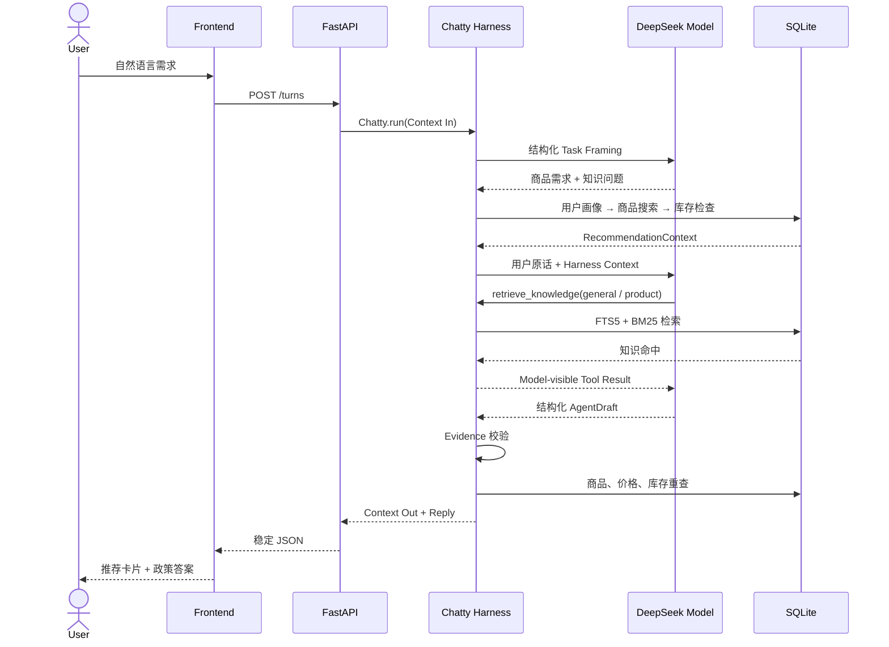

# 第 2 章：Context 如何流动

Model 每次只能根据当前收到的 Context 作出判断。对 Chatty 来说，Context 不只是一句用户原话，还包括会话历史、当前请求约束和 Tool Result。

用户输入首先经过 Task Framer。它把自然语言转换成两个可组合的 Context Requirement：

```text
“我要一个 300 元的蓝牙耳机”
  → product_need = {category: "耳机", max_yuan: 300}
  → knowledge_query = null
```

这里把“300 元的”理解为预算上限；“300 元以上”才表示下限，“200 到 300 元”表示区间。价格统一转换成分，后续代码不再处理模糊的中文金额。

Task Framer 对 Model 使用无 `anyOf` 的扁平 `TaskFrameWire`，再由 Harness 映射为领域
`TaskFrame(product_need?, knowledge_query?)`。Wire 中可缺省的 scalar 用 0/1 元素数组表达，
以兼容 DeepSeek Responses API 的 JSON Schema 子集。两者都仍通过 Agents SDK 的
`output_type` 管理；DeepSeek 偶尔把实例包在 `properties` 时，只在 SDK
`invalid_final_output` handler 中确定性解包和校验，不再次调用 Model。

最终 `AgentDraft` 同样通过 Agents SDK 的 `output_type` 声明 Pydantic Schema，
由 Responses API 的 `text.format` 承载；不再从自由文本里手动截取 JSON。DeepSeek 偶尔仍可能
返回 Schema 外文字，此时 SDK 的 `invalid_final_output` error handler 最多调用一次无 Tool 的
结构化 correction Agent，不重复执行业务 Tool。

随后，Chatty 的 `run()` 只把尚未完成的澄清请求保存成 Agents SDK 使用的结构化
`user` / `assistant` 消息，而不是把所有聊天都继续塞给下一轮。任务成功或失败后会清空
TaskFrame 上下文；Tool Result 与 Evidence 也只属于当前 Agent run，不跨轮累积。

Harness 执行 Tool 后同时更新两类不同用途的 Context：

```text
(Model-visible Tool Result, Harness-owned Evidence')
    = Tool(arguments, Harness-owned Evidence)
```

Model 可以看到商品列表、库存状态和知识内容，从而继续推理。Harness 另外保存召回过哪些商品、检查过哪些库存、哪些商品有知识支撑。这份 Evidence 不需要交给 Model，因为它的用途是最终校验，而不是帮助生成文字。

每次调用 Model 前，Harness 还会把 Evidence 投影成简短的 `<agent_status>`，追加在 Context
末尾。它只告诉 Model 当前阶段、已完成步骤和允许的下一步；既不改写前面的静态 Tool Schema，
也不把 Evidence 原文暴露给 Model。状态栏是导航，`workflow.py` 的 Tool guardrail 才是硬门禁。

进入 Agent Loop 前，Harness 只同步完成确定性的画像、搜索和库存，并将结果组成
`RecommendationContext`；知识不提前检索。进入循环后，Model 根据 `knowledge_query` 与
候选商品调用 `retrieve_knowledge`，观察结果后可以改写 Query，最多三次。推荐路径还必须
调用营销策略；纯知识路径不调用营销策略。Harness 仍按批次开始时的状态裁决重复或未知调用。

Chatty 的会话最多三轮，并保存在服务端内存中。只有未完成的澄清跨轮继承任务约束；
普通任务完成后，下一条消息会形成新的 TaskFrame。这个范围不需要上下文压缩或长期轨迹系统：
会话结束或服务重启后，临时历史自然消失。

DeepSeek Responses API 不负责保存 Chatty 的业务会话。结构化 history 由服务端内存和
Harness 管理，因此这里不依赖 `previous_response_id`。

把这些 Context 放回一次完整请求中，可以看到哪些信息进入 Model、哪些事实始终由 Harness
和 SQLite 掌握：



不同 Context 的位置和生命周期如下：

| Context | 所在位置 | 生命周期 |
| --- | --- | --- |
| `ChattyContext(pending_user_messages / history / turns)` | FastAPI 进程内存中的不透明会话值 | 待澄清任务与轮次；任务完成后清空内容 |
| Evidence 与 Tool trace | Agents SDK RunContext | 每轮重新创建，不跨轮复用 |
| 商品、库存、知识与画像 | SQLite | 运行时业务事实 |

如果准备顺着代码阅读，可以按下面的文件表进入：

| 层 | 文件 | Context In | Context Out |
| --- | --- | --- | --- |
| HTTP | `backend/app/api.py` | 用户原话、会话 ID | answer / recommend / clarify / exhausted |
| Agent Interface | `backend/app/agent/chatty.py` | 用户、原话、`ChattyContext` | `ChattyTurn` |
| Harness / 输入适配 | `backend/app/agent/framing.py` | 当前原话、待澄清上下文、可选类目 | `TaskFrame` |
| Harness / Agent Loop | `backend/app/agent/executor.py` | 原始用户输入、`TaskContext` | 可信回答或稳定错误码 |
| Harness / 控制 | `backend/app/agent/workflow.py` | Evidence、整批 Tool calls | 阶段裁决、`agent_status` |
| Harness / Tool | `backend/app/agent/tools.py` | Tool 参数、RunContext | Model-visible Result 与 Harness-owned Evidence |
| 数据与检索 | `backend/app/data/catalog.py` | 结构化查询 | SQLite 事实与知识命中 |
