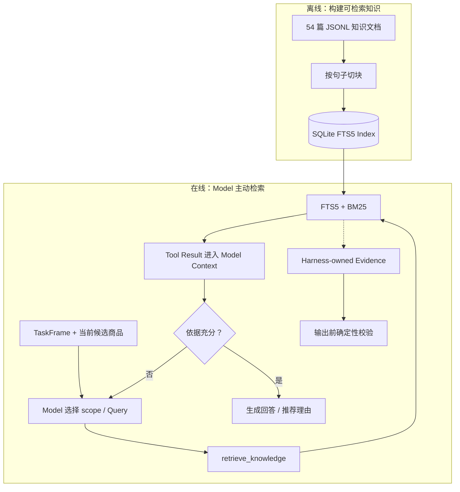

# 第 3 章：用户画像与知识检索

推荐不仅取决于当前需求，也会受到历史偏好的影响。Chatty 用用户画像保存类目偏好、价格区间、最近浏览和最近购买等结构化信息。

画像是历史，用户本轮说的话是当前事实。当两者发生冲突时，本轮需求优先。例如，一个经常购买高价数码产品的用户明确说“这次只要 300 元以内”，Chatty 就不能继续沿用画像里的高预算。

除了用户画像，推荐理由还需要知识依据。商品表只能告诉我们名称、价格和库存；“适合通勤”“降噪表现好”“适合价格敏感用户”来自知识文档。

Chatty 启动时按句子边界切分知识文档，并为每个 Chunk 保留：

- 原文档 ID；
- Chunk 在原文中的顺序；
- 所属类目；
- 关联商品 ID；
- 原始内容和来源。

这些索引让 Chunk 即使离开原文，也不会变成完全孤立的文本。

JSON 和 JSONL 文件只负责提供可读的初始化种子。启动时，`database.ts` 会通过 Node 内置
`node:sqlite` 的 `DatabaseSync` 把种子事务性地投影到 SQLite；后续商品、库存、画像与知识查询
都只读取 SQLite，不把种子文件当作运行时查询接口。

每个知识 Chunk 的目标长度约为 160 个字符，相邻 Chunk 保留约 40 个字符的重叠内容。
索引和查询两侧都会处理中文分词，FTS5 负责全文匹配，BM25 负责排序。同义词只扩展
查询词，不修改知识原文，因此检索结果仍能回到可读、可追踪的原始内容。

检索使用 SQLite FTS5 和 BM25。离线阶段只负责分块与建索引，不调用 Model。在线阶段由
Agent 调用 `retrieve_knowledge`：`general` scope 检索政策等通用知识，`product` scope 由
Harness 自动附加当前类目与在售商品 ID。Tool Result 进入 Model Context；如果第一次结果
不足，Agent 可以调整 Query 再检索，Harness 最多允许三次。

因此，RAG 不只是 FTS5 的一次查询，而是从知识检索、结果进入 Context，到 Model 使用知识
生成回答的完整过程。政策问答与商品推荐都不在 Agent Loop 前预取知识；由于检索由 Agent
观察结果后主动发起或改写，Chatty 使用的是最小 Agentic RAG。

这也是一种单跳的渐进式披露：Model 只常驻看到 `retrieve_knowledge` 的 Tool Interface，
不会看到完整知识库；调用后只把命中的少量原文 Chunk 放进 Context。它与 Claude Code
Skills 的“先看到名称和简述，选中后再加载正文”采用同一原则，但 Chatty 当前文档短、
数据量小，因此把“定位内容”和“读取内容”合并在一次检索中，避免额外一次 Model 往返。
只有当检索评测显示返回内容过长或无关 Context 明显增加时，才需要拆成 `search` 与 `read`
两级披露。

当前数据规模小、关键词和商品 ID 都很明确，FTS5 已经足够。向量数据库、Reranker 或 GraphRAG 只有在现有检索无法满足数据规模和语义召回时才有引入价值。

---

[← 上一章：Context 如何流动](chapter2.md) · [返回目录](README.md) · [下一章：五个 Tool →](chapter4.md)
