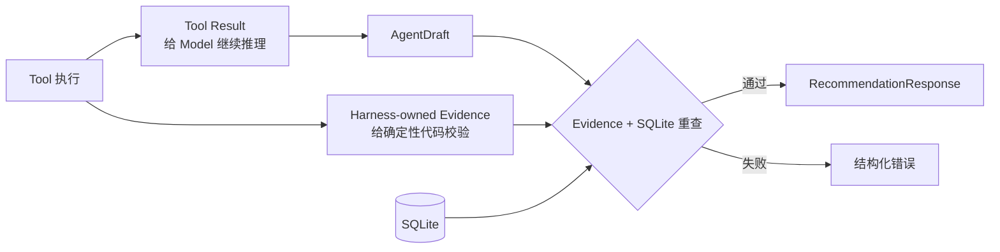

# 第 5 章：用代码守住事实

语言模型生成的内容具有概率性。同一个请求执行两次，推荐理由的措辞可能不同。这种变化适合自然语言表达，却不适合价格、库存和商品 ID。

Chatty 让 Model 只生成一个推荐草稿：

```json
{
  "product_id": "P023",
  "reason": "适合通勤的入门无线耳机",
  "marketing_copy": "轻量通勤，预算友好"
}
```

草稿不是最终响应。Harness 一共执行六类检查：

| # | 检查 | 稳定错误码 |
| --- | --- | --- |
| 1 | 当前 TaskFrame 要求的 Tool 已执行；商品路径前三步遵守依赖顺序 | `required_tools_not_used` |
| 2 | 知识检索至少命中一条内容 | `knowledge_not_retrieved` |
| 3 | 当前用户画像已经加载 | `profile_not_loaded` |
| 4 | 推荐 ID 属于商品搜索的召回集合 | `product_not_recalled` |
| 5 | 推荐 ID 属于库存确认集合 | `inventory_not_checked` |
| 6 | 推荐 ID 属于知识支撑集合 | `product_not_grounded` |

后三项可以理解为三个集合检查。Harness 会检查每个商品 ID 是否同时属于：

1. `search_products` 召回过的商品；
2. `check_inventory` 确认有货的商品；
3. `retrieve_knowledge` 能够支撑的商品。

任何一个集合缺失，整轮请求都会失败，不返回半成品。

校验通过以后，`Catalog.finalize` 再从 SQLite 读取商品名称、类目、价格、品牌、库存和标签。即使 Model 在草稿中想象了一个更低价格，也没有机会进入最终响应。推荐理由和营销文案虽然来自 Model，还要经过禁用词过滤。



这就是 Harness 的核心价值：Model 负责开放式判断，代码负责可执行规则，SQLite 负责业务真值。系统不是因为“相信模型”而正确，而是因为关键结论都能被验证。

代码里还有两个值得注意的接口位置：

- `model-provider.ts` 隔离 DeepSeek Responses 接入。Task Framer 和主 Agent Loop 共用同一份模型配置。
- `catalog.ts` 隔离 Tool 与 SQL。Tool 只表达业务查询，测试可以给 Catalog 使用独立 SQLite。

这两个位置让模型接入、业务数据和 Agent Loop 各自集中，但没有再增加一层只负责转发的抽象。

---

[← 上一章：五个 Tool](chapter4.md) · [返回目录](README.md) · [下一章：如何评估 Chatty →](chapter6.md)
