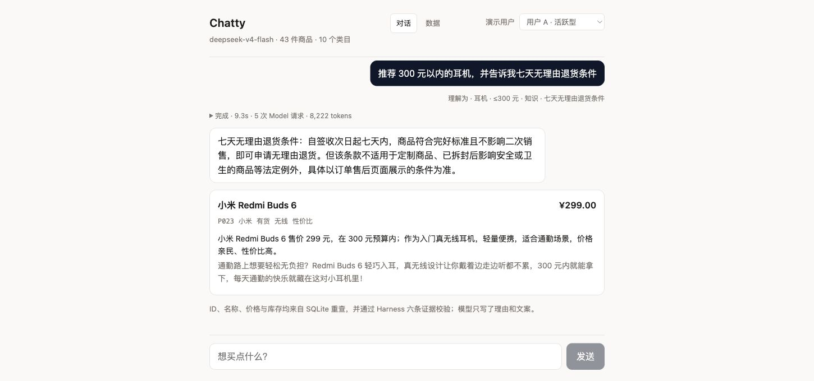
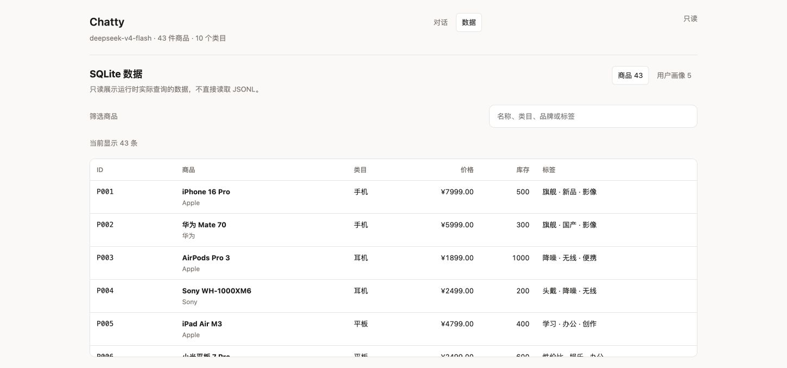

# 第 9 章：中文 Web GUI

Chatty 只保留 Web GUI 这一种用户入口。用户不需要学习命令行参数，只要选择一个演示画像，再用中文描述购物需求。

界面用“用户 A”到“用户 E”展示五个演示身份，并分别标注活跃型、价格敏感型、高价值型、
新客型和流失风险型。中文名称只用于展示，HTTP 请求和数据库仍使用 `user_active`、
`user_budget` 等稳定英文 ID。

一轮请求会依次显示：

1. 用户原话；
2. 输入适配器理解出的类目与价格；
3. Harness Trace、耗时、Model 请求次数和 Token Usage；
4. 政策回答、澄清问题或商品卡片；
5. 商品价格、库存与 Harness 校验说明。

Trace 展示“理解需求、检索知识、生成回答、校验 Evidence”等可验证步骤，不展示 Model
隐藏的 Chain-of-Thought。数据页只读展示 SQLite 中实际查询的商品和演示画像，方便 Demo
时核对价格与库存；JSON/JSONL 仍只是初始化种子。

下面两张图来自同一次真实 DeepSeek Demo。第一张展示 mixed-goal 对话与运行指标，第二张
展示运行时 SQLite 数据：

前端不计算推荐分数，也不修正价格和库存。它只调用 HTTP API 并渲染后端返回的结果，
所有业务规则仍然位于 Chatty Agent（Model + Harness）和 Catalog 中。Hono 只是
Frontend 与 Chatty Agent 之间的 HTTP Adapter。

React GUI 是产品界面，不是多模态 Agent。Model 不会观察屏幕、点击按钮或理解图片；Chatty 当前处理的输入和输出都是文字与结构化数据。只有未来确实需要语音、图片或屏幕操作时，才需要扩展新的观察与行动空间。

前端入口位于 `frontend/src/App.tsx`，数据页位于 `frontend/src/CatalogBrowser.tsx`，HTTP 类型
位于 `frontend/src/api.ts`，后端接口位于 `server/src/api.ts`。

---

[← 上一章：用户画像如何逐步更新](chapter8.md) · [返回目录](README.md) · [下一章：为什么 Chatty 只有一个 Agent →](chapter10.md)
