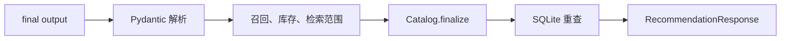

# Chatty 代码讲解指南

本文档按一次推荐请求的执行顺序讲解核心文件，帮助你现场解释代码。

## 1. `models.py`：数据契约

**面试考点**：Pydantic、输入约束、结构化输出。

`RecommendationRequest` 定义用户、场景、数量和上下文。所有模型继承 `StrictModel`，未知字段会被拒绝。

```python
class RecommendationRequest(StrictModel):
    # 字段约束在请求进入 Agent loop 前生效。
    user_id: str = Field(min_length=1, max_length=64)
    scene: Scene = "homepage"
    num_items: int = Field(default=5, ge=1, le=10)
    # 每个请求创建独立 context，避免共享可变默认值。
    context: UserContext = Field(default_factory=UserContext)
```

**面试怎么说**：请求、种子、Tool 参数和模型输出共用 Pydantic，错误会在进入业务逻辑前暴露。

## 2. `config.py`：环境配置

`python-dotenv` 从仓库根目录加载 `.env`。`override=False` 保证进程环境变量优先。

```python
def load_root_env() -> None:
    # 系统环境变量优先，.env 只补充本地配置。
    load_dotenv(ROOT / ".env", override=False)
```

## 3. `database.py` 与 `seed.py`：SQLite 初始化

首次启动会创建业务表、FTS5 虚拟表和种子元数据。`seed.py` 计算数据文件指纹；数据变化或表不完整时，事务会重新导入演示数据。

这套设计避免“数据库存在，但只导入了一半”的静默失败。

## 4. `repositories.py`：业务查询

Repository 把 SQLite 行转换成 Pydantic 模型。Catalog 启动时建立演示数据投影；
库存检查和最终商品回填会重新查询 SQLite。Agent 不直接执行 SQL。

## 5. `retrieval.py`：轻量 RAG

检索器对查询词执行 FTS5 `MATCH`，使用 BM25 排序，并按类目和商品 ID 过滤结果。

**面试怎么说**：知识检索使用 FTS5 MATCH、BM25 排序和 Top-K 返回。

## 6. `catalog.py`：搜索与业务校验

Catalog 负责两件事：

1. 根据实验组对候选商品排序
2. 对模型草稿做最终业务校验

最终响应中的名称、价格、库存和标签全部来自 SQLite。

## 7. `tools.py`：五个 Function Tool

`RecommendationContext` 保存当前请求、Catalog、实验组、已调用 Tool，以及召回、库存和知识证据。五个 Tool 共享这份上下文。

```python
async def get_user_profile(
    ctx: RunContextWrapper[RecommendationContext],
) -> str:
    context = ctx.context
    # Tool 通过本次 RecommendationContext 使用 Catalog，不向模型暴露内部对象。
    profile = context.catalog.user_profile(
        context.request.user_id,
        context.request.context,
    )
    # 保存结构化状态，最终校验无需解析自然语言历史。
    context.profile = profile
    context.used_tools.append("get_user_profile")
    return profile.model_dump_json()

return [
    # SDK 根据类型标注生成模型可见的参数 schema。
    function_tool(
        get_user_profile,
        name_override="get_user_profile",
    )
]
```

Tool 的业务调用、证据记录和 JSON 序列化集中在同一个实现中，不保留只做转发的 payload helper。

## 8. `agent.py`：Agent Loop

`Recommender` 创建一个 Agent，并通过 `Runner.run` 执行最多 10 轮。

```python
# Agent 声明 instructions、model 和可用 tools。
agent = Agent[RecommendationContext](
    name="Chatty",
    instructions=AGENT_INSTRUCTIONS,
    model=model,
    tools=build_tools(),
)

# Runner 执行 tool call -> tool result -> 下一轮模型输入。
result = await Runner.run(
    agent,
    request.model_dump_json(),
    context=context,
    # 轮次上限防止异常模型无限调用 Tool。
    max_turns=10,
)
```

当前模型接入使用文本 JSON。代码提取 JSON 后交给 Pydantic 校验，不把供应商行为包装成通用协议结论。

五个 Tool 必须严格依次执行。推荐商品必须来自召回与库存检查集合，并位于一次返回
非空结果的知识检索请求范围；否则请求明确失败。



## 9. `debug.py`：可观察运行轨迹

调试 hooks 记录 `llm_input → llm_output → tool_call → tool_result → agent_output → response/failure`。Tool 调用与结果通过 `call_id` 对齐；日志不记录模型隐藏思维过程。

## 10. `experiments.py`：稳定分桶

系统对 `user_id + experiment_id` 计算 SHA-256，再按奇偶分成两个 50% 组。服务端重新计算分组，客户端不能伪造实验组。

`control` 只使用商品热度；`treatment_personalized` 组合热度、偏好类目、近期行为和价格范围。

## 11. `app.py`：HTTP API

应用提供推荐、健康检查、实验结果和指标接口。`RecommendationError` 在 HTTP 层映射为 502 或 503。

## 12. 测试设计

- 数据测试：20 个唯一商品、5 类画像、种子修复
- Tool 测试：搜索、库存、RAG、营销策略
- Agent 测试：脚本模型固定五次 Tool 调用
- API 测试：请求校验、错误码、实验和指标

CI 运行 Ruff、ty 和全部确定性测试，不依赖模型密钥。
