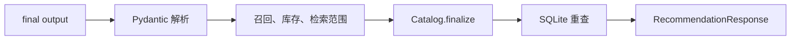

# Chatty 代码讲解指南

本文档按一次推荐请求的执行顺序讲解核心文件，帮助你现场解释代码。

## 1. `models.py`：数据契约

**面试考点**：Pydantic、输入约束、结构化输出。

`RecommendationRequest` 定义用户、场景、数量和上下文。所有模型继承 `StrictModel`，未知字段会被拒绝。

```python
class RecommendationRequest(StrictModel):
    # 字段约束在请求进入 Agent loop 前生效。
    user_id: str = Field(min_length=1, max_length=64)
    scene: Scene = "homepage"
    num_items: int = Field(default=5, ge=1, le=10)
    # 每个请求创建独立 context，避免共享可变默认值。
    context: UserContext = Field(default_factory=UserContext)
```

**面试怎么说**：请求、种子、Tool 参数和模型输出共用 Pydantic，错误会在进入业务逻辑前暴露。

## 2. `config.py`：环境配置

`python-dotenv` 从仓库根目录加载 `.env`。`override=False` 保证进程环境变量优先。

```python
def load_root_env() -> None:
    # 系统环境变量优先，.env 只补充本地配置。
    load_dotenv(ROOT / ".env", override=False)
```

## 3. `database.py`：建库、灌数据、连库

文件内按 `=====` 分成四节，从上往下读：

1. **中文分词** —— `segment_for_index` 把汉字逐个用空格隔开。
   必须有这一步：FTS5 的 `unicode61` 分词器把一整段无空格中文当作**单个 token**，
   不做处理的话 `MATCH "价格"` 检索不到「…价格敏感用户…」。索引和查询两侧都要用。
2. **表结构** —— 业务表 + FTS5 虚拟表 + 种子元数据表。
3. **种子导入** —— 先算 `data/` 目录的 SHA-256 指纹，与库里记录的比对：
   一致就跳过导入，不一致才在一个事务里重建。既避免每次启动重复灌数据，
   也避免“数据库存在但只导入了一半”的静默失败。
4. **连接管理** —— `Database` 类，对外只暴露 `connection` 和 `lock`。

## 4. `repositories.py`：两条读取路径

同一个库、同一把锁，区别只在查询方式：

- `CommerceRepository` —— 结构化查询：按主键、类目、价格取商品和画像
- `KnowledgeRetriever` —— 全文检索：FTS5 `MATCH` + 内置 `bm25()` 排序，
  类目和商品 ID 作为 SQL `WHERE` 条件先缩范围再算分

两者都只把数据库的行转成 Pydantic 模型，不做任何推荐决策。Agent 不直接执行 SQL。

**面试怎么说**：知识检索是稀疏检索——FTS5 倒排索引 + BM25 排序 + Top-K。
没有向量库，因为知识库只有几十篇短文档、领域词汇固定，
关键词匹配够用；代价是不理解同义词，这条边界写在工具描述里告诉了模型。

## 5. `catalog.py`：搜索与业务校验

Catalog 负责两件事：

1. 根据实验组对候选商品排序
2. 对模型草稿做最终业务校验

最终响应中的名称、价格、库存和标签全部来自 SQLite。

## 6. `tools.py`：五个 Function Tool

`RecommendationContext` 保存当前请求、Catalog、实验组、已调用 Tool，以及召回、库存和知识证据。五个 Tool 共享这份上下文。

```python
async def get_user_profile(
    ctx: RunContextWrapper[RecommendationContext],
) -> str:
    context = ctx.context
    # Tool 通过本次 RecommendationContext 使用 Catalog，不向模型暴露内部对象。
    profile = context.catalog.user_profile(
        context.request.user_id,
        context.request.context,
    )
    # 保存结构化状态，最终校验无需解析自然语言历史。
    context.profile = profile
    context.used_tools.append("get_user_profile")
    return profile.model_dump_json()

return [
    # SDK 根据类型标注生成模型可见的参数 schema。
    function_tool(
        get_user_profile,
        name_override="get_user_profile",
    )
]
```

Tool 的业务调用、证据记录和 JSON 序列化集中在同一个实现中，不保留只做转发的 payload helper。

**工具描述按三条原则写**（《深入理解 AI Agent》4.2）：说清"什么时候用"而不只是"能做什么"、
明确列出边界（做不到什么）、参数给具体例子。例如 `retrieve_knowledge` 的描述里
写明了"基于关键词匹配，不理解同义词——查'降噪'不会命中只写了'静音'的文档"。
教材的原话是：**当 Agent 频繁选错工具时，应优先检查工具描述而不是怀疑模型能力。**

同文件里的 `validate_tool_sequence` 负责校验调用序列，它**不做**严格的列表相等比较：

- 五个工具都调用过即可，**允许重复**——搜不到换条件重搜、知识不够补充检索都是合理行为
- 只要求有真实数据依赖的三步保持先后：`画像 → 搜索 → 库存`
- `get_marketing_strategy` 与 `retrieve_knowledge` 之间不约束顺序，它们本来就没有依赖

早期版本用的是严格相等，结果把上述合理行为全判成违规——
2026-07-27 的评估里 11 次"工具未按序调用"失败中没有一次是真的漏调工具。

## 7. `agent.py`：Agent Loop

`Recommender` 创建一个 Agent，并通过 `Runner.run` 执行最多 10 轮。

```python
# Agent 声明 instructions、model 和可用 tools。
agent = Agent[RecommendationContext](
    name="Chatty",
    instructions=AGENT_INSTRUCTIONS,
    model=model,
    tools=build_tools(),
)

# Runner 执行 tool call -> tool result -> 下一轮模型输入。
result = await Runner.run(
    agent,
    request.model_dump_json(),
    context=context,
    # 轮次上限防止异常模型无限调用 Tool。
    max_turns=10,
)
```

当前模型接入使用文本 JSON。代码提取 JSON 后交给 Pydantic 校验，不把供应商行为包装成通用协议结论。

跑完 Agent Loop 之后是 Harness 校验段，六条检查按顺序执行，任何一条不过就明确失败、
绝不静默降级：

| # | 检查 | 失败码 |
|---|---|---|
| ① | 五个工具都调过，且依赖顺序正确 | `required_tools_not_used` |
| ② | 知识检索有命中 | `knowledge_not_retrieved` |
| ③ | 用户画像已加载 | `profile_not_loaded` |
| ④ | 推荐商品 ⊆ 搜索召回集合 | `product_not_recalled` |
| ⑤ | 推荐商品 ⊆ 库存确认集合 | `inventory_not_checked` |
| ⑥ | 推荐商品 ⊆ 有知识依据的集合 | `product_not_grounded` |

第 ⑥ 条的"有知识依据"由**实际命中的文档**决定：
绑定具体商品的文档只覆盖该商品，未绑定商品的类目通用文档覆盖该类目下所有商品。
（早期版本拿模型请求时传的 `product_ids` 参数当依据范围，
会把"命中了手机类目通用指南、推荐同类目其他手机"误判成无依据。）


```mermaid
flowchart LR
    OUTPUT["final output"] --> PARSE["Pydantic 解析"]
    PARSE --> SETS["召回、库存、检索范围"]
    SETS --> FINALIZE["Catalog.finalize"]
    FINALIZE --> DB["SQLite 重查"]
    DB --> RESPONSE["RecommendationResponse"]
```

## 8. `debug.py`：可观察运行轨迹

调试 hooks 记录 `llm_input → llm_output → tool_call → tool_result → agent_output → response/failure`。Tool 调用与结果通过 `call_id` 对齐；日志不记录模型隐藏思维过程。

## 9. `experiments.py`：稳定分桶

系统对 `user_id + experiment_id` 计算 SHA-256，再按奇偶分成两个 50% 组。服务端重新计算分组，客户端不能伪造实验组。

`control` 只使用商品热度；`treatment_personalized` 组合热度、偏好类目、近期行为和价格范围。

## 10. 失败语义：没有 HTTP 层，但保留了可重试性

Chatty 是库不是服务，失败以 `RecommendationError` 抛出。
异常自带 `retriable` 字段表示“原样重试是否有意义”：
`llm_not_configured` 是环境问题（补上密钥就能成功）故为 `True`，
其余都是这一轮 Agent 逻辑没走通故为 `False`。

这个判断放在领域层而不是传输层，将来对外包 HTTP、gRPC 或消息队列都能直接映射
（HTTP 下 `True` → 503、`False` → 502）。

## 11. 测试与评估

**测试**（44 个，`tests/`）验证的是 Harness 契约，全部跑在脚本模型上，不联网不花钱：

- 数据测试：类目覆盖度、每个类目都有知识文档、种子修复
- Tool 测试：五个工具各自的证据记录与前置校验
- Agent 测试：脚本模型固定工具调用序列，验证六条 Harness 校验
- 评估框架测试：Rubric 打分逻辑本身是否正确

**评估**（`evals/`）验证的是模型行为，需要真实模型：
18 条分难度任务 + 三维度 Rubric + 检索质量指标。详见 [evals/README.md](../evals/README.md)。

两者证明的东西不同，不能互相替代。CI 只跑前者。
