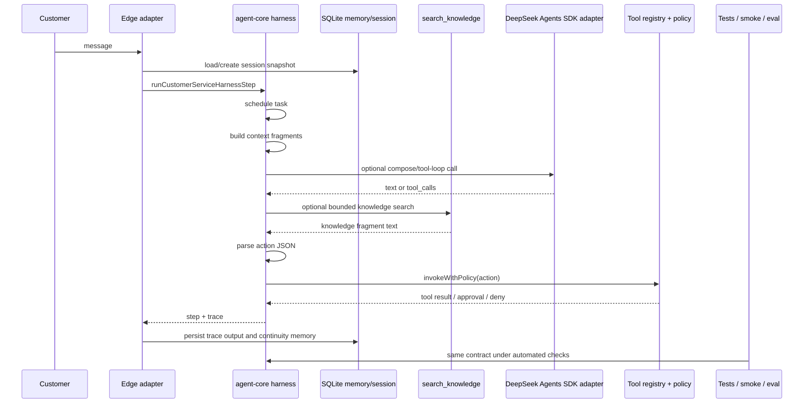
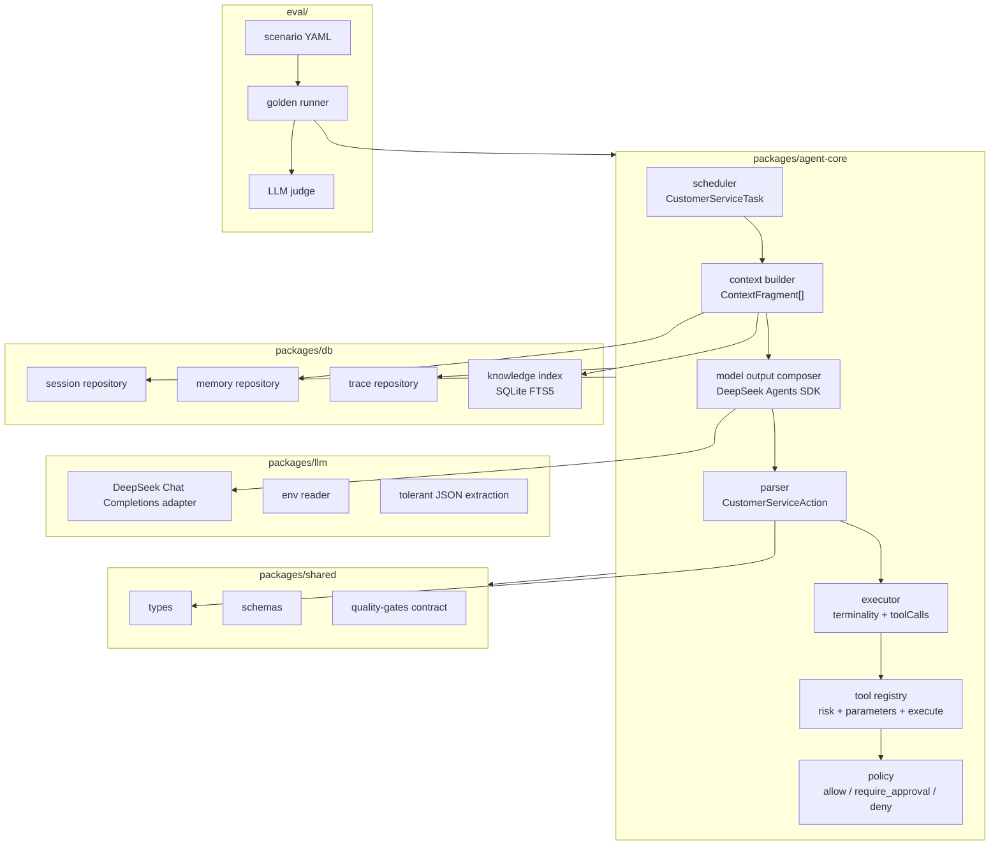
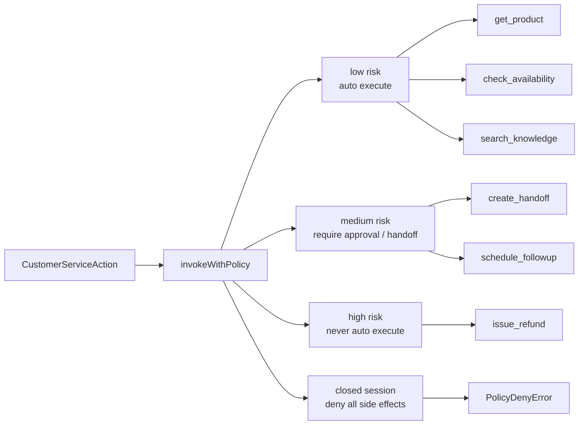
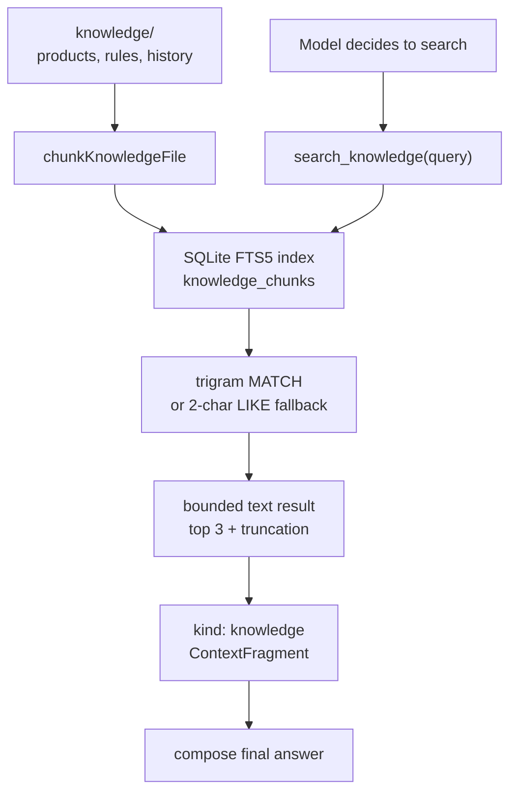
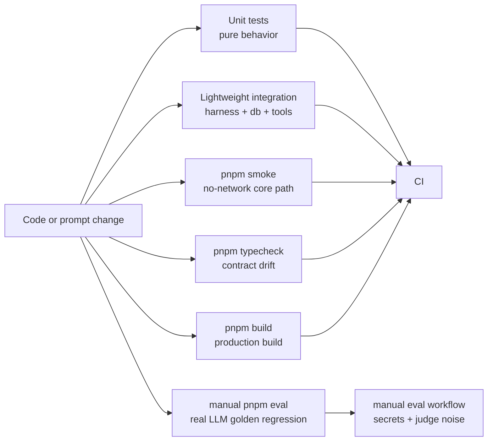
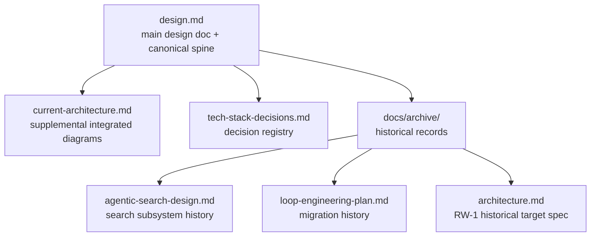

# Chatty Current Architecture

Last updated: 2026-07-12

This is the supplemental diagram set for the current implementation. The main
agent architecture design document is [design.md](design.md), which owns the
`docs/jd.md` lower bound, OpenClaw/Codex/Claude Code upper bound, design
choices, the canonical harness spine, and per-component rationale. This file
holds only the integrated views design.md's per-component decomposition does
not draw: the one-turn sequence, cross-package component owners, and the
tool/risk map.

Update this file whenever a change alters harness flow, tool behavior, memory
shape, knowledge access, model composition, trace fields, or eval gates.

## 0. 90-second Version

If you only keep one mental model, keep this:

```text
message -> scheduler -> context -> compose/search -> parser -> executor -> trace
```

Chatty is not primarily a Next.js app. It is a small customer-service agent
harness:

- **Scheduler** decides the narrow task for one turn.
- **Context builder** assembles task, user message, product, memory, and
  knowledge fragments.
- **Compose** asks DeepSeek pro through the Agents SDK. Missing configuration is
  a 503 response; provider or invalid-output failures are 502 responses.
- **search_knowledge** is the only agentic knowledge loop, bounded to 3 calls.
- **Parser** turns model text into a safe `CustomerServiceAction`.
- **Executor** applies tool policy and risk gates before any side effect.
- **Trace + memory** make every turn observable and testable.

Read only these files first:

- `packages/agent-core/src/customer-harness.ts` for the turn pipeline.
- `packages/agent-core/src/tools/registry.ts` for tool shape and risk.
- `docs/design.md` for the lower/upper complexity bounds and harness component shapes.
- `docs/tech-stack-decisions.md` for decisions and rejected options.

Everything else is supporting detail or history.

## 1. Complexity Budget

Keep the architecture boring:

- One active agent harness path.
- One knowledge-search mechanism: `search_knowledge` over SQLite FTS5/LIKE.
- One live model integration surface: DeepSeek `deepseek-v4-pro` through OpenAI Agents SDK over its OpenAI-format endpoint.
- One persistence family for MVP state: SQLite repositories.
- One quality story: automated tests + smoke + manual real-LLM golden eval.

Avoid adding a new runtime lane, workflow engine, vector database, agent
framework, or background loop unless the existing harness contract cannot
express the required behavior and there is a test/eval showing the gap.

## 2. Agent Harness Spine

The canonical harness spine — message → scheduler → context → compose/search →
parser → executor → trace — is drawn once in [design.md](design.md) (§0 总览).
This file does not re-draw it; what matters here is the contract that spine
implements.

The important boundary is not "web vs backend"; it is the harness contract:

```text
(event, memory, registry, optional model/tool loop) ->
  { step, trace }
```

`step` carries the customer-facing reply, terminality, tool calls, next status,
and memory patch. `trace` carries the inspectable harness path: task, context,
parsed action, tool calls, and tool results.

## 3. One Turn Sequence



## 4. Agent Components and Code Owners



## 5. Tool and Risk Model



Tool policy is the harness safety boundary. The customer-service agent has no
terminal or file tools; its risky surface is business-side effects.

## 6. Knowledge Access: Agentic Search, Not RAG



Current stance:

- No vector database.
- No embedding retrieval subsystem.
- Use memory deliberately instead of similarity-retrieving transient state.
- Chunk, index, and summarize knowledge before exposing it to the harness.
- Give the model an explicit search tool so the agent can decide when to search.
- Product prices, sizes, and exact structured facts should prefer structured
  tools over free-text knowledge search.
- Search failure must degrade to a usable answer path instead of breaking a turn.

## 7. Quality Gates Around the Agent



Every behavior that can be automatically verified should be automatically
verified. The executable quality-gate contract lives in
`packages/shared/src/quality-gates.ts`.

## 8. Documentation Map



Start from `docs/design.md`: it is the main design document and owns the
canonical harness spine. Use this file for the supplemental integrated diagrams,
and `docs/tech-stack-decisions.md` for why a technology or product direction was
chosen.
