# Chatty Harness Design Map

Last updated: 2026-07-05

本文是 Chatty 的 agent 架构设计主文档。目标不是把参考仓所有能力搬进来，而是把 18 个关键问题逐个定清楚：

- 每个问题只选一个主参考实现：OpenClaw / Codex / Claude Code 三选一。
- 新版 JD 的能力覆盖也只在 OpenClaw / Codex / Claude Code 里单选主参考。
- Chatty 只取能服务租衣客服 harness 的最小子集。
- 改动 harness、tool、memory、parser、executor、eval 时，必须同步更新本文和
  `packages/shared/src/architecture-bounds.ts`。

补充图集见 [current-architecture.md](current-architecture.md)。

## 0. 总览

Chatty 的下限是新版 `docs/jd.md`。上限是本地源码：

- `/Users/edward/Documents/oss/openclaw`
- `/Users/edward/Documents/oss/codex`
- `/Users/edward/Documents/oss/claude-code`

Chatty 的位置在中间：保留 agent harness 的骨架，拒绝通用 coding agent 的能力面。

删除优先级高于优化：

- 低于下限：如果能力不足以支撑新版 `docs/jd.md`，补到下限。
- 区间内：保留最小实现，并用测试锁住行为。
- 超出上限或偏离客服 harness：先删除，不做优化、不做抽象、不留半成品。
- 重新引入越界能力前，必须先改 `packages/shared/src/architecture-bounds.ts` 和对应测试。

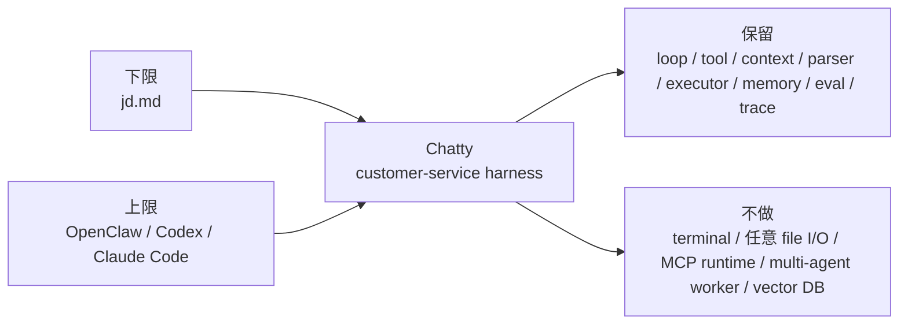

主链路只看这一张图：

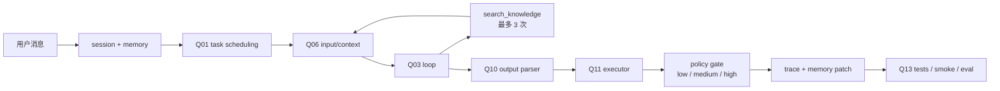

18 个问题在架构上的分组：

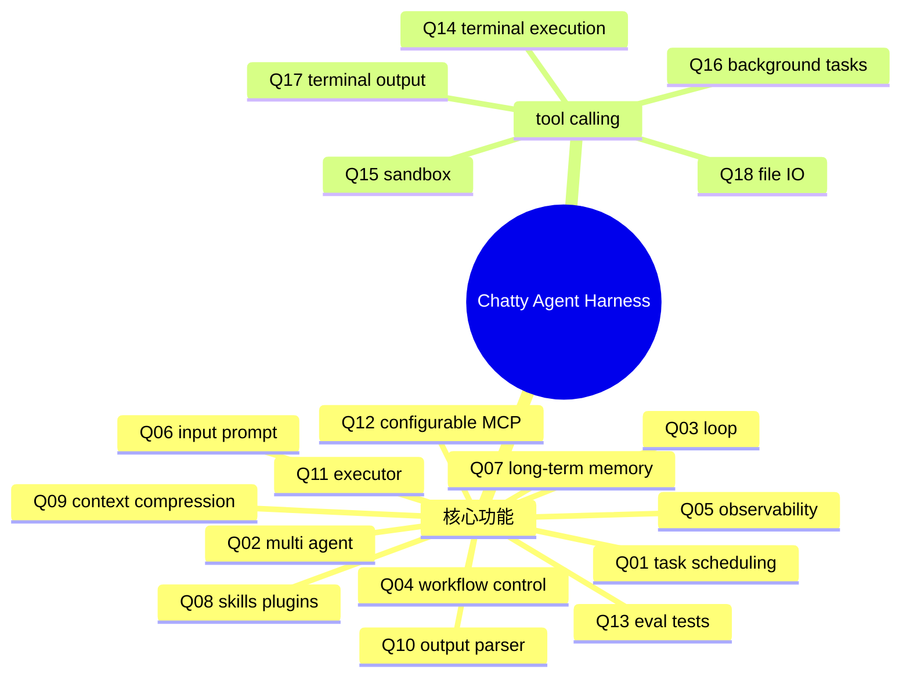

## 1. 18 问矩阵

| # | 问题 | 主参考实现 | Chatty 当前选择 | 代码落点 |
|---|---|---|---|---|
| Q01 | task scheduling 拆分 | Codex | 单轮窄任务 scheduler | `scheduleCustomerServiceTask` |
| Q02 | 如何实现 multi agent | Codex | 当前不做；出现 worker/subagent runtime 先删 | `CustomerServiceTask` |
| Q03 | loop 和流程控制 | Codex | 每请求一次 bounded harness step | `runCustomerServiceHarnessStep` |
| Q04 | 如何更好控制整个 loop 和 workflow | Codex | 常量上限、失败回退、显式 trace，不上 durable workflow | `customer-harness.ts` |
| Q05 | 如何做可视化、可观测性与 terminal UI | Codex | 不做 terminal UI，做 trace inspector | `harnessTrace` / `apps/web` |
| Q06 | input 拼接 prompt | Codex | 结构化 context fragments | `buildCustomerServiceContext` |
| Q07 | 如何实现 long-term memory | OpenClaw | SQLite memory + 业务知识 search，不做 embedding RAG | `memory-repository.ts` |
| Q08 | 如何实现 skills 和 plugins | Claude Code | 不做 runtime plugin；出现 plugin runtime 先删 | `tools/registry.ts` |
| Q09 | 如何做好 context auto compression | Codex | 只做 recentMessages 滑窗，暂不 auto-compact | `memory-repository.ts` |
| Q10 | output parser | Codex | JSON action parser + 安全 fallback | `parseCustomerServiceOutput` |
| Q11 | 执行器 executor | Codex | action -> policy -> tool result | `executeCustomerServiceAction` |
| Q12 | 如何设计可以自由配置的 MCP | Claude Code | 只保留 tool contract；出现 MCP runtime 先删 | `ToolDefinition` |
| Q13 | 如何做好 eval 和自动化测试 | Codex | unit + smoke + manual golden eval | `quality-gates.ts` / `eval/` |
| Q14 | terminal 执行 | Codex | 不开放 terminal；出现 shell/exec tool 先删 | 无 |
| Q15 | 如何控制 sandbox 环境 | Codex | OS sandbox 降维成业务 policy gate | `policies/policy.ts` |
| Q16 | 如何管理 background tasks | Codex | 默认禁止后台 agent task；出现静默后台 loop 先删 | `pnpm eval` 显式触发 |
| Q17 | terminal 读 output | Codex | 不读 stdout/stderr，只读 tool result 和 trace | `toolCalls` |
| Q18 | 基本 file I/O（读、写、搜） | Claude Code | 不开放任意读写，只保留 `search_knowledge` | `search-knowledge.ts` |

参考实现分布：

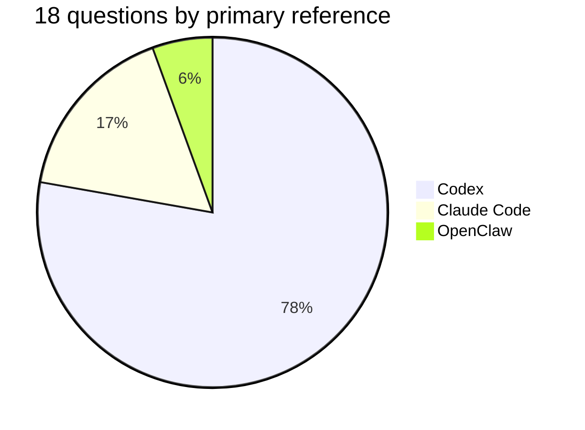

## 1.1 新版 JD 能力覆盖矩阵

新版 JD 的下限不只是“能跑一个客服 demo”，还要求能解释 LLM、KV Cache、Agent Loop、Tool Use、Reasoning、Planning、Skills、MCP、Memory、Subagent、Multi-Agent、Prompt / Context / Harness Engineering，并能用真实任务、评测和产品反馈持续迭代。

| JD 能力项 | 主参考实现 | Chatty 当前状态 | 差距处理 |
|---|---|---|---|
| LLM API 与 KV Cache | Codex | model 固定 `deepseek-v4-pro`；`@rental/llm` 走 DeepSeek OpenAI-format Chat Completions；trace 记录 cache hit/miss、hit ratio、cost | 保留 usage telemetry；下一步只优化 prompt 稳定布局，不引入 provider 私有 cache API |
| Agent Loop 与 Tool Use | Codex | 每轮 bounded tool loop，`search_knowledge` 最多 3 次，失败 deterministic fallback | 保持有界；复杂 workflow 先删 |
| Reasoning 与 Planning | Codex | 以 deterministic scheduler 表达窄 planning，不暴露 chain-of-thought | 补 eval 场景验证 task choice；不做自由规划器 |
| Skills 与 MCP | Claude Code | typed tool registry + risk/policy；无 runtime plugin/MCP | 只保留 tool contract；runtime plugin 先删 |
| Memory | OpenClaw | SQLite memory snapshot + recent messages + business knowledge search | 继续保持 FTS/LIKE；不做 vector RAG |
| Subagent 与 Multi-Agent | Codex | 当前不实现，仅文档化上限和删除规则 | 只有真实任务证明需要时再设计 subagent runtime |
| Prompt / Context / Harness Engineering | Codex | 结构化 fragments、query refinement、output contract、trace inspector | 优先做 cache-friendly prompt order 和 eval |
| 评测基准与数据标注 | Codex | `pnpm test`、`pnpm smoke`、`pnpm eval`、golden YAML | 可补真实反馈到 golden 的人工流程，不做自动晋升飞轮 |
| 真实任务反馈与产品指标 | Codex | playground trace review + `agent_trace_reviews` + `/api/trace-reviews` + dashboard feedback summary | 保持最小人工 review 闭环；不做自动晋升飞轮 |
| UI/UX 与 demo 原型 | Claude Code | playground 展示 loop、tool、trace、LLM cost/cache | 继续提高可解释性；不做大型后台 |

## 2. 核心功能

### Q01. task scheduling 拆分

参考实现：Codex。

Chatty 把一轮用户输入先收敛成一个窄任务：`collect_missing_info`、`answer_question`、
`check_availability`、`handoff`、`follow_up`。这让后面的 context、parser、executor 都围绕同一个任务运行。

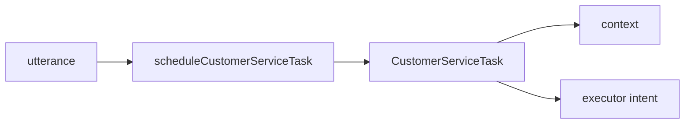

### Q02. 如何实现 multi agent

参考实现：Codex。

Chatty 当前不实现 multi agent。Codex 的 manager/subagent 模式只作为上限参照，不进入当前实现。
如果代码里出现 worker/subagent runtime，而没有先更新复杂度契约和 eval，处理方式是删除。

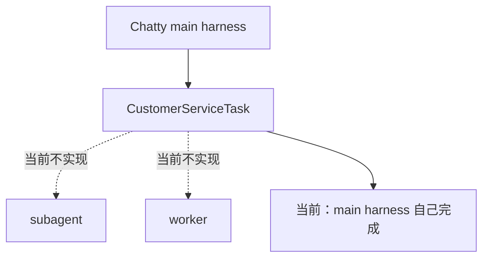

### Q03. loop 和流程控制

参考实现：Codex。

Chatty 的 loop 是一次请求内的有界 harness step。模型最多触发 3 次 `search_knowledge`，失败回退确定性 composer，保证没有 LLM key 也能跑。

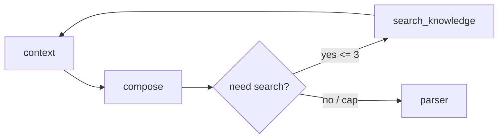

### Q04. 如何更好控制整个 loop 和 workflow

参考实现：Codex。

控制点只有四个：搜索上限、失败回退、trace 必出、显式 eval。Chatty 不上 LangGraph、Temporal 或长期 workflow，因为 MVP 是每请求一次有界步。
`follow_up`、`handoff` 这类 workflow action 的工具参数由 harness 确定性生成，不让 LLM 猜日期、会话 ID 或审批边界。

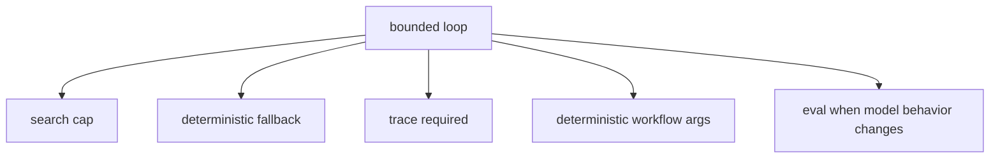

### Q05. 如何做可视化、可观测性与 terminal UI

参考实现：Codex。

Chatty 不做 terminal UI。可视化对象是客服 turn：task、context、toolCalls、action、policy result、memoryPatch。

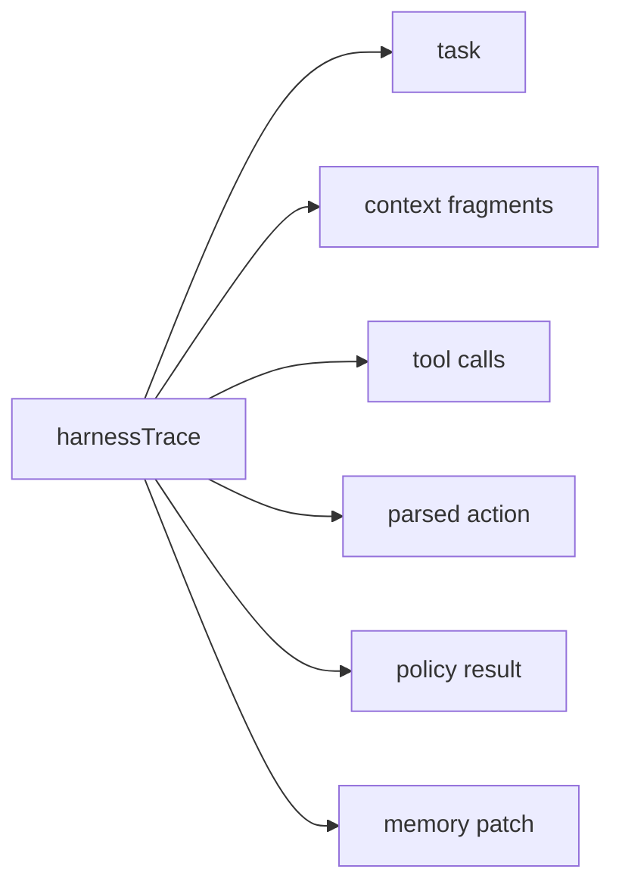

### Q06. input 拼接 prompt

参考实现：Codex。

Prompt 不在 route 里手写大段字符串，而是由结构化 context fragments 组成：task、user、memory、product、knowledge。
compose system prompt 的结构参考两边：

- Codex：取“清晰、务实、严谨”、范围收敛、事实优先和结果忠实的 operating style。
- Claude Code：取 harness / tool / output contract 分层，让模型知道哪些决策由 harness 管，哪些动作必须走工具边界。

`search_knowledge` 的 query 不是完全相信模型：泛词如“规则 / 信息 / 推荐”会在 harness 侧按当前商品和用户问题收敛，例如尺码问题改成 `SUIT-001 尺码`。
Chatty 的 agent 定义为 `agent = model + harness`。model 固定为 `deepseek-v4-pro`，不切 flash，也不按 OpenAI model 能力做设计假设；harness 才是可演进部分。
DeepSeek 官方兼容面是 Chat Completions、tool calls、JSON object、thinking/reasoning 和 context caching。Chatty 已引入 OpenAI Agents SDK 的兼容子集：用 `OpenAIChatCompletionsModel` 包装 DeepSeek endpoint，用 SDK function tools 承接 `search_knowledge` 的模型侧编排；工具执行、policy、knowledge fragment 和 trace 仍归 Chatty harness。SDK session、human-in-the-loop 和 tracing 仍只是候选适配面。不能把 OpenAI Responses API、OpenAI hosted tools 或 OpenAI Conversations API 当成 DeepSeek 默认能力。
LLM billing/cache 参考实现选 Codex：用 cached/non-cached input token、turn usage 和 budget 思路解释 DeepSeek 账单，不引入 provider 私有 cache API。
Chatty 对应字段是 `inputCacheHitTokens`、`inputCacheMissTokens`、`inputCacheHitRatio`、`estimatedCostCny`，用于观察 DeepSeek pro 的 prompt/KV cache 命中情况。

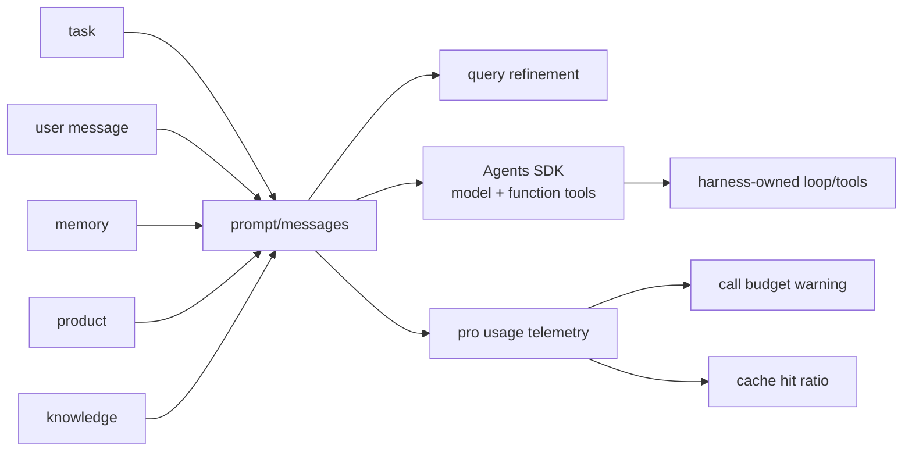

### Q07. 如何实现 long-term memory

参考实现：OpenClaw。

OpenClaw 的主线是 `memory_search` 和 hybrid retrieval。Chatty 只取“长期状态可被检索并回填 prompt”这一层：SQLite memory snapshot + `search_knowledge`，暂不做 embedding/vector RAG。

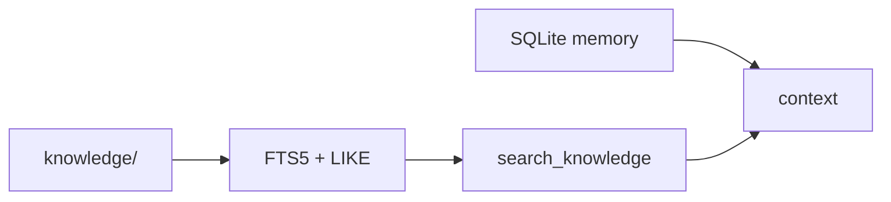

### Q08. 如何实现 skills 和 plugins

参考实现：Claude Code。

Claude Code 的价值在能力目录化：tools、MCP、hooks、skills、memory、permission 都能声明。
Chatty 当前只落到 typed tool registry。plugin runtime 属于越界能力，出现实现先删。

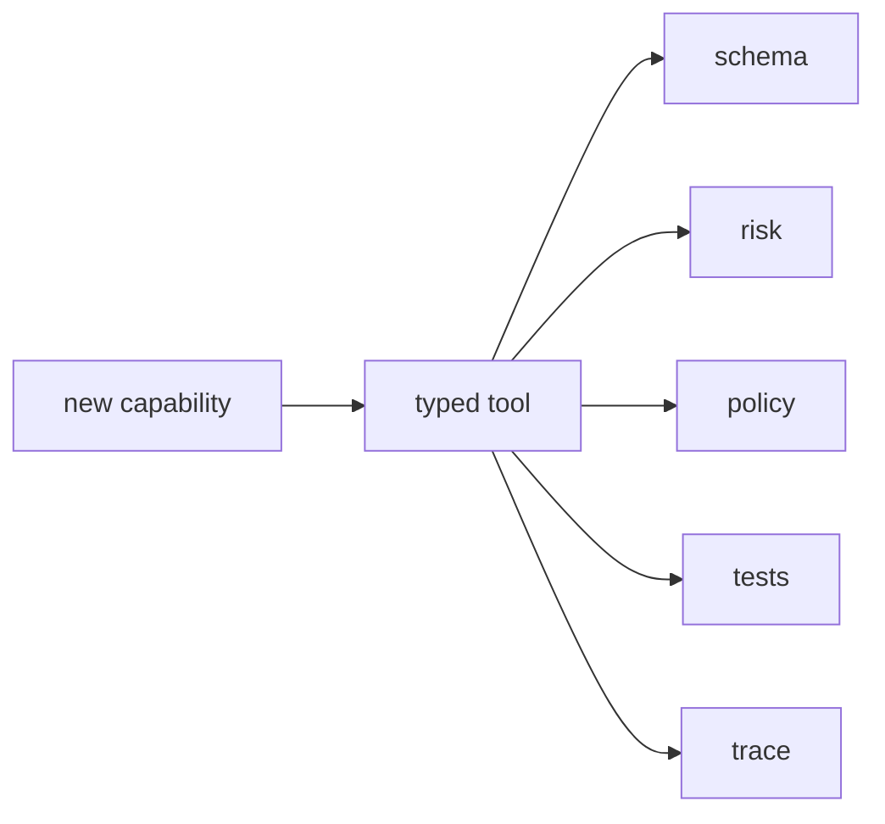

### Q09. 如何做好 context auto compression

参考实现：Codex。

Codex 用 auto-compact 处理长任务。Chatty 当前会话短，先用 recentMessages 滑窗；只有 eval 证明丢上下文，才加 fragment 级摘要。

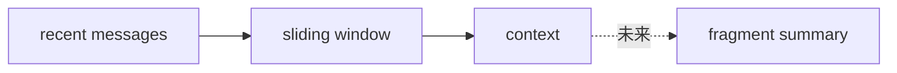

### Q10. output parser

参考实现：Codex。

模型输出必须变成 `CustomerServiceAction`。解析失败不能进入 executor，只能走安全 fallback。

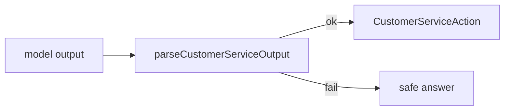

### Q11. 执行器 executor

参考实现：Codex。

Executor 是副作用边界。模型不能直接执行业务动作，必须经过 action、registry、policy。
当 policy 要求审批或拒绝执行时，trace 仍保留候选 tool call；这样 demo 和后台能解释“模型想做什么、为什么没有自动执行”。

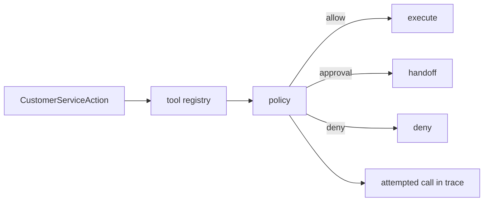

### Q12. 如何设计可以自由配置的 MCP

参考实现：Claude Code。

Chatty 当前不接 MCP runtime。只保留 tool contract：name、description、parameters、risk、execute、policy。
MCP runtime 属于越界能力，出现实现先删。

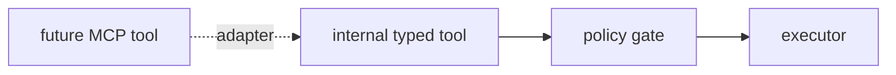

### Q13. 如何做好 eval 和自动化测试

参考实现：Codex。

测试是 architecture 的一部分。确定性逻辑进 unit，跨包行为进 integration，无网络主链路进 smoke，真实模型行为进 manual golden eval。
真实 LLM 调试必须带成本观测：trace 记录 model、调用次数、每轮调用预算、cache hit/miss、cache hit ratio、output tokens、估算成本和预算告警，避免只在账单 CSV 里事后发现峰值。
这些 JD 对齐的工程化改动同步记录在 `docs/changelog.md`，让“为什么改”和“如何验证”能被持续追踪。
真实任务反馈的最小闭环是人工 trace review：产品/运营可以在 playground 对最近一轮 trace 打 `pass`、`fail`、`flagged`，并用 tags 标记 `needs_golden`、`policy_gap` 等问题；dashboard 只展示汇总指标，不自动修改 prompt 或金标。

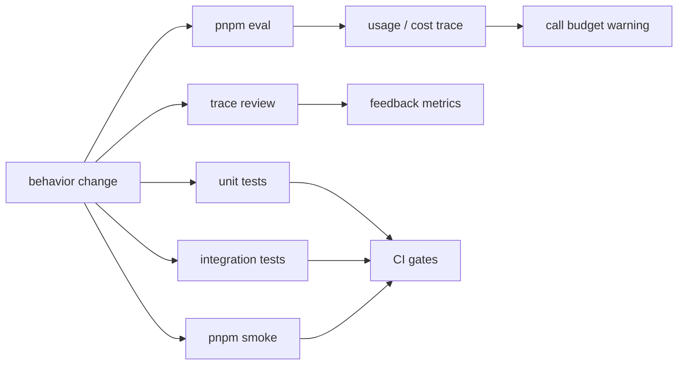

## 3. tool calling

### Q14. terminal 执行

参考实现：Codex。

Chatty 不开放 terminal。客服 agent 的风险面是业务动作，不是 shell。

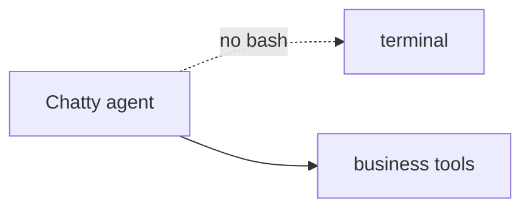

### Q15. 如何控制 sandbox 环境

参考实现：Codex。

Codex 的 OS sandbox 在 Chatty 里降维成业务 policy gate：low 自动执行，medium 转审批，高风险永不自动执行。

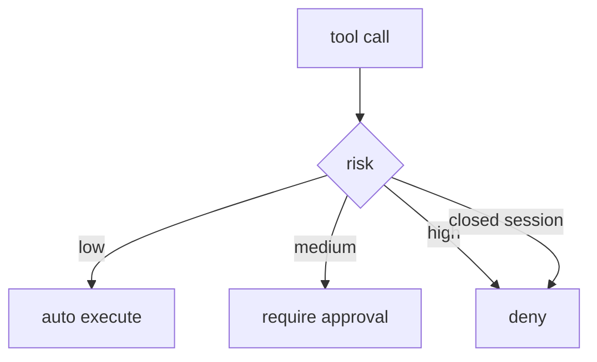

### Q16. 如何管理 background tasks

参考实现：Codex。

默认禁止后台 agent task。允许的后台工作必须显式触发、幂等、可重放、有 trace。
静默后台 loop 属于越界能力，出现实现先删。

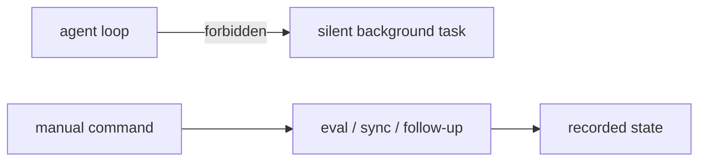

### Q17. terminal 读 output

参考实现：Codex。

Chatty 不解析 stdout/stderr。可观测输出只有 model output、tool result、trace。

```mermaid
flowchart LR
  Model["model output"] --> Parser["parser"]
  Tool["tool result"] --> Trace["trace"]
  Trace --> UI["inspector"]
```

### Q18. 基本 file I/O（读、写、搜）

参考实现：Claude Code。

Claude Code 的 FileRead / FileWrite / Grep / Glob 是上限。Chatty 不开放任意读写，只保留业务知识搜索和 repository 读写。

```mermaid
flowchart LR
  FileIO["generic file I/O"] -. "not exposed" .-> Chatty["Chatty"]
  Knowledge["knowledge corpus"] --> Search["search_knowledge"]
  Repo["typed repositories"] --> State["session / memory / trace"]
```

## 4. 当前代码结构

```mermaid
flowchart TD
  Web["apps/web<br/>adapter + inspector"] --> Core["packages/agent-core<br/>harness"]
  Core --> DB["packages/db<br/>SQLite repositories"]
  Core --> LLM["packages/llm<br/>Chat Completions adapter"]
  Core --> Shared["packages/shared<br/>types / gates"]
  Core --> Tools["tools registry"]
  DB --> Knowledge["knowledge/ corpus"]
  Eval["eval/ golden regression"] --> Core
```

阅读顺序：

1. `packages/agent-core/src/customer-harness.ts`
2. `packages/agent-core/src/tools/registry.ts`
3. `packages/agent-core/src/policies/policy.ts`
4. `packages/db/src/memory-repository.ts`
5. `packages/shared/src/architecture-bounds.ts`

## 5. 设计原则

```mermaid
flowchart LR
  Need["业务需要"] --> Test["能否自动验证"]
  Test -->|"能"| Gate["加测试/CI/eval"]
  Test -->|"不能"| Risk["写明风险"]
  Gate --> Small["选最小实现"]
  Risk --> Small
  Small --> Contract["更新 architecture-bounds + 本文"]
```

核心原则：每个问题只选一个主参考实现；只借鉴 harness 结构，不复制参考仓的完整能力面。
删除比优化重要：任何低于下限或超出上限的实现，都先按边界处理，而不是就地美化。
