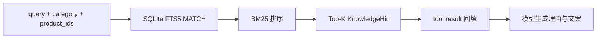
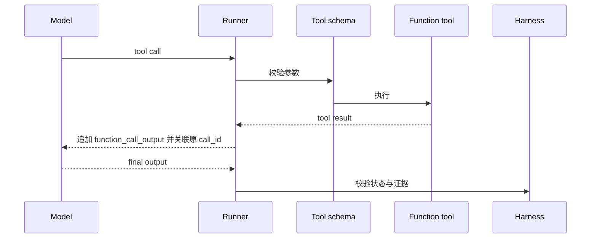

# Chatty 面试指南

这份指南只讲当前代码能够证明的内容。回答时先给结论，再按“机制、异常、验证、边界”
展开；每一段都应能被单独提问和打断。

## 30 秒项目介绍

> Chatty 是一个单 Agent 电商推荐 Demo。我用 OpenAI Agents SDK 让模型依次调用
> 用户画像、商品搜索、库存检查、知识检索和营销策略五个 Tool。业务事实和知识都
> 存在 SQLite，其中 RAG 使用 FTS5 和 BM25。模型只生成商品 ID、推荐理由和文案，
> Harness 再根据 Tool 证据和 SQLite 真值完成最终校验，通过 FastAPI 返回结果。

## 一分钟项目介绍

> 这个项目重点解决的是：怎样让模型参与推荐决策，但不能编造商品、价格和库存。
> Model 负责选择 Tool 和生成语义文本；Harness 负责 RunContext、Tool 执行、轮次限制、
> 证据校验和错误映射。一次请求严格执行五个 Tool，知识检索结果会回到 Agent 上下文；
> 最终 Catalog 重新读取 SQLite，过滤缺货和越价商品，再回填价格、库存与标签。
> 我用脚本模型确定性测试真实 Agents SDK Tool Loop，也把调试中发现的库存缓存、
> Tool 顺序、分群错配和指标双计数问题固化成了回归测试。

## 回答结构

每道项目题都按下面五步回答：

1. **直接回答**：先用一句话回答问题。
2. **代码机制**：说明输入、状态、Tool、输出和失败点。
3. **真实异常**：讲一个实际复现过的问题。
4. **验证证据**：指出测试、日志或数据库查询证明了什么。
5. **能力边界**：明确当前实现没有证明什么。

## 核心问题

### 1. `Agent = Model + Harness` 在 Chatty 中怎么体现？

**直接回答：** Model 处理不确定的语义决策，Harness 控制确定性的业务边界。

**代码机制：**

- Model 根据 instruction、请求和 Tool Result 决定下一步调用。
- OpenAI Agents SDK 的 `Runner.run` 执行 Tool Loop。
- Harness 保存 RunContext、限制最多 10 轮、验证五个 Tool 和证据集合。
- Catalog 根据 SQLite 真值生成最终 `RecommendationResponse`。

**边界：** Prompt 是软约束；库存、价格和商品范围必须由代码验证。

### 2. OpenAI Agents SDK 在项目里承担什么？

**直接回答：** SDK 提供 Agent、Function Tool、Runner 和 RunContext 的运行机制。

**代码机制：** `Agent` 注册 instruction、model 和五个 Tool；`Runner.run` 将请求和
`RecommendationContext` 注入一次运行；Tool Call Result 按 `call_id` 回填，模型再继续
下一轮，直到产生最终输出或达到轮次上限。

**边界：** SDK 负责循环和协议，业务完成条件仍由 Chatty 的 Harness 定义。

### 3. 为什么五项能力是 Tool？

**直接回答：** 它们是确定性查询能力，不负责自主规划下一步。

用户画像、商品搜索、库存、知识检索和营销策略都接受明确参数并返回结构化结果。
Agent 决定何时调用；Tool 只执行受限的业务读取或 FTS5 检索。

### 4. RunContext 有什么作用？

**直接回答：** 它把一次运行中的业务状态和验证证据集中到一个对象里。

RunContext 保存请求、实验组、画像、召回商品、库存商品、知识范围和 Tool 调用顺序。
五个 Tool 逐步写入，Harness 在模型输出后读取，因此不需要从自然语言历史反推业务状态。

### 5. Chatty 的 RAG 流程是什么？

**直接回答：** `retrieve_knowledge` 执行检索，Top-K 文档作为 Tool Result 回到 Agent，
并参与后续生成。

Harness 要求检索结果非空，并要求推荐商品位于这次有命中的检索请求范围内。

**边界：** 当前是关键词 RAG，不包含 embedding、rerank 或逐商品 citation。

### 6. 为什么业务数据和知识都放 SQLite？

商品、库存、用户画像和营销规则适合关系表；演示知识由 SQLite FTS5 检索。JSON/JSONL
只作为可读种子，启动时通过指纹和事务导入。Catalog 从 SQLite 建立演示数据投影；
库存检查、知识检索和最终商品回填在请求路径查询 SQLite。

### 7. 如何防止模型编造价格和库存？

模型草稿只允许包含 `product_id`、`reason` 和 `marketing_copy`。Catalog 在最终响应前
重新读取 SQLite，拒绝未知商品，过滤缺货和超出用户价格范围的商品，并回填名称、价格、
库存和标签。模型没有这些字段的最终决定权。

### 8. Pydantic 和 Harness 分别校验什么？

Pydantic 校验结构：字段类型、长度、数值范围和未知字段。Harness 校验语义：Tool 是否
严格依序完成、是否有知识结果、商品是否经过召回与库存检查，以及最终业务字段是否来自
SQLite。两者解决的问题不同。

### 9. Prompt 已经要求五步，为什么还要代码校验？

模型 instruction 会提高正确调用概率，但不能构成完成证明。实际调试中，Tool 全部调用但
顺序错误、营销分群传错，Runner 都可能正常结束。Harness 因此检查真实调用顺序和画像
分群，而不是相信最终文本说“已经完成”。

### 10. 如何测试概率性的 Agent？

`ScriptedModel` 固定产生五个 Tool Call 和最终消息，但仍通过真实 Agents SDK Runner
执行 Tool、回填 Result 和推进历史。它能稳定验证 Harness 合约和失败路径。

**边界：** 确定性测试不等于真实模型成功率；当前项目没有足够数据给出模型优劣结论。

### 11. 如何调试 Tool Calling 问题？

先按生命周期定位：

1. Model 是否产生 Tool Call
2. 参数是否通过 Schema
3. Tool 是否执行成功
4. Result 是否用正确 `call_id` 回填
5. 后续模型输入是否包含 Result
6. 最终输出是否通过 Harness

本地可观察轨迹按 `llm_input → llm_output → tool_call → tool_result →
agent_output → response/failure` 记录。它不记录模型隐藏思维过程。

### 12. A/B 测试怎么工作？

系统对 `user_id + experiment_id` 计算 SHA-256，并稳定分为 `control` 和
`treatment_personalized`。对照组按热度排序，实验组组合类目、价格、近期行为和热度。
指标保存在当前进程。

### 13. 错误如何映射到 HTTP？

- 请求结构错误：FastAPI/Pydantic 返回 422。
- 缺少模型密钥：返回 503 和 `llm_not_configured`。
- 流程证据不足：返回 502，并保留稳定失败码。
- 模型草稿结构或 Catalog 最终校验失败：返回 502 和 `invalid_recommendation`。
- 未分类的模型、Tool 或 Runner 异常：返回 502 和 `recommendation_failed`。

失败会进入指标和日志，不会静默生成默认推荐。

### 14. 这个项目是否上线？

这是可运行、可测试的本地 API Demo。它证明了 Agent Loop、Tool Calling、SQLite、
FTS5 RAG、业务校验和 FastAPI 接口；没有生产流量，因此不声称真实 CTR、QPS 或可用性。

### 15. 如果数据量和流量扩大，先改哪里？

先根据测量结果定位瓶颈：SQLite 写并发、检索召回、模型延迟或指标持久化。当前模块已经
把结构化查询、检索、Agent Loop 和 HTTP 分开，可以在对应 seam 替换实现；在出现真实
瓶颈前不预先增加基础设施。

## 四个真实调试故事

### 故事一：最终组装可能返回旧库存

- **症状**：Catalog 启动后 SQLite 库存发生变化，最终组装仍可能返回启动缓存中的库存。
- **根因**：Catalog finalize 使用了旧商品对象。
- **修复**：最终组装前重新读取 SQLite。
- **验证**：测试将数据库库存更新为 0，再直接断言 finalize 失败。
- **理解**：启动缓存不是提交响应时的业务真值。

### 故事二：模型绕过用户价格范围

- **症状**：请求最高价为 1000 元，模型仍可用更大的搜索参数召回 1899 元商品。
- **根因**：最终校验只相信 Tool 的搜索结果，没有重查画像价格范围。
- **修复**：Catalog finalize 同时校验 `profile.min/max_price_cents`。
- **验证**：越价草稿必须得到 `no_available_recommendations`。

### 故事三：Tool 都调用了，但顺序和分群错误

- **症状**：先搜索再加载画像，或 active 用户读取 new_user 营销策略，仍能成功。
- **根因**：Harness 只检查 Tool 名称集合。
- **修复**：记录调用顺序，并要求营销策略 segment 与当前画像一致。
- **验证**：两条错误轨迹均进入失败路径。

### 故事四：一次失败同时计入成功和失败

- **症状**：推荐内容生成后，响应构造异常；指标先记成功，异常处理又记失败。
- **根因**：成功指标写入早于 canonical response 构造。
- **修复**：响应构造成功后才记录 success。
- **验证**：注入响应构造异常，断言 successes 为 0、failures 为 1。

## 代码走读顺序

1. `models.py`：Pydantic 请求、草稿和响应契约
2. `database.py`、`seed.py`：SQLite schema 与事务初始化
3. `repositories.py`、`retrieval.py`：结构化查询与 FTS5/BM25
4. `catalog.py`：搜索、排序和最终业务校验
5. `tools.py`：五个 Function Tool 与 RunContext
6. `agent.py`：Agent、Runner 和 Harness 验证
7. `app.py`：FastAPI 接口与错误映射
8. `tests/`：确定性 Tool Loop 和真实失败回归

## 面试前检查

- [ ] 能在 30 秒内讲清用户问题和项目路径
- [ ] 能解释 Model、Harness、Tool 的职责
- [ ] 能画出完整 RAG 数据流
- [ ] 能说明 Pydantic 与业务校验的区别
- [ ] 能从 Tool Calling 生命周期定位失败
- [ ] 能讲至少两个真实 bug 的症状、根因和回归测试
- [ ] 能指出确定性测试和真实模型评测的不同证明范围
- [ ] 能诚实说明本地 Demo 的能力边界
