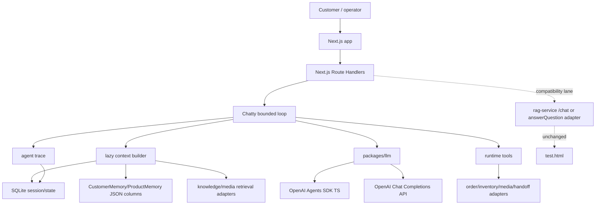
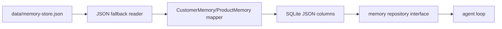
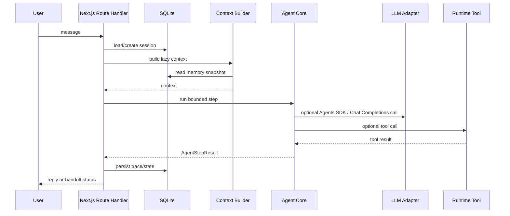
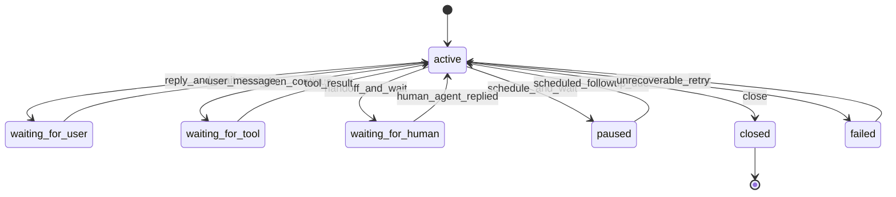
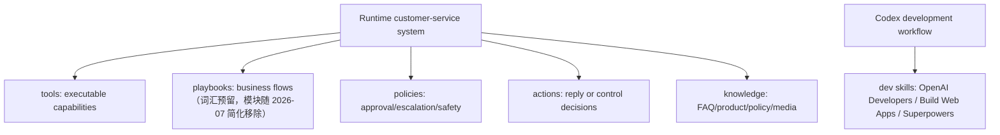
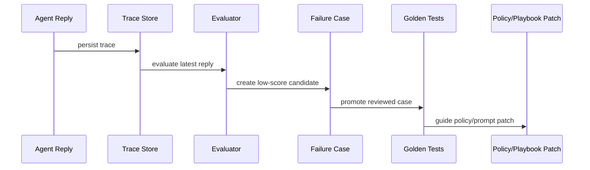

# Loop Engineering Plan

Last updated: 2026-07-04

## 0. Decision Snapshot

This plan starts the Next.js-first Chatty agent loop foundation without rewriting the current rental RAG service.

Stack and product decisions are registered once in
[tech-stack-decisions.md](tech-stack-decisions.md); this plan does not restate them.
This document keeps the migration plan, phase records, and the Legacy Migration Ledger (§16).

## 1. Scope And Non-Goals

### Scope

- Document the target MVP loop architecture.
- Add a minimal TypeScript package skeleton for shared contracts, SQLite schema, agent-core boundaries, and LLM adapters.
- Preserve existing `rag-service` behavior.
- Make the current RAG service build remain the compatibility check.

### Non-Goals

- No full Next.js UI migration yet.
- No rewrite of `rag-service/public/test.html`.
- No rewrite of `rag-service/dashboard`.（该子包已于 2026-07 删除：apps/web 的 `/dashboard` 重建了同类功能，源码在 git 历史 / `legacy-extras` 分支）
- No full memory redesign.
- No full Chatwoot inbox clone.
- No direct production dependency on Agent Builder exported flows.

## 3. Current System Baseline

Current service:

- `rag-service/src/server.ts` exposes Fastify routes and static pages.
- `rag-service/src/rag.ts` exports `answerQuestion()`.
- `rag-service/src/memory-store.ts` persists `CustomerMemory` and `ProductMemory` into `data/memory-store.json`.
- `rag-service/src/conversation-orchestrator.ts` derives the current business stage.
- `rag-service/src/rag/action-picker.ts` maps context into actions.
- `rag-service/public/test.html` is the manual test console.
- `rag-service/dashboard` was the legacy Vite dashboard source (removed 2026-07, superseded by apps/web `/dashboard`).

Important limitation:

- `answerQuestion()` returns an answer but does not write memory by itself.
- The Fastify `/chat` route calls `appendConversationMemory()` after `answerQuestion()`.
- The current `answerQuestion()` still runs RAG before action selection. The new loop must not treat that as the target lazy-context behavior.

## 4. Target MVP Architecture



## 5. Runtime Lanes

### 5.1 Production Lane: Next.js Route Handlers

Next.js Route Handlers are the MVP API surface:

- receive customer/admin messages;
- create or load `AgentSession`;
- call a bounded local agent step;
- persist trace and state;
- return response to the caller.

### 5.2 Model Lane: OpenAI Agents SDK TS

Use OpenAI Agents SDK TypeScript when an agent run benefits from tools, handoffs, guardrails, tracing, or built-in loop semantics.

The product code depends on `packages/llm` interfaces, not SDK implementation details.

### 5.3 Compatibility Lane: Chat Completions API

Use direct Chat Completions for:

- legacy `rag-service` compatibility;
- intent classification;
- structured fact extraction;
- reply evaluation;
- fallback generation;
- low-level direct model calls where Agents SDK is unnecessary.

### 5.5 Legacy Reference Lane: rag-service

The current `rag-service` remains the migration source and compatibility service.

The minimal adapter is:

```text
LegacyRagServiceAdapter.answer(input)
  -> legacy /chat HTTP call, or injected answerQuestion function
  -> mapped answer/action/intent/handoff/references result
```

Short-term safest integration is HTTP against legacy `/chat`, because that preserves existing sanitization, memory writing, and response shape.

### 5.6 Naming

Use Chatty for the customer-facing agent and trace identity:

- external name: `Chatty`
- primary agent name: `ChattyAgent`
- rental-commerce instance: `RentalChattyAgent`
- trace field value: `agent_name = 'chatty'`

Keep low-level packages generic, such as `packages/agent-core`, so the architecture does not depend on the brand name.

## 6. Data And Persistence

### 6.1 SQLite MVP Schema

Table definitions live in [tech-stack-decisions.md §6](tech-stack-decisions.md#6-session-and-memory)
(single registry; not duplicated here).

### 6.2 Current Session Status

There is no real session store today.

Current continuity depends on:

- `customerId`;
- `productId`;
- `conversationId`;
- `data/memory-store.json`;
- `recentMessages` under `ProductMemory`.

### 6.3 Conservative Memory Migration



Migration rules:

- Keep `CustomerMemory` and `ProductMemory` shape as JSON columns first.
- Do not normalize all profile fields in MVP.
- Preserve JSON fallback while SQLite write path is feature-flagged.
- Do not let OpenAI Agents SDK session memory become the long-term business memory.

## 7. Agent Loop Contract

Minimum interfaces:

- `ConversationEvent`
- `AgentSession`
- `AgentStepResult`
- `AgentTrace`
- `RuntimeTool`
- `MemorySnapshot`



## 8. Loop State Model

> **实现状态（2026-07-02）**：当前代码只会产生 `active` / `waiting_for_user` /
> `waiting_for_human` 三个状态（loop-runner 与 SDK 适配器的 `nextStatus`）；
> `waiting_for_tool` / `paused` / `failed` / `closed` 及对应事件（`tool_result`、
> `scheduled_followup_due` 等）是预留设计，类型与 zod schema 已定义但无 producer。
> 引入 tool-chaining / worker 时再实现。下图为目标全集：



## 9. Tools, Playbooks, Policies, And Actions

Runtime vocabulary:



Do not use `skills` for runtime concepts.

## 10. Evaluation And Regression Loop



MVP should preserve the current evaluator direction but make traces first-class.

## 11. Migration Strategy

### Phase 0: Foundation ✅（commit 373c11d）

- Add docs.
- Add shared contracts.
- Add SQLite schema SQL.
- Add agent-core and llm adapter interfaces.
- Keep `rag-service` unchanged.

### Phase 1: Next.js Shell ✅（commit 373c11d / 3f304c5）

- Add `apps/web` with App Router.
- Add simple health and playground routes.
- Link existing `rag-service` test page/dashboard rather than rewriting them.

### Phase 2: SQLite Adapter ✅（CHATTY_SQLITE 开关，commit b464c18）

- Add SQLite connection and repository.
- Add JSON fallback reader from `rag-service/data/memory-store.json`.
- Add feature flag for SQLite write path.

### Phase 3: Agent Loop v0 ✅（commit 373c11d，legacy adapter 为 in-process 注入）

- Implement bounded step runner.
- Use `LegacyRagServiceAdapter.answer()` as the first answer path.
- Persist `AgentTrace`.

### Phase 4: Model Lanes ✅（CHATTY_AGENTS_SDK 开关仅路由 ask_info，commit 4e3a5bc）

- Wire OpenAI Agents SDK TS runner.
- Keep Chat Completions direct adapter for extraction/eval/fallback.
- Route only selected actions through Agents SDK.

## 12. Open Questions

Open:

- When should Route Handlers be split into a separate worker or API service?
- When should Qdrant be retained vs wrapped behind a media/knowledge adapter?
- PRD §8.1 的 durable ConversationEvent 表：当前只持久化 trace，事件对象用后即弃。
  M2 的这条承诺显式推迟——单机 MVP 里 trace 已够回放；引入 worker/重试语义时再建表。

Settled:

- SQLite connection lives in `packages/db` (`database.ts`), repositories are factories over it.
- The legacy adapter injects `answerQuestion()` in-process (`apps/web/lib/legacy-adapter.ts`),
  not HTTP — Next marks rag-service a server external and dynamic-imports its dist.
- Agents SDK routes only `ask_info` (feature flag `CHATTY_AGENTS_SDK=1`); everything else
  stays on direct Chat Completions.
- Stack-level decisions (Next.js first, SQLite, no Fastify, Temporal deferred,
  Chatwoot as reference, runtime concepts are not called skills): see
  [tech-stack-decisions.md](tech-stack-decisions.md).

## 13. Implementation Plan

1. Keep `rag-service` build passing.
2. Add root workspace files without changing `rag-service` behavior.
3. Add `packages/shared` for DTOs and zod schemas.
4. Add `packages/db` for SQLite schema SQL only.
5. Add `packages/agent-core` for loop contracts and legacy adapter boundary.
6. Add `packages/llm` for OpenAI Agents SDK and Chat Completions adapter boundaries.
7. Typecheck new packages.
8. Build `rag-service`.
9. Add Next.js app only after the package contracts are stable.

## 14. Acceptance Criteria

- `docs/loop-engineering-plan.md` exists and matches latest decisions.
- The root workspace has no effect on existing `rag-service` runtime behavior.
- `packages/shared` defines minimal loop DTOs.
- `packages/db` defines SQLite MVP schema.
- `packages/agent-core` defines loop and legacy adapter boundaries.
- `packages/llm` defines Agents SDK and Chat Completions adapter boundaries.
- `pnpm build:rag-service` still passes or its existing failures are documented.

## 16. Legacy Migration Ledger

「保持好 specs/test/interface，随时可重写」的进度账本。五项 legacy 能力的接管状态：

| 能力 | 边界接口 | 状态 | 下一步 |
|---|---|---|---|
| 回答路径 answerQuestion | compose 步的 `CustomerServiceModelFn`（playground route 注入 Chat Completions adapter） | 🟡 部分接线——`CHATTY_LLM=1` 且配置 `OPENAI_API_KEY` 时 compose 走真 LLM，未开启或模型调用失败回退确定性 `createCustomerServiceModelOutput`；尚未接 legacy 的知识检索。旧 loop-runner / Agents SDK lane（含 `LegacyRagService` 注入位与 `@openai/agents` 依赖）已整体删除 | 给 compose 上下文接入知识检索，再拿金标场景对齐后替换 legacy answerQuestion |
| 评估器 LLM-judge | `Evaluator`（`loadLegacyEvaluator`，经 `apps/web/lib/eval-chain.ts`） | 🟡 已接线——playground trace 落库后 fire-and-forget 异步评分：review 落 `trace_reviews`、低分晋升 failure_case、顺带补评积压 trace（`findUnevaluated`），`/dashboard` 读真实表；依赖 `OPENAI_API_KEY`（未配置时静默跳过）；持久化由 `CHATTY_DB_PATH` 决定（未设置时落 `:memory:`，CHATTY_SQLITE 开关已退役） | 换 judge 交叉复评；补评从请求搭车升级为独立 worker |
| 知识检索 searchKnowledge | 曾有 `KnowledgeAdapter` | ⚪ 边界已删（零消费方）；检索仍在 legacy answerQuestion 内部 | 若把检索提出 loop，再随消费方重建边界 |
| 会话记忆 | `MemoryRepository`（SQLite + JSON 只读回退） | 🟡 仅 recentMessages 双写；profile 字段仍由 legacy 写 JSON | profile 写路径迁 SQLite JSON 列 |
| 事实抽取 + 阶段状态机 | 无边界（legacy 内部） | 🔴 完全在 legacy（extractStructuredConversationFacts + orchestrator） | 状态机已有 22 个单测钉行为，可安全搬迁 |

已知缺口（测试钉住待修）：`post_order_followup` stage 在 `decideStage` 中不可达，
`close_loop` 动作是死代码——修复属于行为变更，需跑金标 eval 验证后再动。

金标 harness 目前直连 legacy `answerQuestion()`，断言词汇（stage/action）是 legacy 专有；
重写验收前需要把 eval.ts 的被测面抽象为可切换目标（legacy / /api/playground），
让 11 个金标场景成为两线共享的验收闸门。
