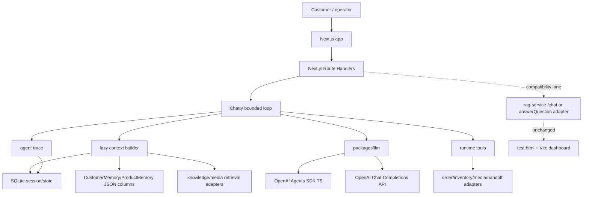
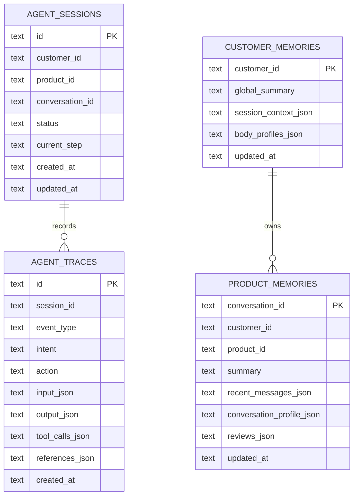
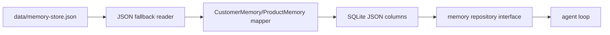
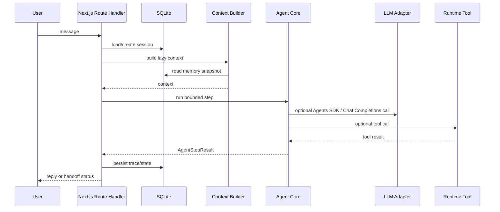
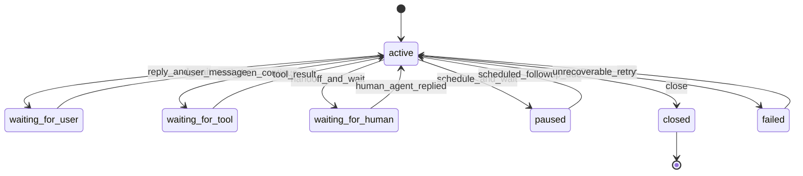
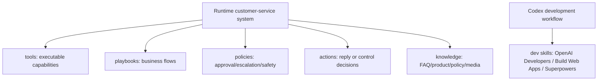
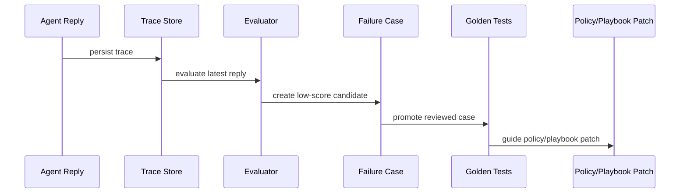

# Loop Engineering Plan

Last updated: 2026-06-25

## 0. Decision Snapshot

This plan starts the Next.js-first Chatty agent loop foundation without rewriting the current rental RAG service.

Decisions:

- Name the customer-service agent Chatty.
- Use Node.js and TypeScript.
- Put Next.js first for Web, BFF, admin, and MVP API Route Handlers.
- Use SQLite for MVP session/state.
- Keep the current long-term memory shape mostly intact.
- Use OpenAI Agents SDK TypeScript for agent runs, tools, handoffs, guardrails, and tracing.
- Keep OpenAI Chat Completions API for extraction, evaluation, direct compatibility, and fallback paths.
- Keep the current `rag-service` running and treat `answerQuestion()` as a legacy capability.
- Do not introduce Fastify in the new stack unless Next.js Route Handlers prove insufficient.
- Do not introduce Temporal in MVP.
- Use Chatwoot as an open-source product reference, not as runtime infrastructure.
- Use AgentKit and Agent Builder as a prototype lane, not production source of truth.
- Do not call runtime tools/playbooks/policies "skills". `skills` means Codex development skills only.

## 1. Scope And Non-Goals

### Scope

- Document the target MVP loop architecture.
- Add a minimal TypeScript package skeleton for shared contracts, SQLite schema, agent-core boundaries, and LLM adapters.
- Preserve existing `rag-service` behavior.
- Make the current RAG service build remain the compatibility check.

### Non-Goals

- No full Next.js UI migration yet.
- No rewrite of `rag-service/public/test.html`.
- No rewrite of `rag-service/dashboard`.
- No full memory redesign.
- No full Chatwoot inbox clone.
- No direct production dependency on Agent Builder exported flows.

## 2. Source Of Truth And Asset Policy

Markdown under `docs/` is the repository source of truth.

Design assets:

- Mermaid diagrams live directly in docs.
- Figma can be linked for precise UI flow and layout specs.
- Canva can be linked for stakeholder summaries.
- Figma and Canva links supplement docs; they do not replace docs.

## 3. Current System Baseline

Current service:

- `rag-service/src/server.ts` exposes Fastify routes and static pages.
- `rag-service/src/rag.ts` exports `answerQuestion()`.
- `rag-service/src/memory-store.ts` persists `CustomerMemory` and `ProductMemory` into `data/memory-store.json`.
- `rag-service/src/conversation-orchestrator.ts` derives the current business stage.
- `rag-service/src/rag/action-picker.ts` maps context into actions.
- `rag-service/public/test.html` is the manual test console.
- `rag-service/dashboard` is the existing Vite dashboard source.

Important limitation:

- `answerQuestion()` returns an answer but does not write memory by itself.
- The Fastify `/chat` route calls `appendConversationMemory()` after `answerQuestion()`.
- The current `answerQuestion()` still runs RAG before action selection. The new loop must not treat that as the target lazy-context behavior.

## 4. Target MVP Architecture



## 5. Runtime Lanes

### 5.1 Production Lane: Next.js Route Handlers

Next.js Route Handlers are the MVP API surface:

- receive customer/admin messages;
- create or load `AgentSession`;
- call a bounded local agent step;
- persist trace and state;
- return response to the caller.

Rule: avoid long-running loops in the request handler. A single bounded step is acceptable. Background follow-ups or long waits should move to a worker in a later phase.

### 5.2 Model Lane: OpenAI Agents SDK TS

Use OpenAI Agents SDK TypeScript when an agent run benefits from tools, handoffs, guardrails, tracing, or built-in loop semantics.

The product code depends on `packages/llm` interfaces, not SDK implementation details.

### 5.3 Compatibility Lane: Chat Completions API

Use direct Chat Completions for:

- legacy `rag-service` compatibility;
- intent classification;
- structured fact extraction;
- reply evaluation;
- fallback generation;
- low-level direct model calls where Agents SDK is unnecessary.

### 5.4 Prototype Lane: AgentKit / Agent Builder

AgentKit and Agent Builder can be used for visual workflow prototypes and stakeholder review.

Production promotion requires:

- typed input/output schema;
- runtime tool schema;
- guardrails;
- memory read/write policy;
- handoff policy;
- eval cases;
- trace fields.

Prototype output should live under `experiments/agent-builder/` when added.

### 5.5 Legacy Reference Lane: rag-service

The current `rag-service` remains the migration source and compatibility service.

The minimal adapter is:

```text
LegacyRagServiceAdapter.answer(input)
  -> legacy /chat HTTP call, or injected answerQuestion function
  -> mapped answer/action/intent/handoff/references result
```

Short-term safest integration is HTTP against legacy `/chat`, because that preserves existing sanitization, memory writing, and response shape.

### 5.6 Naming

Use Chatty for the customer-facing agent and trace identity:

- external name: `Chatty`
- primary agent name: `ChattyAgent`
- rental-commerce instance: `RentalChattyAgent`
- trace field value: `agent_name = 'chatty'`

Keep low-level packages generic, such as `packages/agent-core`, so the architecture does not depend on the brand name.

## 6. Data And Persistence

### 6.1 SQLite MVP Schema



### 6.2 Current Session Status

There is no real session store today.

Current continuity depends on:

- `customerId`;
- `productId`;
- `conversationId`;
- `data/memory-store.json`;
- `recentMessages` under `ProductMemory`.

### 6.3 Conservative Memory Migration



Migration rules:

- Keep `CustomerMemory` and `ProductMemory` shape as JSON columns first.
- Do not normalize all profile fields in MVP.
- Preserve JSON fallback while SQLite write path is feature-flagged.
- Do not let OpenAI Agents SDK session memory become the long-term business memory.

## 7. Agent Loop Contract

Minimum interfaces:

- `ConversationEvent`
- `AgentSession`
- `AgentStepResult`
- `AgentTrace`
- `RuntimeTool`
- `MemorySnapshot`



## 8. Loop State Model



## 9. Tools, Playbooks, Policies, And Actions

Runtime vocabulary:



Do not use `skills` for runtime concepts.

## 10. Evaluation And Regression Loop



MVP should preserve the current evaluator direction but make traces first-class.

## 11. Migration Strategy

### Phase 0: Foundation

- Add docs.
- Add shared contracts.
- Add SQLite schema SQL.
- Add agent-core and llm adapter interfaces.
- Keep `rag-service` unchanged.

### Phase 1: Next.js Shell

- Add `apps/web` with App Router.
- Add simple health and playground routes.
- Link existing `rag-service` test page/dashboard rather than rewriting them.

### Phase 2: SQLite Adapter

- Add SQLite connection and repository.
- Add JSON fallback reader from `rag-service/data/memory-store.json`.
- Add feature flag for SQLite write path.

### Phase 3: Agent Loop v0

- Implement bounded step runner.
- Use `LegacyRagServiceAdapter.answer()` as the first answer path.
- Persist `AgentTrace`.

### Phase 4: Model Lanes

- Wire OpenAI Agents SDK TS runner.
- Keep Chat Completions direct adapter for extraction/eval/fallback.
- Route only selected actions through Agents SDK.

## 12. Open Questions

Open:

- When should Route Handlers be split into a separate worker or API service?
- Which package should own the first SQLite connection implementation?
- Should the first legacy adapter call HTTP `/chat` or inject `answerQuestion()` in-process?
- Which exact paths should use Agents SDK before direct Chat Completions?
- When should Qdrant be retained vs wrapped behind a media/knowledge adapter?

Settled:

- MVP uses Next.js first.
- MVP uses SQLite.
- Fastify is not a new MVP dependency.
- Temporal is deferred.
- Chatwoot is a reference, not runtime.
- Current frontend is preserved.
- Runtime concepts are not called skills.

## 13. Implementation Plan

1. Keep `rag-service` build passing.
2. Add root workspace files without changing `rag-service` behavior.
3. Add `packages/shared` for DTOs and zod schemas.
4. Add `packages/db` for SQLite schema SQL only.
5. Add `packages/agent-core` for loop contracts and legacy adapter boundary.
6. Add `packages/llm` for OpenAI Agents SDK and Chat Completions adapter boundaries.
7. Typecheck new packages.
8. Build `rag-service`.
9. Add Next.js app only after the package contracts are stable.

## 14. Acceptance Criteria

- `docs/loop-engineering-plan.md` exists and matches latest decisions.
- The root workspace has no effect on existing `rag-service` runtime behavior.
- `packages/shared` defines minimal loop DTOs.
- `packages/db` defines SQLite MVP schema.
- `packages/agent-core` defines loop and legacy adapter boundaries.
- `packages/llm` defines Agents SDK and Chat Completions adapter boundaries.
- `rag-service npm run build` still passes or its existing failures are documented.

## 15. Appendix: External Asset Links

No Figma or Canva links have been added yet.
