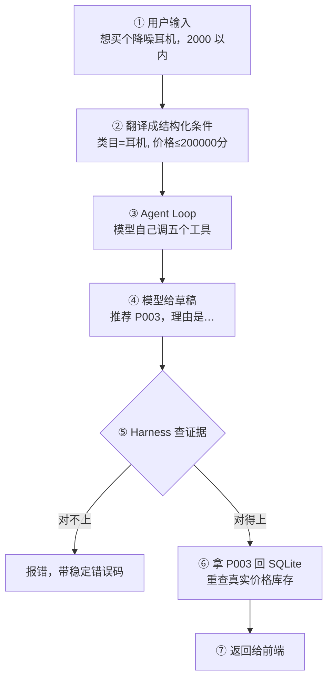

# Chatty 是怎么跑起来的（新手版）

如果你写过普通的 Web 后端，这份文档用你熟悉的东西来解释 Chatty。
想看每一层的精确契约、全部错误码和字段来源，去看 [roadmap.md](roadmap.md)。

---

## 一句话

**用户说一句大白话，Chatty 推荐几件商品，并给出理由和文案。**
难点不在「推荐」，在**不让模型瞎编价格和库存**。

---

## 先建立一个类比

把 Chatty 想成一个普通的 Web 应用，只不过「业务逻辑」那一层换成了模型：

| 你熟悉的 | Chatty 里对应的 | 说明 |
|---|---|---|
| 前端表单提交 | 用户说的那句话 | 只不过是自然语言，不是结构化字段 |
| Controller / 路由 | `api.py` | 三个 REST 端点，很薄 |
| Service 层业务逻辑 | **模型 + Agent Loop** | 这里是唯一「不确定」的部分 |
| Service 调的那些函数 | **五个 Tool** | 模型只能通过它们碰数据 |
| 后端参数校验 | **Harness** | 不信任模型的输出，逐条查 |
| ORM / DAO | `catalog.py` + `repositories.py` | 所有 SQL 都在这后面 |
| 数据库 | SQLite | 商品、库存、知识文档 |

**最关键的一条类比**：你写后端时，绝不会相信前端提交上来的 `price` 字段，一定要
拿商品 ID 去库里重查真实价格。**Chatty 对模型的态度完全一样**——模型说
「P003 卖 1999」，代码不采信，拿 P003 去 SQLite 重查。

---

## 三个新概念（只有三个）

### 1. Tool（工具）
就是**几个你写好的普通 Python 函数**，交给模型，让它自己决定什么时候调、传什么参数。

Chatty 有五个：查画像、搜商品、查库存、检索知识、拿营销策略。
它们全部只读，都在 [tools.py](../src/chatty/tools.py)。

模型不能直接查数据库，只能调这五个函数——**这就是权限边界**。

### 2. Agent Loop（智能体循环）
一个 `while` 循环，Agents SDK 帮你写好了：

```
while 模型还想调工具:
    问模型：接下来干什么？
    模型说：调 search_products，参数是 {...}
    执行这个函数，把返回值喂回给模型
最后模型说：我不调了，答案是 ...
```

设了上限（10 或 18 圈），防止它绕不出来。

### 3. Harness（约束层）
**这是 Chatty 真正的主角，也是最容易被忽略的一层。**

模型跑完会说「我查过了，推荐 P003」。Harness 不信，去翻记录：

- 五个工具真的都调过吗？
- P003 真的在搜索结果里吗？
- P003 真的确认过有货吗？
- P003 真的有知识文档支撑吗？

任何一条不满足 → **直接报错**，不返回半成品。

那本「记录」叫**证据本**（`RecommendationContext`），就是一个 dataclass。
五个工具执行时顺手往里写，**模型看不见它**，所以没法伪造。

> 类比：请假审批。员工填的表（模型草稿）不算数，HR 要去考勤系统核对（证据本）。

---

## 完整走一遍

用户在网页上输入：**「想买个降噪耳机，2000 以内」**



逐步说：

**① → ②　翻译**（[need_parser.py](../src/chatty/need_parser.py)）
先单独问一次模型：「把这句话转成 JSON」。得到 `{类目: 耳机, 最高价: 2000元}`。
这一步失败了就当没给条件，**绝不让程序崩**。

**③　Agent Loop**（[agent.py](../src/chatty/agent.py)）
模型依次调用：

```
get_user_profile      → 这人是「活跃用户」，喜欢耳机，预算 500-3000
search_products       → 召回 P003 P007 P012
check_inventory       → P003 有货，P007 卖光了
retrieve_knowledge    → 找到 2 篇讲降噪耳机的文档
get_marketing_strategy→ 活跃用户用什么语气写文案，哪些词不能用
```

每调一个，证据本就多记一笔。

**④　草稿**
模型返回一段 JSON 文本：`{"action":"recommend","recommendations":[{"product_id":"P003","reason":"…","marketing_copy":"…"}]}`

**⑤　查证据**
`P003` 在召回集里 ✅、在有货集里 ✅、有知识支撑 ✅ → 放行。
如果模型推荐了 `P007`（已卖光），这里就会拦下来报 `inventory_not_checked`。

**⑥　重查数据库**（[catalog.py](../src/chatty/catalog.py) 的 `finalize`）
拿 `P003` 回 SQLite 查出真实的名字、价格、库存、标签，**覆盖掉模型说的一切**。
模型写的 `reason` 和 `marketing_copy` 保留，但要过一遍禁词替换（「打折」→「***」）。

**⑦　返回**
前端拿到的商品卡片里，**只有推荐理由和营销文案是模型生成的**，其余全部来自数据库。

---

## 信息不够怎么办

用户如果只说「想买个能用很久的东西」，没说类目——模型这一轮**一个工具都不调**，
直接反问：「你想看哪一类商品？我们有：耳机、手机、家电…」

用户答完，把这一问一答记进 `history`，下一轮模型就知道自己问过什么。
最多三轮，问不出来就结束。

这套「反问 → 记历史 → 下一轮」的逻辑在 [conversation.py](../src/chatty/conversation.py)，
**只有一份**——终端、网页、评估都用它。

---

## 四个入口，一条主干

同一套逻辑有四个用法：

| 入口 | 怎么跑 | 干嘛用 |
|---|---|---|
| **网页** | `uv run uvicorn chatty.api:create_app --factory` + `cd web && pnpm install && pnpm dev` | 主界面 |
| **终端** | `uv run python demo.py` | 快速试、演示 |
| **单轮评估** | `uv run python -m evals` | 18 条任务打分，看通过率 |
| **多轮评估** | `uv run python -m evals --multiturn` | 拿模型当假用户，测它会不会问 |

它们只在两件事上不同：**怎么把话变成条件**、**怎么拿到下一句回答**。
其余（历史怎么拼、最多几轮、证据不跨轮）全共用。

---

## 数据从哪来

`data/` 下面几个 JSON/JSONL 文件是**种子**，程序启动时一次性灌进 SQLite。
之后所有查询只走 SQLite，**不再读那些 JSON**。

```
data/products.jsonl          43 件商品
data/user_profiles.jsonl     10 个演示用户
data/knowledge_documents.jsonl  52 篇知识文档  →  切成小块，建全文索引
data/marketing_templates.json   五个用户分群的文案语气
data/forbidden_words.json       禁用词
```

知识检索用的是 **SQLite 自带的全文搜索**（FTS5 + BM25），不是向量数据库——
52 篇文档的规模，关键词匹配足够，还能解释「为什么召回这条」。

> 这就是常说的 RAG（检索增强生成）：先检索出相关文档，塞进模型的上下文，
> 让它基于这些材料写理由，而不是凭印象编。

---

## 第一次读代码，按这个顺序

1. [models.py](../src/chatty/models.py) —— 所有数据结构，20 分钟看完，看完就有全局感
2. [tools.py](../src/chatty/tools.py) —— 五个工具 + 证据本，Chatty 的手脚
3. [agent.py](../src/chatty/agent.py) 的 `_run_turn` —— 一轮的完整流程，**最重要的一个函数**
4. [catalog.py](../src/chatty/catalog.py) 的 `finalize` —— 怎么用数据库覆盖模型的话
5. [conversation.py](../src/chatty/conversation.py) —— 多轮反问怎么管
6. [api.py](../src/chatty/api.py) —— 最薄的一层，最后看

代码里的中文注释写了很多**「为什么这么做」和「以前踩过什么坑」**，那部分比代码本身值钱。

---

## 记住这三句就够了

1. **模型只负责挑商品、写理由和文案；价格库存这些硬事实一律来自 SQLite。**
2. **模型说它做过了不算数——证据本记着它到底调了什么，Harness 逐条核对。**
3. **宁可明确报错，也不返回一个看着像成功的结果。**
