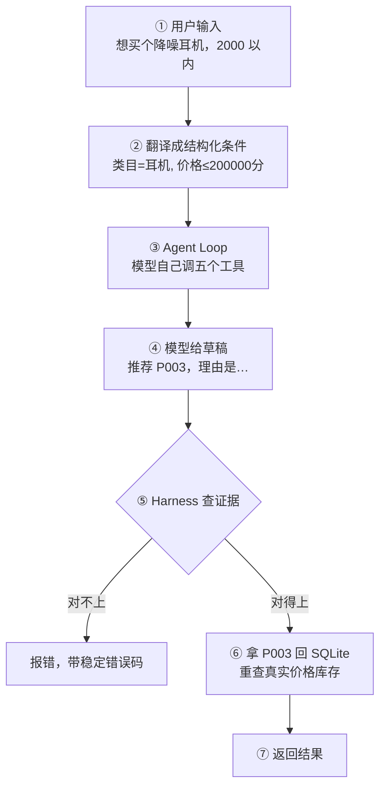
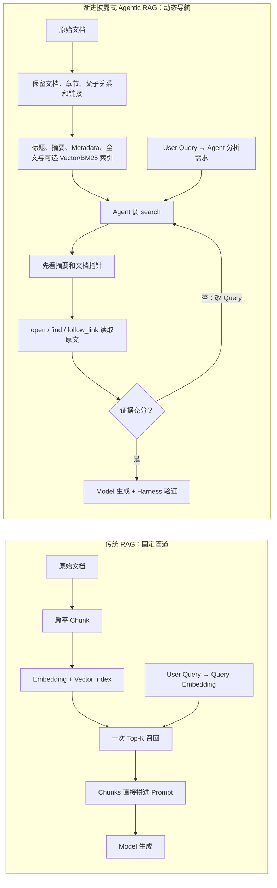

# Chatty 是怎么跑起来的（新手版）

如果你写过普通的 Web 后端，这份文档用你熟悉的东西来解释 Chatty。
想看每一层的精确契约、全部错误码和字段来源，去看 [roadmap.md](roadmap.md)。

---

## 一句话

**用户说一句大白话，Chatty 推荐几件商品，并给出理由和文案。**
难点不在「推荐」，在**不让模型瞎编价格和库存**。

---

## 先建立一个模型

从外面看，Chatty 可以写成：

```text
Agent = Model + Harness
```

- **Model** 接收 Harness 准备的上下文，决定调用哪个 Tool、传什么参数，最后生成推荐草稿。
- **Harness** 承载 Agent Loop 和 Tool，维护 Model 看不到的运行时状态，并决定草稿能否通过。

两者之间反复交换 Context：

```text
Harness Context In → Model → Tool Call
                         ↓
Harness 执行 Tool ←──────┘
        ├── Tool Result → Model Context Out
        └── Tool Evidence → Harness Context Out
```

最关键的边界是：**Model 看见 Tool Result，用它推理；Harness 保存 Tool Evidence，
用它裁决。**隐藏证据不在返回给 Model 的 Tool Result 里面，而是 Tool 执行时旁路写入
`RecommendationContext`，Model 不能伪造或修改。

---

## 三个新概念

### 1. Tool（工具）

就是**几个你写好的普通 Python 函数**，交给模型，让它自己决定什么时候调、传什么参数。

Chatty 有五个：查画像、搜商品、查库存、检索知识、拿营销策略。
它们全部只读，都在 [tools.py](../src/chatty/tools.py)。

模型不能直接查数据库，只能调这五个函数——**这就是权限边界**。

### 2. Agent Loop（智能体循环）

Harness 里的一个 `while` 循环，Agents SDK 帮你写好了：

```
while 模型还想调工具:
    问模型：接下来干什么？
    模型说：调 search_products，参数是 {...}
    执行这个函数，把返回值喂回给模型
最后模型说：我不调了，答案是 ...
```

设了上限（10 或 18 圈），防止它绕不出来。

### 3. Harness（运行与约束层）

**这是 Chatty 真正的主角，也是最容易被忽略的一层。**

Harness 不只是模型输出后的参数校验，它负责四件事：

1. 承载 Agent Loop，向 Model 注册允许调用的 Tool。
2. 校验 Tool 参数、调用前置条件和重复调用。
3. 保存 Model 不可见的 Evidence、Trace 和 Control 状态。
4. 对 Model 的最终草稿做后置校验，并回 SQLite 重查业务事实。

模型跑完会说「我查过了，推荐 P003」。Harness 不信声明，只查证据：

- 五个工具真的都调过吗？
- P003 真的在搜索结果里吗？
- P003 真的确认过有货吗？
- P003 真的有知识文档支撑吗？

任何一条不满足 → **直接报错**，不返回半成品。

那本「记录」是 `RecommendationContext`，就是一个 dataclass。里面的状态分三类：

| 状态     | 例子                            | 回答的问题              |
| -------- | ------------------------------- | ----------------------- |
| Evidence | 召回、有货、有知识支撑的商品 ID | 推荐有没有事实依据？    |
| Trace    | `used_tools`、`call_log`        | Model 真实执行过什么？  |
| Control  | 重复调用次数、轮次上限          | Agent Loop 有没有失控？ |

> 类比：请假审批。员工填的表（模型草稿）不算数，HR 要去考勤系统核对（证据本）。

---

## 五个 Tool：像函数一样看 Context In / Out

先区分「用户约束」和「业务事实」。用户说「我要一个 200 元的蓝牙耳机」时：

```text
耳机   → 类目约束
蓝牙   → 商品属性约束
200 元 → 价格约束
```

这些只是用户提出的条件，不等于目录里真的存在这样的商品。商品是否属于耳机、是否支持
蓝牙、价格是否不超过 200 元，要由商品目录证明；当前是否可售由库存证明；推荐理由是否
有依据由知识检索证明。

当前 `UserContext` 只稳定保留类目和价格，没有独立的商品属性字段，因此「蓝牙」仍可能在
输入适配时丢失。这是现有实现的边界，不能把下面完整的属性筛选说成已经实现。

一次 Tool 调用可以写成：

```text
(Model 可见结果 y, Harness 隐藏状态 C') = Tool(参数 x, Harness 状态 C)
```

| Tool                     | Context In                  | 给 Model 的 Context Out        | 给 Harness 的 Context Out            |
| ------------------------ | --------------------------- | ------------------------------ | ------------------------------------ |
| `get_user_profile`       | 当前请求、`user_id`         | 分群、偏好、价格范围、近期行为 | `profile`、调用轨迹                  |
| `search_products`        | `profile`、类目、价格、标签 | 符合条件的候选商品             | `recalled_product_ids`               |
| `check_inventory`        | 候选商品 ID                 | 有货商品和低库存标记           | `in_stock_product_ids`               |
| `retrieve_knowledge`     | 查询词、类目、候选商品 ID   | 商品与场景知识                 | `knowledge`、`knowledge_product_ids` |
| `get_marketing_strategy` | 用户分群                    | 语气、写作要求、禁用词         | 调用轨迹                             |

三个看起来都像「搜索」的 Tool，其实回答不同的问题：

```text
search_products    → 哪些商品符合需求？    （找候选）
check_inventory    → 这些候选现在能卖吗？  （验可售）
retrieve_knowledge → 为什么适合，怎么解释？（找依据）
```

前三个存在严格的数据依赖：

```text
profile = get_user_profile(request)
candidates = search_products(profile, need)
available = check_inventory(candidates.product_ids)
```

没有画像，搜索缺少用户条件；没有候选商品，库存检查就不知道查谁。所以 Harness 强制
`画像 → 搜索 → 库存` 的首次调用顺序。它们把商品集合逐步收窄为「符合需求且当前可售」。

后两个分别提供「说什么」和「怎么说」：知识检索给推荐依据，营销策略给表达约束；
二者彼此不依赖，结果最终在 Model 生成草稿时汇合。`get_marketing_strategy` 只要已经拿到
画像就可以执行；`retrieve_knowledge` 最好围绕候选商品执行。若搜索或库存已经证明没有
可售商品，业务上可以提前失败，不应为了凑结果继续生成。

---

## 完整走一遍

用户输入：**「想买个降噪耳机，2000 以内」**



逐步说：

**① → ②　翻译**（[need_parser.py](../src/chatty/need_parser.py)）
先单独问一次模型：「把这句话转成 JSON」。得到 `{类目: 耳机, 最高价: 2000元}`。
这一步失败了就当没给条件，**绝不让程序崩**。

**③　Agent Loop**（[agent.py](../src/chatty/agent.py)）
模型依次调用：

```
get_user_profile      → 这人是「活跃用户」，喜欢耳机，预算 500-3000
search_products       → 召回 P003 P007 P012
check_inventory       → P003 有货，P007 卖光了
retrieve_knowledge    → 找到 2 篇讲降噪耳机的文档
get_marketing_strategy→ 活跃用户用什么语气写文案，哪些词不能用
```

每调一个，一份结果返回 Model，另一份证据留在 Harness。

**④　草稿**
模型返回一段 JSON 文本：`{"action":"recommend","recommendations":[{"product_id":"P003","reason":"…","marketing_copy":"…"}]}`

**⑤　查证据**
`P003` 在召回集里 ✅、在有货集里 ✅、有知识支撑 ✅ → 放行。
如果模型推荐了 `P007`（已卖光），这里就会拦下来报 `inventory_not_checked`。

**⑥　重查数据库**（[catalog.py](../src/chatty/catalog.py) 的 `finalize`）
拿 `P003` 回 SQLite 查出真实的名字、价格、库存、标签，**覆盖掉模型说的一切**。
模型写的 `reason` 和 `marketing_copy` 保留，但要过一遍禁词替换（「打折」→「***」）。

**⑦　返回**
最终结果中，**只有推荐理由和营销文案是模型生成的**，其余全部来自数据库。

---

## 信息不够怎么办

用户如果只说「想买个能用很久的东西」，没说类目——模型这一轮**一个工具都不调**，
直接反问：「你想看哪一类商品？我们有：耳机、手机、家电…」

用户答完，把这一问一答记进 `history`，下一轮模型就知道自己问过什么。
最多三轮，问不出来就结束。

这套「反问 → 记历史 → 下一轮」的逻辑在 [conversation.py](../src/chatty/conversation.py)，
**只有一份**——终端、网页、评估都用它。

---

## 四个入口，一条主干

同一套逻辑有四个用法：

| 入口         | 怎么跑                                                                                  | 干嘛用                       |
| ------------ | --------------------------------------------------------------------------------------- | ---------------------------- |
| **网页**     | `uv run uvicorn chatty.api:create_app --factory` + `cd web && pnpm install && pnpm dev` | 主界面                       |
| **终端**     | `uv run python demo.py`                                                                 | 快速试、演示                 |
| **单轮评估** | `uv run python -m evals`                                                                | 18 条任务打分，看通过率      |
| **多轮评估** | `uv run python -m evals --multiturn`                                                    | 拿模型当假用户，测它会不会问 |

它们只在两件事上不同：**怎么把话变成条件**、**怎么拿到下一句回答**。
其余（历史怎么拼、最多几轮、证据不跨轮）全共用。

---

## 数据从哪来

`data/` 下面几个 JSON/JSONL 文件是**种子**，程序启动时一次性灌进 SQLite。
之后所有查询只走 SQLite，**不再读那些 JSON**。

```
data/products.jsonl          43 件商品
data/user_profiles.jsonl     10 个演示用户
data/knowledge_documents.jsonl  52 篇知识文档  →  切成小块，建全文索引
data/marketing_templates.json   五个用户分群的文案语气
data/forbidden_words.json       禁用词
```

知识检索用的是 **SQLite 自带的全文搜索**（FTS5 + BM25），不是向量数据库——
52 篇文档的规模，关键词匹配足够，还能解释「为什么召回这条」。

> 这就是常说的 RAG（检索增强生成）：先检索出相关文档，塞进模型的上下文，
> 让它基于这些材料写理由，而不是凭印象编。

---

## 画像怎么进化

Chatty 只实现一条最小规则：

```text
成功推荐 + 本轮明确类目 → 记住新偏好 → 下一次 get_user_profile 读取
```

例如用户画像原来偏好「手机、耳机」，这轮明确要耳机并成功拿到推荐，下一次画像偏好就
更新为「耳机」。如果下一轮用户明确说要家电，则本轮需求优先，历史画像不能覆盖它。
推荐失败或澄清轮不会更新画像；五个 Tool 仍然全部只读，更新发生在会话确认成功之后。

这不是 Model 修改自己，而是 Context 随用户的成功交互更新：

```text
新画像 = 旧画像 + 本轮成功交互
下一次推荐 = Agent(当前需求, 新画像)
```

---

## 传统 RAG 与渐进披露式 Agentic RAG

两者不是互相替代。共同主干始终是：

```text
外部知识 → Retrieval → Model Context → Generation
```

不同的是「知识怎样组织」以及「谁控制检索过程」：



| 阶段     | 相同点                         | 不同点                                                                                                 |
| -------- | ------------------------------ | ------------------------------------------------------------------------------------------------------ |
| 内容准备 | 都要清洗、组织外部知识         | 传统方案常以扁平 Chunk 为检索单位；渐进披露方案保留原文层次和链接                                      |
| 索引     | 都必须让海量内容可检索         | 传统方案常以 Chunk 向量为主；新方案同时索引标题、摘要、Metadata、全文和结构关系，Vector 只是可选粗召回 |
| 查询     | 都根据用户问题召回相关内容     | 传统方案由固定代码生成一次 Query；Agentic RAG 由 Agent 拆解需求、修改 Query                            |
| 召回     | 都只把少量相关信息放进 Context | 传统方案直接返回 Top-K Chunk；新方案先返回摘要和指针，再按需打开原文                                   |
| 循环     | 都在生成前取得外部依据         | 传统方案通常检索一次；Agent 可以搜索、阅读、判断并再次搜索                                             |
| 生成     | 都由 Model 基于检索内容生成    | Agentic 方案还可由 Harness 核对答案与真实检索证据                                                      |

一句话区分：

> 传统 RAG 是「一次召回 Top-K Chunk 后生成」；渐进披露式 Agentic RAG 是
> 「先用层次索引导航，再由 Agent 按需打开原文、迭代检索，最后基于证据生成」。

Vector Database 在新方案里仍可用于从海量内容中做第一层语义粗召回，但它只负责告诉
Agent「可能去哪里看」，不直接决定最终给 Model 看什么。**Chunk 是检索入口，不是知识
本体；原始文档才是最终依据。**

### Chatty 当前处在哪里

Chatty 不是上图右侧方案的完整实现，而是两者之间的轻量版本：

```text
传统部分：文档分块 + SQLite FTS5/BM25 索引 + 检索结果进入 Model Context
Agentic 部分：retrieve_knowledge 是 Tool，Model 选择 Query，结果不足时可以换词再搜
Harness 部分：记录真实知识命中，禁止没有知识依据的商品通过
尚未实现：层次摘要、文档指针、open/find/follow_link、Vector 粗召回和 Reranker
```

因此面试时可以先完整回答传统向量 RAG，再补充设计观点：

> 大规模场景下，我会用语义分块、Embedding、Vector/BM25 Hybrid Retrieval 和 Reranker
> 建立底层 Retrieval；但不会把固定 Top-K Chunk 当成最终方案。我会把检索封装成 Tool，
> 让 Agent 先看标题、摘要和文档指针，再渐进读取原文并迭代搜索。底层索引解决「去哪里找」，
> Agent Loop 解决「搜什么、是否继续搜」，Harness 解决「最终结论是否真的有证据」。

---

## 第一次读代码，按这个顺序

1. [models.py](../src/chatty/models.py) —— 所有数据结构，20 分钟看完，看完就有全局感
2. [tools.py](../src/chatty/tools.py) —— 五个工具 + 证据本，Chatty 的手脚
3. [agent.py](../src/chatty/agent.py) 的 `_run_turn` —— 一轮的完整流程，**最重要的一个函数**
4. [catalog.py](../src/chatty/catalog.py) 的 `finalize` —— 怎么用数据库覆盖模型的话
5. [conversation.py](../src/chatty/conversation.py) —— 多轮反问怎么管
6. [api.py](../src/chatty/api.py) —— 最薄的一层，最后看

代码里的中文注释写了很多**「为什么这么做」和「以前踩过什么坑」**，那部分比代码本身值钱。

---

## 记住这三句就够了

1. **Agent = Model + Harness：Model 负责判断和生成，Harness 负责运行和裁决。**
2. **Tool Result 给 Model 推理，Tool Evidence 留给 Harness 对账；价格库存等硬事实来自 SQLite。**
3. **Model 说它做过了不算数；宁可明确报错，也不返回没有证据的结果。**
