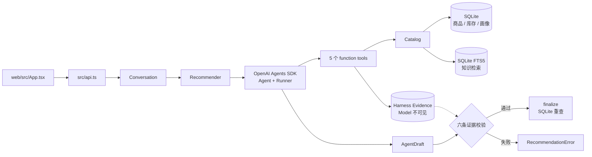

# Chatty 代码地图

这份文档只回答：入口在哪、Agent Loop 怎么接、事实如何流动。领域词汇见根目录 [CONTEXT.md](../CONTEXT.md)；讲解版见 [roadmap-beginner.md](roadmap-beginner.md)。

## 一张图看全



## 入口与调用链

| 层            | 文件                                      | Context In              | Context Out                     |
| ------------- | ----------------------------------------- | ----------------------- | ------------------------------- |
| HTTP          | [api.ts](../src/api.ts)                   | 自然语言、会话 ID       | recommend / clarify / exhausted |
| 输入适配      | [need-parser.ts](../src/need-parser.ts)   | 用户原话、可选类目      | `UserContext`                   |
| 会话          | [conversation.ts](../src/conversation.ts) | 累积话语、history       | 一轮回复、新 history            |
| Agent/Harness | [agent.ts](../src/agent.ts)               | `RecommendationRequest` | 可信推荐或稳定错误码            |
| SDK runtime   | [agent-sdk.ts](../src/agent-sdk.ts)       | Agent、Tool、RunContext | Tool Loop、模型草稿             |
| 数据/检索     | [catalog.ts](../src/catalog.ts)           | 结构化查询              | SQLite 事实与知识命中           |

主路径：

```text
用户原话
  → parseNeed
  → Conversation.send
  → Recommender
  → Agents SDK Runner
  → 五个 Tool
  → parseDraft
  → Harness 六条校验
  → Catalog.finalize
  → HTTP 响应
```

DeepSeek Responses API 是无状态的，因此会话历史由服务端内存与 Harness 管理；不依赖 `previous_response_id`。

## 五个 Tool 与偏序

五个 Tool 都必须出现，但只有前三个有严格数据依赖：

```text
get_user_profile → search_products → check_inventory
                         │
                         ├→ retrieve_knowledge
                         └→ get_marketing_strategy
```

知识检索和营销策略可以换序。允许换条件重搜；相同参数第 4 次调用会被 Harness 阻止。

Tool 有两个 Context Out：

```text
Tool Call
  ├→ model result：序列化后进入下一轮模型上下文
  └→ evidence：写进 RunContext，只归 Harness
```

SDK 负责循环和 Tool 调用；[tools.ts](../src/tools.ts) 负责 Evidence 与业务校验。两者不是同一层职责。

## 六条后置校验

| #   | 校验                             | 错误码                    |
| --- | -------------------------------- | ------------------------- |
| 1   | 五 Tool 都执行，且前三个偏序正确 | `required_tools_not_used` |
| 2   | 知识检索至少有一条命中           | `knowledge_not_retrieved` |
| 3   | 用户画像已加载                   | `profile_not_loaded`      |
| 4   | 推荐 ID 属于搜索召回集           | `product_not_recalled`    |
| 5   | 推荐 ID 属于库存确认集           | `inventory_not_checked`   |
| 6   | 推荐 ID 属于知识支撑集           | `product_not_grounded`    |

任一失败都不返回半成品。通过后，[Catalog.finalize](../src/catalog.ts) 会重新从 SQLite 读取名称、价格、库存和标签；模型只拥有 `reason` 与 `marketing_copy`，两者还要经过禁词过滤。

## 数据与 RAG

[database.ts](../src/database.ts) 启动时把 JSON/JSONL 种子事务性投影进 SQLite。运行时业务查询只走 SQLite。

知识文档按句子切块（目标约 160 字、重叠 40 字），索引侧和查询侧都对中文按字切分，再由 FTS5 + BM25 排序。同义词只扩展 Query，不修改原文。

`retrieve_knowledge` 的结果进入 Agent 上下文并参与推荐理由生成；从检索到生成的完整链路才是 Chatty 的 RAG。当前没有向量数据库。

## 状态与自进化

| 状态                   | 所在位置              | 生命周期             |
| ---------------------- | --------------------- | -------------------- |
| `said/history/turns`   | HTTP 进程内存         | 会话级，重启丢失     |
| Evidence / Tool trace  | Agents SDK RunContext | 每轮新建，不跨轮累积 |
| 商品、库存、知识、画像 | SQLite                | 运行时事实源         |
| 当前显式类目偏好       | 成功后写回画像        | 下一次请求可见       |

画像只做一条最小更新：成功推荐后记住本轮显式类目；当前请求永远优先于历史画像。

## 两个 seam

- [model-provider.ts](../src/model-provider.ts)：生产用 DeepSeek Responses；Agents SDK provider 与一次性 `complete()` 共用同一配置。
- [catalog.ts](../src/catalog.ts)：Tool 不碰 SQL，只调用 Catalog；测试可给每个用例独立 SQLite。

## 运行与验证

```bash
pnpm dev
pnpm dev:web
pnpm check
pnpm eval:retrieval
```

配置优先级：`system environment > .env.local > .env`。主密钥是 `DEEPSEEK_API_KEY`，兼容回退 `OPENAI_API_KEY`。
