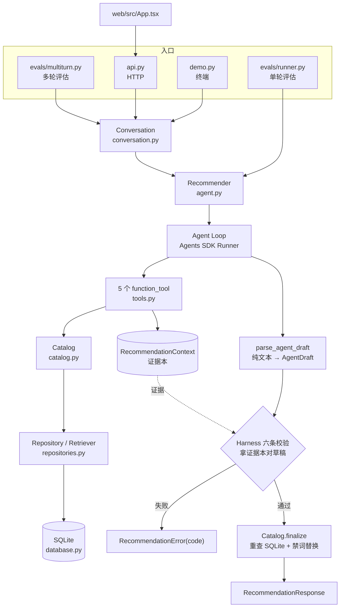
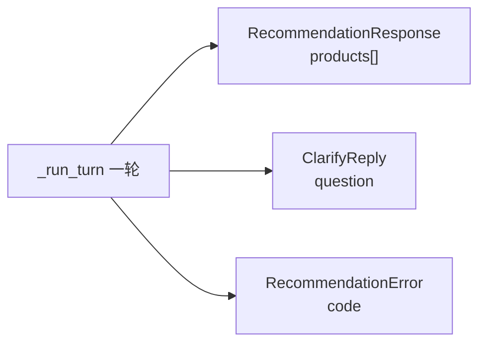
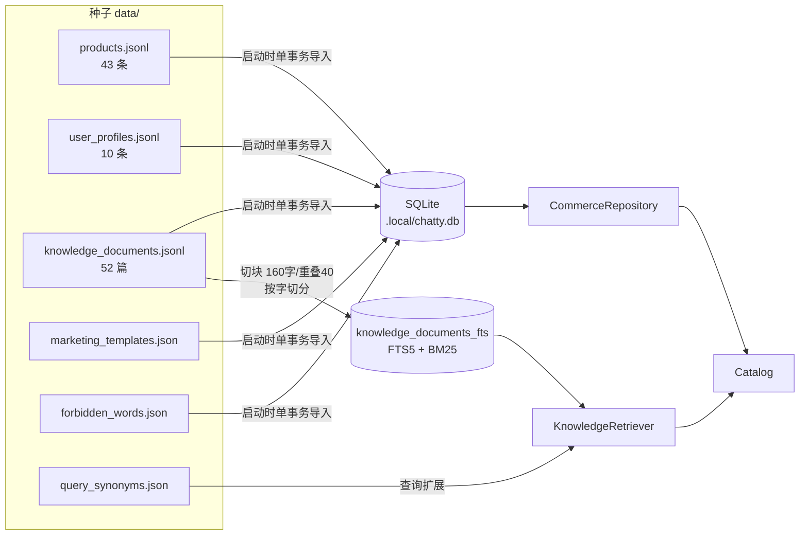

# Chatty 代码地图

这份文档回答四个问题：**入口在哪、调用链怎么走、数据从哪来到哪去、输入输出各是什么**。
领域词汇见根目录 `CONTEXT.md`，这里只讲代码。

> 第一次接触这个项目，先看 [roadmap-beginner.md](roadmap-beginner.md)——同样的内容，
> 用 Web 开发的类比讲，不含精确契约。

---

## 1. 一张图看全



---

## 2. 入口

四个入口共用同一条主干。它们真正不同的只有两件事，因此成了参数
（[conversation.py:36-39](../src/chatty/conversation.py#L36-L39)）：

- `resolve` —— 用户说过的话 → 结构化条件
- `ask` —— 拿到下一句用户回答

| 入口       | 文件                                                           | 用途                     | 会话循环             | resolve                | ask                            |
| ---------- | -------------------------------------------------------------- | ------------------------ | -------------------- | ---------------------- | ------------------------------ |
| 终端 demo  | [demo.py](../demo.py)                                          | 人手演示、产生失败轨迹   | `converse()`         | `parse_need`（调模型） | `input()` 阻塞                 |
| HTTP + Web | [api.py](../src/chatty/api.py) → [App.tsx](../web/src/App.tsx) | 浏览器对话界面           | `send()`，一轮一请求 | `parse_need`           | 无（下一次 HTTP 请求就是回答） |
| 单轮评估   | [evals/runner.py](../evals/runner.py)                          | 18 条任务打分            | 不走 Conversation    | 任务里写死             | 无                             |
| 多轮评估   | [evals/multiturn.py](../evals/multiturn.py)                    | 测「缺信息会不会问出来」 | `converse()`         | 关键词匹配（要可复现） | 用户模拟器（调模型）           |

服务端没法在一个 HTTP 请求里挂着等用户打字，所以 `Conversation` 给了两个入口：
`send()` 跑一轮就返回，`converse()` 内部循环调 `send()`。澄清历史的拼装形状因此
只有一份（[conversation.py:98-109](../src/chatty/conversation.py#L98-L109)）。

**辅助入口**（不在推荐主干上）：

- `python -m evals --retrieval` —— 只评检索质量，不调模型、零成本
- `python -m evals --harvest` —— 把 `.local/failures.jsonl` 收成回归用例
- `python -m evals --ablation` —— 拿掉工具与 Harness 的对照组
- `CHATTY_AGENT_DEBUG=1` —— 打开 [debug.py](../src/chatty/debug.py) 的钩子，逐轮打印模型输入输出

---

## 3. 调用链

```
用户一句话  "想买个降噪耳机，2000 以内"
  │
  ├─ need_parser.parse_need()               输入适配：provider.complete() 单次调用
  │    └─ UserContext{类目, 价格区间}         解析失败就当没给条件，绝不抛异常
  │
  └─ Conversation.send(said, history)       协议层：拼 history、管轮次上限
       └─ Recommender._run_turn()           agent.py:214，重心在这
            │
            ├─ Runner.run(agent, turn_input, context=证据本, max_turns=10|18)
            │    └─ 五个 function_tool 依次执行
            │         get_user_profile → search_products → check_inventory
            │         → retrieve_knowledge → get_marketing_strategy
            │              ↘ 每个都往 RecommendationContext 写证据
            │              ↘ 每个都经 Catalog 读 SQLite（Tool 不碰 SQL）
            │
            ├─ parse_agent_draft(result.final_output)   纯文本 → AgentDraft
            │
            ├─ Harness 六条校验                          agent.py:288-327
            │
            └─ Catalog.finalize(draft, request, profile) 重查 SQLite 覆盖事实
                 └─ RecommendationResponse
```

**分支**：模型这一轮如果返回 `{"action":"clarify"}`，在校验之前就返回 `ClarifyReply`——
澄清轮不产商品，也就没有价格库存可编造，六条校验对它不适用。

---

## 4. 输入 / 输出

### 输入（逐层收窄，每层都有类型）

| 层       | 类型                       | 内容                                                                                                 |
| -------- | -------------------------- | ---------------------------------------------------------------------------------------------------- |
| 最外     | `TurnRequest{text}`        | 一句自然语言，1–500 字                                                                               |
| 适配后   | `UserContext`              | `preferred_categories` / `min_price_cents` / `max_price_cents` / `recent_views` / `recent_purchases` |
| 进 Agent | `RecommendationRequest`    | `user_id` + `num_items` + `context`，序列化成 JSON                                                   |
| 多轮     | `list[TResponseInputItem]` | 上面那个 JSON 前面接 history（`{"role":..., "content":...}`）                                        |

模型能看到的只有这个 JSON 和五个 tool 的 schema。**证据本对模型不可见，只有工具能写**
（[tools.py:70-88](../src/chatty/tools.py#L70-L88)）——这是「模型说做过了不算数」的物理保证。

### 输出（三种互斥）



**`RecommendedProduct` 的字段来源**，这是整个项目的核心承诺：

| 字段                                                                            | 来源                                                                    |
| ------------------------------------------------------------------------------- | ----------------------------------------------------------------------- |
| `product_id` `name` `category` `price_cents` `brand` `stock` `tags` `low_stock` | SQLite 重查（[catalog.py:170-207](../src/chatty/catalog.py#L170-L207)） |
| `score`                                                                         | 代码计算（热度 0.55 + 画像匹配 0.25 + 近期行为 0.15 + 价格区间 0.05）   |
| `reason` `marketing_copy`                                                       | **只有这两项来自模型**，且先过一遍禁词替换                              |

**错误码**是稳定契约，一路透传到浏览器：

```
RecommendationError(code) → HTTP 422 detail=code → api.ts explain(code) → 人话
```

对外错误码：`clarification_needed` `required_tools_not_used` `knowledge_not_retrieved`
`profile_not_loaded` `product_not_recalled` `inventory_not_checked` `product_not_grounded`
`invalid_recommendation` `llm_not_configured` `recommendation_failed`。

`Catalog` 内部还会产生 `no_available_recommendations` 和 `unknown_recommended_product`，
但 `Recommender` 会将它们统一收敛为对外的 `invalid_recommendation`。

---

## 5. 核心流程：一轮 6 步

### ① 输入适配

`parse_need` 一次 `complete()` 调用把大白话转成 `UserContext`。不走 Agent Loop——不需要
工具，一问一答更快更稳。解析不出来返回空条件，**不让调用方在这里崩掉**。

### ② Agent Loop

五个只读 tool，提示词里给的顺序是画像 → 搜索 → 库存 → 知识检索 → 营销策略。
`max_turns` 单轮 10、多轮 18，是失控保护不是重试策略。
同参数第 4 次调用被 `guard_repeated_call` 拦下，异常回给模型让它改策略。

### ③ 收证据

工具执行时往 `RecommendationContext` 累加（`|=` 不是 `=`，分多次搜不同类目不会互相覆盖）：

```
profile               画像
recalled_product_ids  搜索召回的 ID
in_stock_product_ids  SQLite 确认有货的 ID
knowledge_product_ids 有知识支撑的 ID
used_tools            调过哪些工具，按顺序
call_log              带参数的调用记录，用于查重
```

### ④ 解析草稿

模型返回纯文本（DeepSeek 不吃 `json_schema`），三个候选依次试：Markdown 代码块 →
掐头去尾取 `{...}` → 整段原文。多轮时若模型用大白话反问且**一个工具都没调**，
降级成 `ClarifyReply`；单轮不给这条路。

### ⑤ Harness 六条校验（[agent.py:288-327](../src/chatty/agent.py#L288-L327)）

| #   | 校验                                                                       | 失败码                    |
| --- | -------------------------------------------------------------------------- | ------------------------- |
| ①   | 五工具都调过，且「画像→搜索→库存」偏序成立（允许重复、允许知识与营销换序） | `required_tools_not_used` |
| ②   | 知识检索有命中                                                             | `knowledge_not_retrieved` |
| ③   | 画像已加载                                                                 | `profile_not_loaded`      |
| ④   | 推荐 ID ⊆ 搜索召回集                                                       | `product_not_recalled`    |
| ⑤   | 推荐 ID ⊆ 有货集                                                           | `inventory_not_checked`   |
| ⑥   | 推荐 ID ⊆ 有知识支撑集                                                     | `product_not_grounded`    |

任一不过就明确失败，**不返回看似成功的降级结果**。

### ⑥ 回填

`Catalog.finalize` 重查 SQLite：模型编的 ID → 报错；售罄或超预算 → 跳过；重复推荐 → 去重；
禁词 → 替换成 `***`；全被过滤光 → 内部报 `no_available_recommendations`，再对外收敛为
`invalid_recommendation`，宁可报错也不返回空列表。

---

## 6. 数据流



**规矩**：JSON/JSONL 是种子，**不进运行时查询路径**；SQLite 是唯一事实源。
导入在一个事务里先 DELETE 再 INSERT，任何一步失败都回滚，不会留下半初始化的库。

**中文检索**：FTS5 的 `unicode61` 不切无空格中文，所以索引侧和查询侧**都**按字切开
（`segment_for_index`）。FTS 表里 `content` 存切分版（只建索引）、`raw_content` 存原文
（返回给模型），命中哪块返回哪块。

---

## 7. 状态住在哪

| 状态                                 | 位置                          | 生命周期                                                         |
| ------------------------------------ | ----------------------------- | ---------------------------------------------------------------- |
| 会话（`said` / `history` / `turns`） | `SessionStore`，HTTP 进程内存 | 重启即丢（ADR 0001）                                             |
| 证据本 `RecommendationContext`       | 每轮新建                      | **不跨轮累积**——累积会让六条校验形同虚设，代价是每轮重跑五个工具 |
| 商品 / 画像 / 知识                   | SQLite                        | 进程级，启动时重建                                               |
| 失败轨迹                             | `.local/failures.jsonl`       | 追加写，供 harvest 读                                            |

---

## 8. 两个 seam

代码里只有两处「可替换」是刻意设计的，其余都是实现零件：

- **`ModelProvider`**（[model_provider.py](../src/chatty/model_provider.py)）
  `model()` 给 Agent Loop，`complete()` 给输入适配和用户模拟器。
  生产是 `EnvModelProvider`（DeepSeek Responses API），测试注入 `StaticModelProvider` 全程离线。
  `run_settings()` / `run_config()` 不在接口里——消融对照组和生产必须用同一份设置。
- **`Catalog`**（[catalog.py](../src/chatty/catalog.py)）
  所有 SQL 都在它后面。Agent 和 Tool 要的是「搜商品」「查库存」，不是「拿连接自己写 SQL」。

所有权规矩全仓库一致：**只关自己建的东西**。注入进来的 provider / catalog 由建它的人关。

---

## 9. 反馈闭环

```
demo 跑挂
  └ failure_log.record()  →  .local/failures.jsonl   （写入时脱敏，绝对路径）
       └ python -m evals --harvest  →  去重后生成 EvalTask 代码
            └ 进 evals/dataset.py 回归集
```

`failure_log` 独立成 module，拥有日志的**位置、格式、脱敏规则**三件事——写它的是生产
路径，读它的是评估路径，隔着一个文件，定义只能有一份。

---

## 10. 已知缺口

- **HTTP 路径没接 `failure_log`**，只有 demo 会产生失败轨迹。Web 成为主入口后
  「失败 → 回归用例」这条闭环会变窄。
- `database.py` 和 `tools.py` 的注释引用了 `docs/code-walkthrough.md`，该文件不存在。
