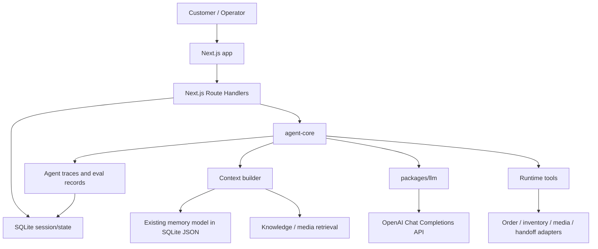

# Tech Stack Decisions

Last updated: 2026-07-04

This document is the single decision registry for Chatty, the agentic customer-service rewrite. It supersedes the exploratory PRD (now a short decision record in `docs/agentic-customer-service-prd.md`, full text in git history) where the two conflict.

## 1. Current Decision Summary

```text
Product/agent name: Chatty
Node.js + TypeScript
Next.js first
Customer-service Harness Core drives /api/playground
OpenAI Chat Completions API (only live model lane; the Agents SDK lane was removed 2026-07)
SQLite for MVP sessions/state
Existing memory model kept mostly intact
Temporal deferred until the product proves it needs durable workflow guarantees
Chatwoot used as open-source product reference, not as runtime dependency
```

## 2. Next.js vs Fastify

Decision: use Next.js first. Do not add Fastify unless a concrete limitation appears.

Next.js can cover the initial Fastify role:

- Route Handlers for `/api/chat`, webhook-style callbacks, health checks, knowledge APIs, eval triggers, and admin BFF endpoints.
- Server Components for trace, memory, evaluation, and knowledge dashboard reads.
- Server Actions for internal admin mutations where browser forms are the caller.
- API routes or Route Handlers for file uploads and streaming where needed.

Fastify remains a later extraction option, not an MVP dependency.

Use Fastify later only if:

- We need a separately deployed high-throughput public API.
- Webhook handling needs independent scaling or stricter middleware control.
- Next.js route runtime becomes awkward for streaming, large uploads, or long-lived connections.
- The API surface must be consumed by multiple external services independent of the web app.

Rule: the agent loop must not run as an unbounded long-lived Next.js request handler. Next.js can run one bounded local harness step for playground usage, but background work belongs in a worker process.

## 3. Existing Frontend

Decision: do not heavily rewrite the existing frontend.

Current frontend assets:

- `rag-service/public/test.html`: manual test console.
- `rag-service/dashboard`（已删除，2026-07）: legacy React/Vite dashboard source; apps/web 的 `/dashboard` 已重建同类功能，源码在 git 历史 / `legacy-extras` 分支.

Migration approach:

1. Keep existing pages working.
2. Rehost or wrap them under Next.js only when useful.
3. Optimize progressively: trace visibility, knowledge management, eval drilldown, and conversation replay.
4. Avoid a full Chatwoot-style inbox rebuild in the first pass.

## 4. Chatwoot Role

Decision: Chatwoot is a reference product, not a runtime dependency.

We use Chatwoot to study and translate product concepts:

- Inbox
- Contact
- Conversation
- Message
- Assignment
- Internal note
- Label
- Handoff
- Canned response
- SLA/follow-up

We do not require Rails, Chatwoot deployment, or Chatwoot database in the target architecture.

## 5. Runtime Tools vs Development Skills

Use separate names.

Runtime concepts:

- `tools`: executable capabilities such as order lookup, availability check, media lookup, and handoff.
- `playbooks`: business conversation flows.（词汇保留；曾有 schema-only 的 playbooks 模块，2026-07 简化中因无执行引擎而移除，需要时再随执行器一起引入）
- `policies`: approval, escalation, and safety rules.
- `knowledge`: FAQ, product, policy, and historical answer sources.

Development concepts:

- `dev skills`: agent-side skills and plugins used while developing.
- Project-level dev-skill files were removed in the 2026-07 simplification (history preserved on the `legacy-extras` branch); the practices they encoded live on as conventions, not files.
- Non-trivial or high-risk development should include at least one read-only sub-agent grill before completion; sub-agent collaboration remains tree-shaped with the main agent as controller.
- Open-source or external skills can be adopted or adapted only with recorded provenance, license compatibility, and local changes (see `docs/open-source-adoption.md`).

Do not call customer-service runtime capabilities "skills" in product docs.

## 6. Session and Memory

Current state (updated 2026-07):

- `agent_sessions` is a real SQLite session store (`packages/db`); the playground route loads/creates a session per conversation.
- Conversations are keyed by `customerId`, `productId`, and `conversationId`.
- New-loop memory writes go to SQLite JSON columns (recentMessages only so far); `rag-service/data/memory-store.json` remains a read-only fallback and the legacy lane's own store.
- Recent messages, summaries, profile facts, orchestration state, and reviews are stored under `CustomerMemory` and `ProductMemory`.

Decision:

- Use SQLite for MVP sessions and lightweight state.
- Keep the current memory shape mostly intact.
- Move from JSON file to SQLite tables with JSON columns instead of redesigning memory now.

Suggested MVP tables:

```text
agent_sessions
  id
  customer_id
  product_id
  conversation_id
  status
  current_step
  created_at
  updated_at

customer_memories
  customer_id
  global_summary
  session_context_json
  body_profiles_json
  updated_at

product_memories
  customer_id
  product_id
  conversation_id
  summary
  recent_messages_json
  conversation_profile_json
  reviews_json
  updated_at

agent_traces
  id
  session_id
  event_type
  intent
  action
  input_json
  output_json
  tool_calls_json
  references_json
  created_at
```

Postgres can replace SQLite later when multi-user concurrency, deployment topology, or data volume requires it.

## 7. Harness Core, OpenAI Agents SDK, and Chat Completions

Decision: keep product orchestration in `packages/agent-core`, with model providers
behind adapter boundaries.

The first live path is the customer-service Harness Core:

- `scheduleCustomerServiceTask`: maps a customer utterance into a narrow service task
  (`collect_missing_info` / `answer_question` / `check_availability` / `handoff` / `follow_up`).
- `buildCustomerServiceContext`: assembles customer, product, memory, policy, and retrieved context fragments.
- `parseCustomerServiceOutput`: parses strict JSON action output with a deterministic fallback.
- `executeCustomerServiceAction`: runs low-risk tools through policy-aware executors and escalates sensitive actions.
- `runCustomerServiceHarnessStep`: returns reply, terminality, tool calls, memory patch, and trace.

This keeps Chatty scoped to a rental customer-service project instead of a
general-purpose agent runtime. LLM/SDK usage can replace the model-output
composer later without changing task scheduling, executor policy, or trace
contracts. Deliberately out of scope for the harness core: terminal/file tools,
MCP, background workers, multi-agent routing, and any new GUI.

Decision (2026-06): use both. **Revised 2026-07: the Agents SDK lane (adapter,
`CHATTY_AGENTS_SDK` flag, `@openai/agents` dependency) was removed with zero
production callers; Chat Completions is the only live model path. Re-adopt the
SDK only when a concrete consumer needs run/handoff/guardrail semantics.**

OpenAI Agents SDK TypeScript (removed 2026-07; original rationale):

- Agent run abstraction.
- Tools.
- Handoffs.
- Guardrails.
- Tracing.
- Agent-level orchestration for bounded runs.

OpenAI Chat Completions API:

- Existing `rag-service` compatibility path.
- Intent classification.
- Structured fact extraction.
- Reply generation fallback.
- Evaluator judge.
- Direct low-level model calls when an Agents SDK run is unnecessary.

All model calls should go through `packages/llm` adapters so the runtime can switch model providers (or re-introduce an SDK lane) without touching product logic.

## 8. AgentKit and Agent Builder

Decision: use AgentKit and Agent Builder for design/prototyping, not as production source of truth.

Workflow:

1. Prototype workflows in Agent Builder when visual iteration helps.
2. Export or translate useful designs into TypeScript agent recipes.
3. Store experiments under `experiments/agent-builder/`.
4. Promote only reviewed code into `packages/agent-core` and `packages/llm`.

Production requirements for promoted workflows:

- Typed input/output schema.
- Tool schema.
- Guardrail.
- Memory read/write policy.
- Handoff policy.
- Golden eval cases.
- Trace fields.

## 9. Mermaid Architecture



## 10. Design Artifacts

Maintain architecture and product design in `docs/`.

Recommended artifacts:

- Mermaid diagrams in markdown for architecture and data flow.
- Figma for UI flow and information architecture when product screens need precision.
- Canva for presentation-style stakeholder summaries.

The repository source of truth remains markdown under `docs/`. Figma/Canva links should be referenced from docs instead of replacing docs.

## 11. Still Open

1. Whether to introduce Temporal later. Current decision: defer.
2. Whether Next.js Route Handlers are sufficient for all public API needs. Current decision: yes for MVP.
3. Whether SQLite remains local-only or becomes production MVP storage. Current decision: use SQLite for MVP unless deployment constraints force Postgres.
4. ~~How much of the existing Vite dashboard gets migrated into Next.js.~~ Resolved 2026-07: apps/web rebuilt `/dashboard`; the legacy Vite dashboard package was removed.
