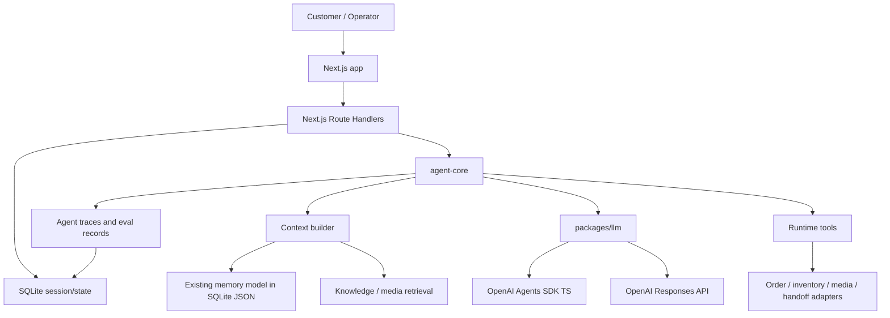

# Tech Stack Decisions

Last updated: 2026-06-25

This document records the current stack decisions for Chatty, the agentic customer-service rewrite. It supersedes earlier exploratory notes in `docs/agentic-customer-service-prd.md` where the two conflict.

## 1. Current Decision Summary

```text
Product/agent name: Chatty
Node.js + TypeScript
Next.js first
OpenAI Agents SDK TypeScript
OpenAI Responses API
MiMo model lane, defaulting to mimo-2.5
SQLite for MVP sessions/state
Existing memory model kept mostly intact
Temporal deferred until the product proves it needs durable workflow guarantees
Chatwoot used as open-source product reference, not as runtime dependency
```

## 2. Next.js vs Fastify

Decision: use Next.js first. Do not add Fastify unless a concrete limitation appears.

Next.js can cover the initial Fastify role:

- Route Handlers for `/api/chat`, webhook-style callbacks, health checks, knowledge APIs, eval triggers, and admin BFF endpoints.
- Server Components for trace, memory, evaluation, and knowledge dashboard reads.
- Server Actions for internal admin mutations where browser forms are the caller.
- API routes or Route Handlers for file uploads and streaming where needed.

Fastify remains a later extraction option, not an MVP dependency.

Use Fastify later only if:

- We need a separately deployed high-throughput public API.
- Webhook handling needs independent scaling or stricter middleware control.
- Next.js route runtime becomes awkward for streaming, large uploads, or long-lived connections.
- The API surface must be consumed by multiple external services independent of the web app.

Rule: the agent loop must not run inside long-lived Next.js request handlers. Next.js can accept the event and enqueue/run a bounded local step, but background work belongs in a worker process.

## 3. Existing Frontend

Decision: do not heavily rewrite the existing frontend.

Current frontend assets:

- `rag-service/public/test.html`: manual test console.
- `rag-service/dashboard`: React/Vite dashboard source.
- `rag-service/public/dashboard`: built dashboard output.

Migration approach:

1. Keep existing pages working.
2. Rehost or wrap them under Next.js only when useful.
3. Optimize progressively: trace visibility, knowledge management, eval drilldown, and conversation replay.
4. Avoid a full Chatwoot-style inbox rebuild in the first pass.

## 4. Chatwoot Role

Decision: Chatwoot is a reference product, not a runtime dependency.

We use Chatwoot to study and translate product concepts:

- Inbox
- Contact
- Conversation
- Message
- Assignment
- Internal note
- Label
- Handoff
- Canned response
- SLA/follow-up

We do not require Rails, Chatwoot deployment, or Chatwoot database in the target architecture.

## 5. Runtime Tools vs Development Skills

Use separate names.

Runtime concepts:

- `tools`: executable capabilities such as order lookup, availability check, media lookup, and handoff.
- `playbooks`: business conversation flows.
- `policies`: approval, escalation, and safety rules.
- `knowledge`: FAQ, product, policy, and historical answer sources.

Development concepts:

- `dev skills`: Codex-side skills and plugins used while developing, such as OpenAI Developers, Build Web Apps, and Superpowers.

Do not call customer-service runtime capabilities "skills" in product docs.

## 6. Session and Memory

Current state:

- There is no real session store yet.
- The current service uses `customerId`, `productId`, and `conversationId`.
- Long-term memory is file-backed in `rag-service/data/memory-store.json`.
- Recent messages, summaries, profile facts, orchestration state, and reviews are stored under `CustomerMemory` and `ProductMemory`.

Decision:

- Use SQLite for MVP sessions and lightweight state.
- Keep the current memory shape mostly intact.
- Move from JSON file to SQLite tables with JSON columns instead of redesigning memory now.

Suggested MVP tables:

```text
agent_sessions
  id
  customer_id
  product_id
  conversation_id
  status
  current_step
  created_at
  updated_at

customer_memories
  customer_id
  global_summary
  session_context_json
  body_profiles_json
  updated_at

product_memories
  customer_id
  product_id
  conversation_id
  summary
  recent_messages_json
  conversation_profile_json
  reviews_json
  updated_at

agent_traces
  id
  session_id
  event_type
  intent
  action
  input_json
  output_json
  tool_calls_json
  references_json
  created_at
```

Postgres can replace SQLite later when multi-user concurrency, deployment topology, or data volume requires it.

## 7. OpenAI Agents SDK and Responses API

Decision: use both.

OpenAI Agents SDK TypeScript:

- Agent run abstraction.
- Tools.
- Handoffs.
- Guardrails.
- Tracing.
- Agent-level orchestration for bounded runs.

OpenAI Responses API:

- Existing `rag-service` compatibility path.
- Intent classification.
- Structured fact extraction.
- Reply generation fallback.
- Evaluator judge.
- Direct low-level model calls when an Agents SDK run is unnecessary.

All model calls should go through `packages/llm` or `rag-service/src/responses.ts` adapters so the runtime can switch between direct Responses calls and Agents SDK runs without touching product logic.

## 8. AgentKit and Agent Builder

Decision: use AgentKit and Agent Builder for design/prototyping, not as production source of truth.

Workflow:

1. Prototype workflows in Agent Builder when visual iteration helps.
2. Export or translate useful designs into TypeScript agent recipes.
3. Store experiments under `experiments/agent-builder/`.
4. Promote only reviewed code into `packages/agent-core` and `packages/llm`.

Production requirements for promoted workflows:

- Typed input/output schema.
- Tool schema.
- Guardrail.
- Memory read/write policy.
- Handoff policy.
- Golden eval cases.
- Trace fields.

## 9. Mermaid Architecture



## 10. Design Artifacts

Maintain architecture and product design in `docs/`.

Recommended artifacts:

- Mermaid diagrams in markdown for architecture and data flow.
- Figma for UI flow and information architecture when product screens need precision.
- Canva for presentation-style stakeholder summaries.

The repository source of truth remains markdown under `docs/`. Figma/Canva links should be referenced from docs instead of replacing docs.

## 11. Still Open

1. Whether to introduce Temporal later. Current decision: defer.
2. Whether Next.js Route Handlers are sufficient for all public API needs. Current decision: yes for MVP.
3. Whether SQLite remains local-only or becomes production MVP storage. Current decision: use SQLite for MVP unless deployment constraints force Postgres.
4. How much of the existing Vite dashboard gets migrated into Next.js. Current decision: minimize changes first.
